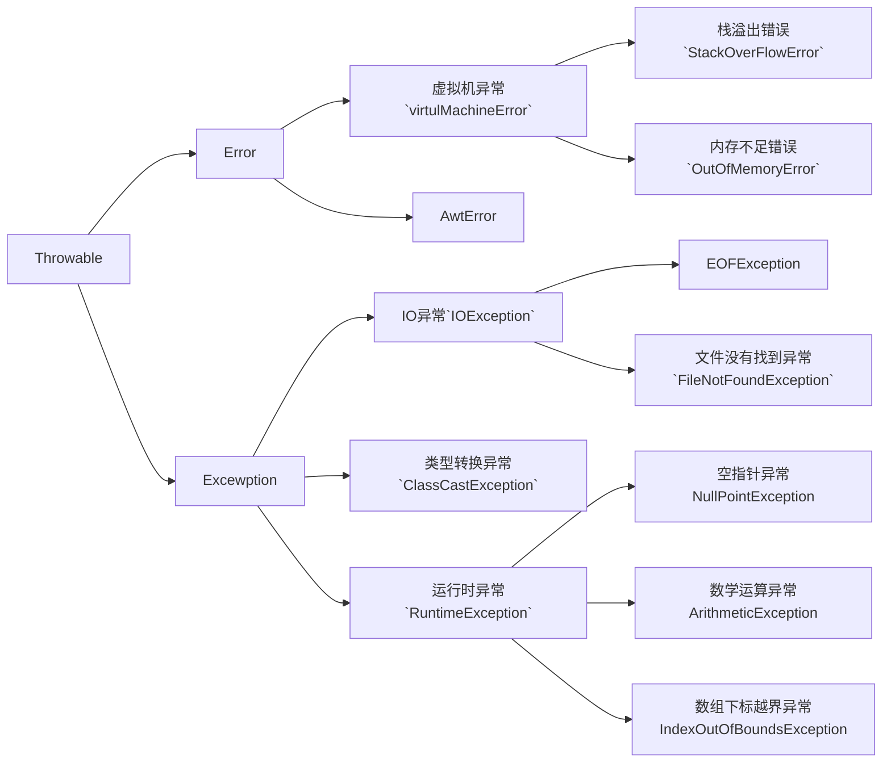

---

# 异常面试题

###### **Java异常架构图**

------



*****

### 一，常见概念

****

###### 1，Throwable

- `Throwable` 是 Java 语言中`所有错误与异常的超类`。
- Throwable 包含两个子类：`Error（错误）`和 `Exception（异常）`，
- 它们通常用于`指示发生了异常情况`。
- Throwable 包含了其线程创建时线程执行堆栈的快照，它提供了 `printStackTrace()` 等接口用于`获取堆栈跟踪数据`等信息。

###### 2，Error

- 定义：Error类及其子类， 是指程序中无法处理的错误。
- 特点： 
  - 一般都是代码运行时，`jvm`出现问题。通常有`虚拟机运行错误`和`类定义错误`。例如：内存不足错误，和栈溢出错误。
  - 他们都是非受检异常，也就是并不是代码的错误。应用程序不应该去处理这些错误。

###### 3，Exception (异常)

- 定义： 程序本身可以捕获并且可以处理的异常。可分为：**运行时异常** `RuntimeException` 和 **编译时异常**

- ***运行时异常***

  - 定义：`RuntimeException 类及其子类`，表示 JVM 在运行期间可能出现的异常。
  - 特点：属于非受检异常。
    - 常见的有：
      - `NullPointerException`      空指针异常
      - `ArrayIndexOutBoundException`   数组下标越界异常
      - `ClassCastException  `    类型转换异常
      - `ArithmeticExecption`     算术异常
    - 原因：一般是由程序的逻辑错误引起的
    - 处理方式：在程序中可以选择`处理`或者`不处理`
      - ***处理***：
        1. 通过`throws` 进行声明抛出
        2. 通过 `try-catch` 对它进行捕获处理。
        3. 如果产生运行时异常，则需要通过修改代码来进行避免。
        4. `RuntimeException 异常`会由 Java 虚拟机**自动抛出**并**自动捕获**（就算我们没写异常捕获语句运行时也会抛出错误！）
        5. 此类异常通常都是因为代码本身有问题，应该修改代码来解决。
      - ***不处理***

- ***编译时异常***

  - 定义： `Exception `中`除 RuntimeException 及其子类之外`的异常。

  - 特点： 属于受检异常。通常有：

    - `ClassNotFoundException`（没有找到指定的类异常）
    - `IOException`（IO流异常）

  - 处理方式：

    1. 通过throws进行声明抛出
    2. 通过try-catch进行捕获处理

    否则不能通过编译。

  - 该异常必须手动在代码中添加捕获语句来处理该异常。

###### 4，受检异常和非受检异常

Java的所有异常可分为 **受检异常**`(checked exception)`和**非受检异常**`unchecked exception`。

- **受检异常**：
  - 编译器必须处理的异常。是正确的程序在运行过程中经常容易出现的，符合预期的异常情况。
  - 一旦发生此类异常，就必须采用某种方式进行处理。（`throws ` 或者  `try- catch`）,否则编译不通过。
- **非受检异常**
  - 编译器不会进行检查并且不要求必须处理的异常
  - 即便我们不使用（`throws ` 或者  `try- catch`），编译器也不会报错。
  - 该异常包括 运行时异常 `RuntimeException`及其子类 和 错误 `Error`

###### 5，Java异常关键字


|   关键字    | 作用                                                         |
| :---------: | :----------------------------------------------------------- |
|   **try**   | 用于监听可能出现异常的代码。当 try 语句块内的代码发生异常时，异常就会被抛出。 |
|  **catch**  | 用于捕获异常。catch用来捕获try语句块中发生的异常。           |
| **finally** | finally语句块总是会被执行。它主要用于回收在try块里打开的物理资源（如数据库连接、网络连接和磁盘文件)只有finally块，执行完成之后，才会回来执行try或者catch块中的return或者throw语句，如果finally中使用了return或者throw等终止方法的语句，则就不会跳回执行，直接停止。 |
|  **throw**  | 用于抛出异常                                                 |
| **throws**  | 用在方法签名中，用于声明该方法可能抛出的异常。               |


------

###### 6，Java异常处理结构图

 ```mermaid
 graph TD;
     异常处理-->抛出异常;
     异常处理-->捕获异常;
     异常处理-->声明异常;
 	抛出异常-->throw;
 	捕获异常-->try;
 	捕获异常-->catch;
 	捕获异常-->finally;
 	声明异常-->throws;
 ```


### 二，常见面试题

###### 1，Error 和 Exception 区别是什么？

> 1. `Error` 通常为虚拟机的相关错误，如 系统崩溃，内存不足，堆栈溢出等。属于非受检异常，Java程序不应对此类错误进行捕获，一旦发生，应用程序就会终止。
> 2. `Exception` 是可以在应用程序中捕获并处理的，通常遇到这种错误，需要对其进行处理，是应用程序可以继续运行。

###### 2，运行时异常和受检异常的区别？

> 1. 运行时异常包括的是  RuntimeException 类及其子类，Java编译器不检查此类异常。
> 2. 而受检异常包括的是 Exception 中 除了 RuntimeException 类及其子类 之外的异常。Java编译器会对此类异常进行检查。
> 3. 运行时异常不要求调用者必须处理此异常
> 4. 受检异常要求调用者必须处理。

###### 3，JVM 是如何处理异常的？

~~~mermaid
graph TD;
	方法中发生异常 --> 当前方法创建异常对象;
	当前方法创建异常对象 --> 转交JVM处理;
	转交JVM处理 --> JVM会顺着调用栈去查找看是否有可以处理异常的代码;
	JVM会顺着调用栈去查找看是否有可以处理异常的代码 --> 如果有 --> 调用异常处理代码;
	JVM会顺着调用栈去查找看是否有可以处理异常的代码 --> 如果没有 --> 转交给默认的异常处理器 --> 默认异常处理器打印出异常信息并终止应用程序;

~~~

**补充：**

> 抛出异常 ：创建异常对象并转交给 JVM 的过程；
>
> 调用栈   ：可能有一系列的方法调用，最终才进入抛出异常的方法，这一系列方法调用的有序列表叫做调用栈。

###### 4，throws 和 throw的区别是什么？

> - Java 中的异常处理除了包括捕获异常和处理异常之外，还包括声明异常和拋出异常，可以通过 throws 关键字在方法上声明该方法要拋出的异常，或者在方法内部通过 throw 拋出异常对象。
> - 区别：`throw `关键字用在方法内部，只能用于抛出`一种异常`，用来抛出方法或代码块中的异常，受检异常和非受检异常都可以被抛出。
> - `throws` 关键字用在方法声明上，可以抛出`多个异常`，用来标识该方法可能抛出的异常列表。一个方法用 throws 标识了可能抛出的异常列表，调用该方法的方法中必须包含可处理异常的代码，否则也要在方法签名中用 throws 关键字声明相应的异常

###### 5，final、finally、finalize 有什么区别？

> `final` :可以修饰类、变量、方法，修饰类表示该类不能被继承、修饰方法表示该方法不能被重写、修饰变量表示该变量是一个常量不能被重新赋值。
>
> `finally`一般作用在**try-catch**代码块中，在处理异常的时候，通常我们将一定要执行的代码方法finally代码块中，表示不管是否出现异常，该代码块都会执行，*一般用来存放一些关闭资源的代码。*
>
> `finalize`是一个方法，属于Object类的一个方法，而Object类是所有类的父类，Java 中允许使用 finalize()方法在垃圾收集器将对象从内存中清除出去之前做必要的清理工作。

###### 6, `NoClassDefFoundError` 和 `ClassNotFoundException` 区别?

> - **NoClassDefFoundError**是一个有JVM引起的Error类型的异常。不应该尝试捕获这个异常。
> - **ClassNotFoundException**是一个受检异常，需要显示的使用 **try-catch**对其进行捕获和处理。或在方法签名中用 throws 来声明。
>   - 两种触发此类异常的情况：
>   - 当使用 Class.forName, ClassLoader.loadClass 或 ClassLoader.findSystemClass 动态加载类到内存的时候，通过传入的类路径参数没有找到该类，就会抛出该异常；
>   - 重复加载： 某个类已经由一个类加载器加载至内存中，另一个加载器又尝试去加载它，也会抛出该异常。
>
> 

###### 7. try-catch-finally 中哪个部分可以省略？

> **catch**可以省略

###### 8，try-catch-finally 中，如果 catch 中 return 了，finally 还会执行吗？

> 会执行，在return执行前执行。
>
> ***注意：***在 finally 中改变返回值的做法是不好的。
>
> 因为如果存在 finally 代码块，try中的 return 语句不会立马返回调用者，而是记录下返回值待 finally 代码块执行完毕之后再向调用者返回其值，然后如果在 finally 中修改了返回值，就会返回修改后的值。显然，在 finally 中返回或者修改返回值会对程序造成很大的困扰，C#中直接用编译错误的方式来阻止程序员干这种龌龊的事情，Java 中也可以通过提升编译器的语法检查级别来产生警告或错误。

###### 9，常见的 RuntimeException 有哪些？

1. ClassCastException (类转换异常)
2. IndexOutOfBoundsException(数组越界)
3. NullPointerException(空指针)
4. ArrayStoreException(数据存储异常，操作数组时类型不一致)
5. 还有IO操作的BufferOverflowException异常

