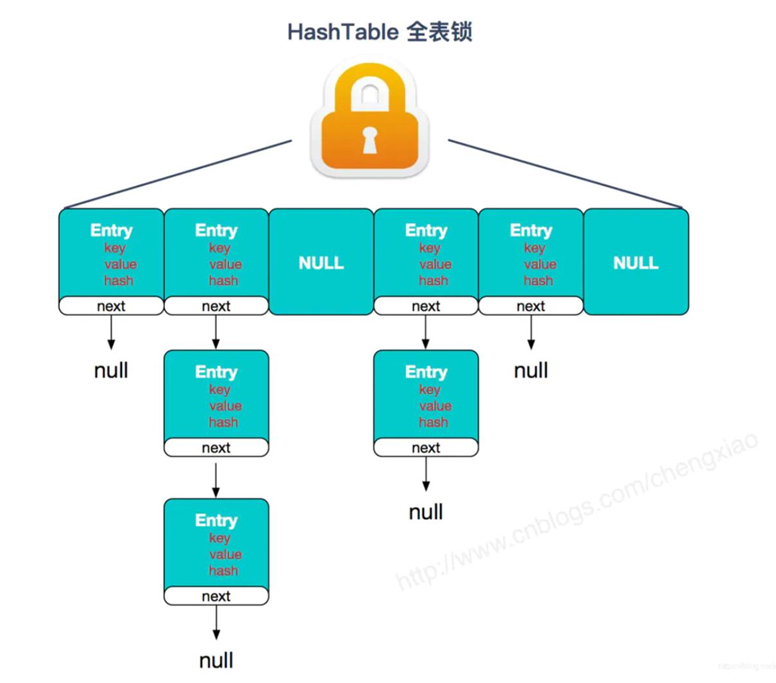
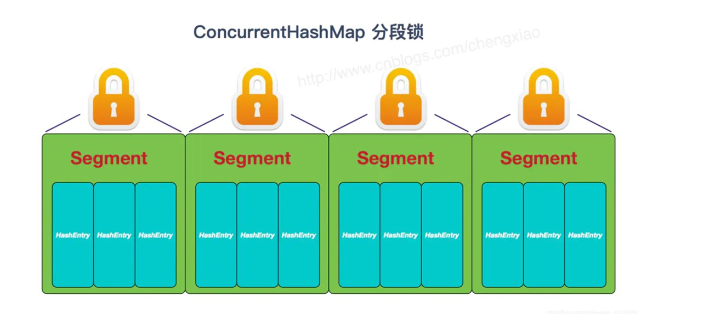
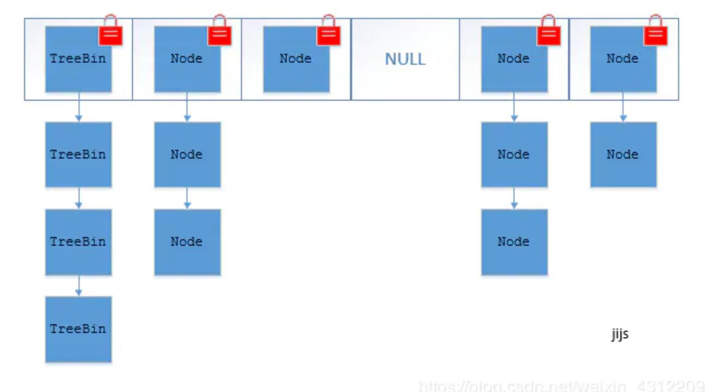

# Java集合面试题总结

## 集合容器概述

***

1. 什么是集合?

   - 集合就是一个放数据的容器,准确的说是放数据对象的引用的容器;
   - 集合类存放的都是对象的引用
   - 集合类型主要有3种: `set(集)`,`list(列表)`,`map(映射)`

2. 集合的特点?

   - 集合用于存储对象的容器,对象是用来封装数据,对象多了也需要存储集中式管理.
   - 和数组对比对象大小不确定.因此集合是可变长度的.数组需要提前定义大小

3. 集合和数组的特点?

   - 数组是固定长度的,集合的长度不定
   - 数组可以存储基本数据类型,也可以存储引用数据类型;集合只能存储引用数据类型
   - 数组存储的元素必须是同一个数据类型,但是集合存储的对象可以是不同的类型

4. 使用集合框架的好处?

   - 不用关心容量的问题(容量自增长)
   - 提供了高性能的数据结构和算法,使编码更加轻松,提高了程序的速度和质量
   - 可以方便的扩展或者改写集合,提高代码的复用性和可操作性
   - 通过JDK自带的集合类,可以降低代码的维护和学习新的API的成本

5. 常用的集合类有哪些?

   - Map接口和Collection接口是所有的集合框架的父接口
     1. Collection接口的实现类主要有: `Set接口` ` List接口`
     2. Map接口的实现类主要有:`HashMap`, `TreeMap`,`HashTable`,`ConCurrentHashMap`
     
        `Properities`
     3. Set接口的实现类主要有:`HashSet`,`TreeSet`,`LinkedHashSet`
     4. List接口的实现类有:`ArrayList`,`LinkedList`,`Stack`,`Vector`
   
6. List,Set,Map三者的区别?

   ```mermaid
   graph LR;
   集合框架 --> Collection单列集合;
   集合框架 --> Map双列集合;
   Collection单列集合 --> List有序可重复元素可以有多个null;
   List有序可重复元素可以有多个null --> Vector数组结构,线程安全;
   List有序可重复元素可以有多个null --> ArrayList数组结构,非线程安全;
   List有序可重复元素可以有多个null --> LinkedList链表结构,非线程安全;
   Collection单列集合 --> Set无序唯一只能有一个null;
   Set无序唯一只能有一个null --> HashSet哈希表结构
   Set无序唯一只能有一个null --> TreeSet红黑树结构;
   Map双列集合 --> HashTable哈希表结构线程安全 --> Properties;
   Map双列集合 --> HashMap哈希表结构非线程安全 --> LinkedHashMap哈希表链表结构;
   Map双列集合 --> TreeMap红黑树结构.
   ```


7. 集合框架的底层数据结构?

   - Collection

     - List

       |  集合名称  | 底层数据结构 |
       | :--------: | :----------: |
       | ArrayList  |   object[]   |
       |   Vector   |   object[]   |
       | LinkedList | 双向循环链表 |

     - Set

       |   集合名称    |                 底层数据结构                  |
       | :-----------: | :-------------------------------------------: |
       |    HashSet    | 基于HashMap实现的,底层采用hashMap来保存元素的 |
       | LinkedHashSet |             通过LinkedHashMap实现             |
       |    TreeSet    |          红黑树(自平衡的二叉排序树)           |

     - Map

       |   集合名称    | 底层数据结构                                                 |
       | :-----------: | :----------------------------------------------------------- |
       |    HashMap    | JDK1.8之前HashMap由数组+链表组成的，数组是HashMap的主体，链表则是主要为了解决哈希冲突而存在的（“拉链法”解决冲突）. JDK1.8以后在解决哈希冲突时有了较大的变化，当链表长度大于阈值（默认为8）时，将链表转化为红黑树，以减少搜索时间 |
       | LinkedHashMap | 它的底层仍然是基于拉链式散列结构即由数组和链表或红黑树组成红黑树(自平衡的二叉排序树) |
       |   HashTable   | 数组+链表组成,数组是来HashTable的主体,链表主要是为了解决哈希冲突 |
       |    TreeMap    | 红黑树                                                       |

8. ### 那些集合类是线程安全的 ?

   - Vector : 比 ArrayList 多了个线程安全(synchronized) ,但是效率很低(不建议使用)
   - hashTable : 比hashMap 多了个线程安全(synchronized),效率低,(不建议使用)
   - ConcurrentHashMap: 
     - 是Java5中支持高并发、高吞吐量的线程安全HashMap实现。
     - 它由`Segment数组结构`和`HashEntry数组结构`组成。
       - Segment数组在ConcurrentHashMap里扮演锁的角色，
       - HashEntry则用于存储键-值对数据。
     - 一个ConcurrentHashMap里包含一个Segment数组,
       - Segment的结构和HashMap类似，是一种`数组和链表结构`；
       - 一个Segment里包含一个HashEntry数组，每个HashEntry是一个链表结构的元素；
       - 每个Segment守护着一个HashEntry数组里的元素，当对HashEntry数组的数据进行修改时，必须首先获得它对应的Segment锁。（推荐使用）   

9. ### 说一下 Java集合的快速失败机制`fail-fast`？

   - 是java集合的一种错误检测机制，当多个线程对集合进行结构上的改变的操作时，有可能会触发 `fail-fast` 机制。
   - 例如：假设存在两个线程（线程1、线程2
     - 线程1通过Iterator在遍历集合A中的元素，在某个时候线程2修改了集合A的结构（是结构上面的修改，而不是简单的修改集合元素的内容），
     - 那么这个时候程序就会抛出 ConcurrentModificationException 异常，从而产生fail-fast机制。  
   - 原因：
     - 迭代器在遍历时直接访问集合中的内容，并且在遍历过程中使用一个 **modCount 变量**。
     - 集合在被遍历期间如果内容发生变化，就会改变modCount的值。
     - 每当迭代器使用`hashNext()/next()` 遍历下一个元素之前，都会检测modCount变量是否为expectedmodCount值，
     - 是的话就返回遍历；否则抛出异常，终止遍历。  
   - 解决办法:
     1. 在遍历过程中，所有涉及到改变modCount值得地方全部加上synchronized。  
     2. 使用CopyOnWriteArrayList来替换ArrayList;  
   
10. 怎么确保一个集合不能被修改?

    - 可以使用 `Collections. unmodifiableCollection(Collection c) `方法来创建一个**只读集合**，这样改变  

      集合的任何操作都会抛出 Java. lang. UnsupportedOperationException(不支持的操作) 异常

    - ```java
      List<String> list = new ArrayList<>();
      list. add("x");
      Collection<String> clist = Collections. unmodifiableCollection(list);
      clist. add("y"); // 运行时此行报错
      System. out. println(list. size());
      ```
      
      
      

## Collection接口

***

### List接口

###### 1. 迭代器Iterator是什么?

- `Iterator` 接口提供遍历任何 `Collection` 的接口。
- 我们可以从一个 Collection 中使用迭代器方法来获取迭代器实例。
- 迭代器取代了 Java 集合框架中的 Enumeration(枚举)，迭代器允许调用者在迭代过程中**移除**元素.
- 所有的 Collection 接口都继承了 Iterator 迭代器

###### 2. Iterator 怎么使用？有什么特点？  

- 示例代码

  ```java
  	List<String> list = new ArrayList<>();
  	Iterator<String> it = list. iterator();
  	while(it. hasNext()){
  		String obj = it. next();
  		System. out. println(obj);
  	}
  ```

- Iterator 的特点是:只能单向遍历,但是更加安全.因为它可以确保如果当前遍历的集合元素被更改,就会抛出异常( `ConcurrentModificationException`)

###### 3. 如何一边遍历一边移除集合 Collection中的元素?

- 应该用迭代器的remove()方法,而不是集合的 remove方法

  - ```java
    //正确示例	
    Iterator<Integer> it = list.iterator();
    	while(it.hasNext()){
    		*// do something*
    		it.remove();
    	}
    //错误示例
    for(Integer i : list){
    	list.remove(i)
    }
    这个会报错: ConcurrentModificationException这是因为当使用
    foreach(for(Integer i : list)) 语句时，会自动生成一个iterator 来遍历该 list，但同时该 list 正在被 Iterator.remove() 修改。Java 一般不允许一个线程在遍历 Collection 时另一个线程修改它。
    ```

13. `Iterator` 和 `ListIterator` 有什么区别?
    - Itertor可以遍历Set 和 List 但是ListItertor只能遍历 List集合
    - Iterator 只能单向遍历，而 ListIterator 可以双向遍历（向前/后遍历）
    - ListIterator 实现 Iterator 接口，然后添加了一些额外的功能，比如添加一个元素、替换一个元素、获取前面或后面元素的索引位置。 
14. 遍历一个List有哪些不同的方式？每种方法的实现原理是什么？Java中 List  遍历的最佳实践是什么？

    1. 三种方式来遍历List以及他们的原理如下:
       - for(),基于计数器,在集合外部维护一个计数器,依次读取即可
       - 迭代器遍历: 面向对象的设计模式,屏蔽了不同数据集合的特点,统一遍历集合的接口.
       - foreach 循环遍历: foreach 内部也是采用了迭代器的方式实现.
         - 优点:代码简洁,不易出错.
         - 缺点: 只能遍历,不可以做其他的操作(删除,替换等).
    2. 最佳实践:
       - 推荐的做法就是，支持 Random Access 的列表可用 for 循环遍历，否则建议用 Iterator 或  foreach 遍历。  
         - Java Collections 框架中提供了一个 RandomAccess 接口，用来标记 List 实现是否支持 Random Access。 
         - 如果一个数据集合实现了该接口，就意味着它支持 Random Access，按位置读取元素的平均时间复杂度为 O(1)，如ArrayList。
         - 如果没有实现该接口，表示不支持 Random Access，如LinkedList

###### 4. 说一下ArrayList的优缺点?

- **优点**: ArrayList 底层以数组实现，是一种随机访问模式(Random Access)。ArrayList 实现了 RandomAccess 接口,因此查找的时候非常快 : 平均时间复杂度 `O(1)`
- **缺点**: 
  - 插入/删除 元素的时候,需要做一次复制操作.如果需要复制的元素很多,那么就会比较耗费性能.
- **使用场景**:适合顺序添加,随机访问的场景.

###### Arraylist扩容: 

ArrayList底层是[数组](https://so.csdn.net/so/search?q=数组&spm=1001.2101.3001.7020)elementData，用于存放插入的数据。初始大小是0，当有数据插入时，默认大小DEFAULT_CAPACITY = 10。如果在创建ArrayList时指定了initialCapacity，则初始大小是ArrayList

从示例当添加元素时，如果元素个数+1> 当前数组长度 【size + 1 > elementData.length】时，进行扩容，扩容后的数组大小是： oldCapacity + (oldCapacity >> 1)

将旧数组内容通过Array.copyOf全部复制到新数组，此时新旧列表的size大小相同，但elementData的长度即容量不同

注意：扩容并不是严格的1.5倍，是扩容前的数组长度右移一位 + 扩容前的数组长度

###### 5. 如何实现数组 和 List的转换?

- 数组 -> List : Arrays.asList(array) 方法.
- List -> 数组 : List自带的 toArray() 方法.

###### 6. ArrayList 和 LinkedList 的区别是什么？

|               | ArrayList                                            | LinkedList                                                  |
| ------------- | :--------------------------------------------------- | ----------------------------------------------------------- |
| 数据结构实现  | 动态数组                                             | 双向链表                                                    |
| 随机访问效率  | 高(random access)                                    | 低                                                          |
| 插入/删除效率 | ArrayList 增删操作要影响数组内的其他数据的下标。(低) | 在非首尾的增加和删除操作，LinkedList要比ArrayList 效率要 高 |
| 内存空间占用  | 低 只存数据即可                                      | 高: 要额外的记录前一个元素和后一个元素的位置()              |
| 线程安全      | 不安全                                               | 不安全                                                      |

**最佳实践**: 在需要频繁读取集合中的元素时，更推荐使用 ArrayList，而在插入和删除操作较多时，更推荐使用 LinkedList。  

LinkedList 的双向链表也叫双链表，是链表的一种，它的每个数据结点中都有两个指针，分别指向  直接后继和直接前驱。所以，从双向链表中的任意一个结点开始，都可以很方便地访问它的前驱结  点和后继结点。  

###### ArrayList和Vector的区别是什么?

这两个类都实现了List接口 ,有序集合

- arrayList是非线程安全的,Vector是线程安全的
- 但是ArrayList的性能要高于Vector
- **扩容**: ArrayList 和 Vector 都会根据实际的需要动态的调整容量，只不过在 Vector 扩容每次会增加 1 倍，而 ArrayList 只会增加 50%。  

###### 插入数据的时候,ArrayList,LinkedList,  Vector谁速度较快？

- 阐述 ArrayList、Vector、LinkedList的存储性能和特性？ 

- ArrayList 和 Vector 底层的实现都是使用**数组方式**存储数据。数组元素数大于实际存储的数据以便 增加和插入元素，它们都允许直接按序号索引元素，但是插入元素要涉及数组元素移动等内存操作，所以**索引数据快而插入数据慢**。  

- Vector 中的方法由于加了 synchronized 修饰，因此 Vector是线程安全容器，但性能上较ArrayList差。
- LinkedList 使用**双向链表**实现存储，按序号索引数据需要进行前向或后向遍历，但插入数据时只需要记录当前项的前后项即可，所以 LinkedList插入**速度较快**   

###### 多线程场景下如何使用 ArrayList？

- ArrayList不是线程安全的,如果遇到多线程场景,可以使用Collection的synchronizedList() 方法,将其转换成线程安全的容器再使用.

  ```java
  List<String> synchronizedList = Collections.synchronizedList(list);
  synchronizedList.add("aaa");
  synchronizedList.add("bbb");
  for (int i = 0; i < synchronizedList.size(); i++) {
  	System.out.println(synchronizedList.get(i));
  }
  ```

###### 为什么`ArrayList `的 `elementData` 加上`transient`修饰?

-   ArrayList 中的数组定义如下：  

    private transient Object[] elementData;  

- 再看一下ArrayList的定义:

  - ```java
    public class ArrayList<E> extends AbstractList<E>
    	implements List<E>, RandomAccess, Cloneable, java.io.Serializable
    ```

  - 可以看到 ArrayList 实现了 Serializable 接口，这意味着 ArrayList 支持序列化。transient 的作用是说不希望 elementData 数组被序列化，重写了 writeObject 实现： 

  - 每次序列化时，先调用 defaultWriteObject() 方法序列化 ArrayList 中的非 transient 元素，然后遍历 elementData，只序列化已存入的元素，这样既加快了序列化的速度，又减小了序列化之后的文件大小。  

###### **List和Set的区别?**

- List 特点：一个有序（元素存入集合的顺序和取出的顺序一致）容器，元素可以重复，可以插入多个null元素，每个元素都有索引。常用的实现类有 ArrayList、LinkedList 和 Vector。  

- Set 特点 ：一个无序（存入和取出顺序有可能不一致）容器，不可以存储重复元素，只允许存入一 个null元素，必须保证元素唯一性。Set 接口常用实现类是 HashSet、LinkedHashSet 以及  TreeSet。  

- 另外 List 支持for循环，也就是通过下标来**遍历**，也可以用迭代器，但是set只能用迭代，因为他无  

  序，无法用下标来取得想要的值.

### Set接口

###### 说一下 HashSet的实现原理?

- HashSet 是基于HashMap实现的,HashSet的值存放在HashMap 的Key上,HashMap的Value统一为 present.因此HashSet的实现比较简单,相关HashSet的操作基本上都是直接调用底层的HashMap来完成.HashSet不允许有重复的值.
  
###### HashSet如何检查重复?HashSet如何保证数据不重复?

- 向HashSet中添加元素时,不仅要判断hashCode 而且 要用 equals来比较
- hashSet 的add() 方法会调用 hashmap 的 put() 方法,hashSet 的插入的值作为hashmap的 key,并且在hashmap中如果 key相同时,会用新的 value,覆盖掉旧的值.因此不会重复(比较的过程就是: 相比较key 的hashcode ,如果hashcode相同,在比较 equals())

###### hashSet和HashMap的区别?

| hashMap                                                      | hashSet                                                      |
| ------------------------------------------------------------ | ------------------------------------------------------------ |
| 实现了Map接口                                                | 实现了set接口                                                |
| 存储键值对                                                   | 存储对象                                                     |
| 调用 put() 方法来添加元素                                    | add()添加元素                                                |
| 使用 key 来计算 hashcode                                     | HashSet使用成员对象来计算hashcode值，对于两个对象来说  hashcode可能相同，所以equals()方法用来判断对象的相等性，  如果两个对象不同的话，那么返回false |
| HashMap相对于  HashSet较快，因为它  是使用唯一的键获取对  象 | HashSet较HashMap来说比较慢                                   |


****

## Map接口

***

##### 什么是hash算法?  

- 哈希算法 : 是指把任意长度的二进制映射为固定长度的较小的二进制值，这个较小的二进制值叫做哈希值。  

##### 什么是链表?

- 链表是可以将物理地址不连续的数据连接起来,通过指针来对物理地址进行操作,实现了增删改查等功能.
- 链表大致分为单链表和双向链表
  - 单链表: 每个节点包含两个部分,一部分存放数据,一部分存放next 指针
  - 双向链表: 除了包含单链表的部分,还增加的pre前一个节点的指针
- 链表的优点:
  - 插入删除快
  - 内存的利用率高
  - 大小不固定,拓展很灵活
- 缺点:
  - 不可以随机查找,查找效率低

#### HashMap概述

##### hashMap的实现原理?

- **hashMap概述**: hashmap是基于哈希表的Map接口的非同步实现(非线程安全),提高了所有可选的映射操作.允许 null值和null键.
- **数据结构**: 数组 + 链表 + 红黑树(1.8之后)
- hashMap是基于哈希算法实现的:
  - 当我们调用`put(key,val)` 方法往hashMap中添加元素的时候, 利用key的hashcode() 的重新计算当前对象在 hashTable 数组中的下标.
    - 怎么计算的? : 用对象的 hashcode() 的高16位 和 低16位 进行异或 得到 下标; 
  - 如果出现hash值相同的 key:
    - 如果key 相同,则覆盖原始值
    - 如果key不相同(哈希冲突),则将当前的 key - val,放入链表(拉链法),当(同义词)链表的元素数量 >= 8,就会转成红黑树来提高查询效率
  - `get(key)`获取时，直接找到hash值对应的下标，在进一步判断key是否相同，从而找到对应值
- 处理冲突的方式:
  - 就是使用了数组的存储方式，然后将冲突的key的对象放入链表中，一旦发现冲突(key不相同,但是得到的下标相等)就在链表中做进一步的对比(`equals()`)。  
  - JDK1.8 中对HashMap的实现做了优化，当链表中的节点数据超过八个之后，该链表会转为红黑树来提高查询效率，从原来的O(n)到O(logn)

###### HashMap在 jdk1.7 和 jdk1.8 之中有什么不同? HashMap底层实现?

- JDK1.8之前采用的是拉链法。

  - **拉链法**：将链表和数组相结合。也就是说创建一个链表数组，数组中每一格就是一个链表。若遇到哈希冲突，则将冲突的值加到链表中即可

- JDK1.8之后: 

  - 相比于之前的版本，jdk1.8在解决哈希冲突时有了较大的变化，当链表长度大于阈值（默认为8)时，将链表转化为红黑树，以减少搜索时间。  

- JDK1.8优化了一些问题:

  1. resize 扩容优化  

  2. 引入了红黑树，目的是避免单条链表过长而影响查询效率，红黑树算法请参考  

  3. 解决了多线程死循环问题，但仍是非线程安全的，多线程时可能会造成数据丢失问题

     |            不同点            |                            jdk1.7                            |                            jdk1.8                            |
     | :--------------------------: | :----------------------------------------------------------: | :----------------------------------------------------------: |
     |           存储方式           |                          数组+链表                           |                       数组+链表+红黑树                       |
     |          初始化方式          |                 单独的函数:`infiateTable()`                  |               直接集成到了扩容函数`resize()`中               |
     |        hash值计算方式        |         扰动处理 = 9次扰动 = 4次位运算 + 5次异或运算         |         扰动处理 = 2次扰动 = 1次位运算 + 1次异或运算         |
     |        存放数据的规则        |              无冲突时,存放数组,冲突时,存放链表               | 无冲突时，存放数组；冲突 & 链表长度 <  8：存放单链表；冲突 & 链表长度 > 8 ：  转化成红黑树 |
     |        插入数据 方式         | 头插法（先讲原位置的数据移  到后1位，再插入数据到该位  置）  |             尾插法（直接插入到链表尾部/红黑树）              |
     | 扩容后存  储位置的  计算方式 | 全部按照原来方法进行计算（即hashCode ->> 扰动函数 -  >> (h&length-1)） |            按照扩容后的规律计算（即扩容后的位置)             |

##### 什么是红黑树?

- 红黑树是一种特殊的二叉查找树。红黑树的每个结点上都有存储位表示结点的颜色，可以是红(Red)或黑(Black)。
- 红黑树的`规则`
  1. 每个结点是黑色或者红色。但是不管怎么样他的`根结点是黑色`。
  2. 每个`叶子结点（叶子结点  代表终结、结尾的节点）也是黑色` [注意：这里叶子结点，是指为空(NIL或NULL)的叶子结点！]。  
  3. `如果一个结点是红色的，则它的子结点必须是黑色的`。
- **特点**:
  1. 每个结点到叶子结点NIL所经过的黑色结点的个数一样的。[确保没有一条路径会比其他路径长出俩  倍，所以红黑树是相对接近平衡的二叉树的！]  
  2. 红黑树的基本操作是**添加、删除**。
     - 在对红黑树进行添加或删除之后，都会用到旋转方法。为什么呢？
     - 道理很简单，添加或删除红黑树中的结点之后，红黑树的结构就发生了变化，可能不满足上面 三条性质，也就不再是一颗红黑树了，而是一颗普通的树。而通过旋转和变色，可以使这颗树重新  成为红黑树。简单点说，旋转和变色的目的是让树保持红黑树的特性。  

##### HashMap 的 put方法的具体流程?


- 当我们`put()`的时候，首先计算 key的 hash值，这里调用了 hash方法， hash方法实际是让  `key.hashCode()`与 `key.hashCode()>>>16`进行异或操作，高16bit补0，一个数和0异或不变，所以 hash 函数大概的作用就是：高16bit不变，`低16bit和高16bit做了一个异或`，目的是减少碰撞。

- 按照函数注释，因为bucket数组大小是2的幂，计算下标 index = (table.length - 1) &  hash，如果不做 hash 处理，相当于散列生效的只有几个低 bit 位，为了减少散列的碰撞，设计者综合考虑了速度、作用、质量之后，使用高16bit和低16bit异或来简单处理减少碰撞，而且JDK8中  用了复杂度 O（logn）的树结构来提升碰撞下的性能。

- 流程

  1. 判断键值对数组table[i]是否为空或为null，否则执行resize()进行扩容；  

  2. 根据键值key计算hash值得到插入的数组索引i，如果table[i]==null，直接新建节点添加，转向  ⑥，如果table[i]不为空，转向③；  

  3. 判断table[i]的首个元素是否和key一样，如果相同直接覆盖value，否则转向④，这里的相同指的  是hashCode以及equals；  
  4. 判断table[i] 是否为treeNode，即table[i] 是否是红黑树，如果是红黑树，则直接在树中插入键值  对，否则转向5； 
  5. 遍历table[i]，判断链表长度是否大于8，大于8的话把链表转换为红黑树，在红黑树中执行插入操  作，否则进行链表的插入操作；遍历过程中若发现key已经存在直接覆盖value即可；  
  6. 插入成功后，判断实际存在的键值对数量size是否超多了最大容量threshold，如果超过，进行扩容

  ****


#### HashMap扩容

##### HashMap的扩容操作是怎么实现的？

- 在jdk1.8中，resize方法是在hashmap中的键值对大于阀值时或者初始化时，就调用resize方法进行扩容；  
- 每次扩展的时候，都是扩展2倍
- 扩展后Node对象的位置要么在原位置，要么移动到原偏移量两倍的位置。  

33.  HashMap是怎么解决哈希冲突的?
     - 用`key.hashcode()` 的高16位和低16位进行异或操作,得到在数组中的下标.如果冲突了,就是用拉链法来解决冲突,链表的长度 > 8 之后就转化为 红黑树来存储,提高查询效率.
34.  能否使用任何类作为 Map 的 key？
     - 可以使用任何类作为 Map 的 key，然而在使用之前，需要考虑以下几点:
       1. 如果类重写了 equals() 方法，也应该重写 hashCode() 方法。
       2. 类的所有实例需要遵循与 equals() 和 hashCode() 相关的规则。  
       3. 如果一个类没有使用 equals()，不应该在 hashCode() 中使用它。  
       4. 用户自定义 Key 类最佳实践是使之为不可变的，这样 hashCode() 值可以被缓存起来，拥有更好的  性能。不可变的类也可以确保 hashCode() 和 equals() 在未来不会改变，这样就会解决与可变相关的问题了。  
35.  为什么HashMap中String、Integer这样的包装类适合作为 Key ？

- String、Integer 等包装类的特性能够保证Hash值的不可更改性和计算准确性，能够有效的减少Hash碰撞的几率 
- 都是`final类型，即不可变性`，`保证key的不可更改性`，不会存在获取hash值不同的情况  `内部已重写了 equals() 、 hashCode() 等方法`，遵守了HashMap内部的规范（不清楚可以去上面看看putValue的过程），不容易出现Hash值计算错误的情况


##### 如果使用Object作为HashMap的Key，应该怎么办呢？

- 重写 hashCode() 和 equals() 方法 

  1. 重写  hashCode() 是因为需要计算存储数据的存储位置，需要注意不要试图从散列码计算中  

    排除掉一个对象的关键部分来提高性能，这样虽然能更快但可能会导致更多的Hash碰撞；  

  2. 重写  equals() 方法，需要遵守自反性、对称性、传递性、一致性以及对于任何非null的引用值x，x.equals(null)必须返回false的这几个特性，目的是为了保证key在哈希表中的唯一性.

##### HashMap 为什么不直接使用hashCode()处理后的哈希值直接作为table的下标？

- hashCode() 方法返回的是int整数类型，其范围为-(2 ^ 31)~(2  ^ 31 - 1)，约有40亿个映射空间，而HashMap的容量范围是在16（初始化默认值）~2 ^ 30，HashMap通常情况下是取不到最大值的，并且设备上也难以提供这么多的存储空间，从而导致通过 hashCode() 计算出的哈希值可  能不在数组大小范围内，进而无法匹配存储位置；
- 解决方法: 
  - HashMap自己实现了自己的 hash() 方法，通过两次扰动使得它自己的哈希值高低位自行进行异或运算，降低哈希碰撞概率也使得数据分布更平均；
  - 在保证数组长度为2的幂次方的时候，使用 hash() 运算之后的值与运算（&）（数组长度 -  1）来获取数组下标的方式进行存储，
  - 这样做的好处: 
    1. 比取余操作更加有效率
    2. 只有当数组长度为2的幂次方时，h & (length-1) 才等价于 h % length
    3. 解决了`哈希值与数组大小范围不匹配` 的问题；    

##### HashMap 的长度为什么是2的幂次方?

- 取余(%)操作中如果除数是 2 的幂次 则等价于与其除数减一的与(&)操作（也就是说 hash%length==hash&(length-1)的前提是 length 是2的 n 次方；）。” 
- 并且 采用二进制位操作 &，相对于 % 能够提高运算效率，这就解释了 HashMap 的长度为什么是2的幂次方。
- 那为什么是两次扰动呢？
  - 这样就是`加大哈希值低位的随机性`，使得分布更均匀，从而提高对应数组存储下标位置的随机性和均匀性，最终减少Hash冲突，两次就够了，已经达到了高位低位同时参与运算的目的；

##### HashMap 和 HashTable有什么区别?

|                                | HashMap                                                      | hashTable                                                    |
| ------------------------------ | :----------------------------------------------------------- | ------------------------------------------------------------ |
| 线程安全                       | 不安全                                                       | 安全 : 内部的方法基本都经过 synchronized 修饰                |
| 效率                           | 较高                                                         | 低: HashTable 基本被淘汰了,如果你要保证线程安全的话就ConcurrentHashMap |
| 对Null key 和Null value的支持  | 只能有一个null 作为 key,可以有多个null值                     | 但是在 HashTable 中 put 进的键值只要有一个 null，直接抛  NullPointerException。 |
| 初始容量大小和每次扩充容量大小 | 默认的初始化大小为16。每次扩充，容量变为原来2倍。   如果给了初始值: HashMap 会将其扩充为2的幂次方大小。 | Hashtable 默认的初始大小为11，之后每次扩充，容量变为原来的 2n+1.如果给你了初始值,就直接用初始值 |
| 底层数据结构                   | JDK1.8 以后的 HashMap 在解决哈希冲突时有了较大的变化，当链表长度大于阈值(8)时，将链表转化为红黑树，以减少搜索时间 | Hashtable 没有这样的机制                                     |

`最佳实践`: 单线程用 `hashmap`, 多线程用 `ConcurrentHashMap `;

##### 简单介绍一下 TreeMap?

- TreeMap 是一个 有序的 key-value 集合，它是通过红黑树实现的。  
- TreeMap基于红黑树实现。该映射根据其键的自然顺序进行排序, 或者根据创建映射时提供的`Comparator` 进行排序，具体取决于使用的构造方法。  

- TreeMap是线程不同步的.

##### 如何决定使用 HashMap 还是 TreeMap ？

- 对于在Map中`插入、删除和定位元素`这类操作，HashMap是最好的选择。
- 然而，假如你需要对一个`**有序的key集合**`进行遍历，TreeMap是更好的选择。
- 基于你的collection的大小，也许向 HashMap中添加元素会更快，将map换为TreeMap进行有序key的遍历。

##### **HashMap** **和** **ConcurrentHashMap**  **的区别**  ?

- `ConcurrentHashMap` 对整个桶数组进行了`分割分段(Segment)`，然后在每一个分段上都用lock锁进行保护，相对于HashTable 的 synchronized锁的粒度更精细了一些，并发性能更好，而 HashMap没有锁机制，不是线程安全的。（JDK1.8之后ConcurrentHashMap启用了一种全新的  方式实现,利用CAS算法。）
- HashMap的键值对允许有null，但是ConCurrentHashMap都不允许。  

##### **ConcurrentHashMap 和Hashtable 的区别？**  

- `底层数据结构`： JDK1.7的 ConcurrentHashMap 底层采用 `分段的数组 + 链表 `实现，JDK1.8  采用的数据结构跟HashMap1.8的结构一样，数组+链表/红黑二叉树。Hashtable 和 JDK1.8  之前的 HashMap 的底层数据结构类似都是采用 **数组****+链表** 的形式，数组是 HashMap 的主  体，链表则是主要为了解决哈希冲突而存在的；
- 实现线程安全的方式不一样:
  -  在JDK1.7的时候，ConcurrentHashMap`（分段锁） 对整个桶数组进行了分割分段  (Segment)`，每一把锁只锁容器其中一部分数据，多线程访问容器里不同数据段的数据，就不会存在锁竞争，提高并发访问率。  默认分配16个 Segment，比 Hashtable 的 效率提高 16 倍  
  -  到了JDK1.8的时候 已经摒弃了Segment的概念，而是直接用 `Node 数组+链表+红黑树`的数据结构来实现，并发控制使用 synchronized 和 CAS算法  来操作。  JDK1.6 以后对 synchronized锁 做了很多优化.  整个看起来就像是优化过且线程安全的 HashMap，虽然在  JDK1.8中还能看到 Segment 的数据结构，但是已经简化了属性，只是为了兼容旧版本；  
  -  Hashtable(同一把锁) :使用 synchronized 来保证线程安全，效率非常低下。当一个线程  访问同步方法时，其他线程也访问同步方法，可能会进入阻塞或轮询状态，如使用 put 添加元素，另一个线程不能使用 put 添加元素，也不能使用 get，竞争会越来越激烈, 效率越来越低.

**对比图:**

- HashTable:



- JDK1.7 的 ConcurrentHashMap



- JDK1.8 的 ConcurrentHashMap （TreeBin: **红黑二叉树节点** Node: 链表节点）： 



##### ConcurrentHashMap 底层具体实现知道吗？实现原理是什么？

- jdk1.7 是分段锁,首先将数据分为一段一段的存储,然后给每一段数据配一把锁,当一个线程占用锁访问的其中一个段数据时,其他段的数据也能被其他线程访问.

-  在JDK1.7中，ConcurrentHashMap采用Segment + HashEntry的方式进行实现，

  - 结构如下：一个ConcurrentHashMap 里包含一个 Segment 数组。
  - Segment 的结构和 HashMap 类似，是一种数组和链表结构，
  - 一个 Segment 包含一个 HashEntry 数组，每个 HashEntry 是一个链表结构的元素，
  - 每个 Segment 守护着一个HashEntry 数组里的元素，当对 HashEntry 数组的数据进行修改时，必须首先获得对应的 Segment的锁。

- 该类包含两个静态内部类 HashEntry 和 Segment ；前者用来封装映射表的键值对，后者用来充当 锁 的角色.

-  Segment 是一种可重入的锁 ReentrantLock，每个 Segment 守护一个 HashEntry 数组里的元素，当对 HashEntry 数组的数据进行修改时，必须首先获得对应的 Segment 锁。

- 在JDK1.8中，放弃了 Segment 臃肿的设计，取而代之的是采用 **Node + CAS + Synchronized** 来保证并发安全进行实现，synchronized 只锁定当前链表或红黑二叉树的首节点，这样只要hash不冲突，就不会产生并发，效率又提升N倍。

  1. 如果该节点是 `TreeBin` 类型的节点，说明是红黑树结构，则通过 `putTreeVal()` 方法往红黑树中插入节点；

  2. 如果 binCount 不为 0，说明 put 操作对数据产生了影响，如果当前链表的个数达到8个，则通过 `treeifyBin()` 方法转化为红黑树，
  3. 如果oldVal不为空，说明是一次更新操作，没有对元素个数产生影响，则直接返回旧值；  
  4. 如果插入的是一个新节点，则执行addCount()方法尝试更新元素个数baseCount

*************

## 辅助工具类

*****

46. Array 和 ArrayList 有何区别?

    - Array 可以存储基本数据类型和对象 ArrayList 只能存储对象
    - Array 定长.ArrayList 可以自由扩展长度
    - Array 中没有 addAll ,removeAll, iteration 等方法.而 ArrayList 中有
    - 对于基本类型数据,集合使用自动装箱来减少编码工作量,但是当处理固定大小的基本数据类型的时候,这种方式相对较慢

47. 如何实现 Array 和 List 之间的转换？

    ```java
    // Array 转 List： 
           Arrays.asList(array)；
    // List 转 Array： 
           List.toArray() 方法。
    ```

48. `comparable`  和 `comparator` 的区别？ 

    - comparable 接口实际上是出自java.lang包，它有一个 compareTo(Object obj)方法用来排序  

    - comparator 接口实际上是出自java.util 包，它有一个 compare(Object obj1, Object obj2)方法用来排序  

    - 一般我们需要对一个集合使用**自定义排序**时，我们就要`重写compareTo方法或compare方法`

      当我们需要对某一个集合实现两种排序方式，比如一个song对象中的歌名和歌手名分别采用一种排  序方法的话，我们可以重写 compareTo 方法和使用自制的Comparator方法 或者以两个Comparator来实现歌名排序和歌星名排序，第二种代表我们只能使用两个参数版的 Collections.sort().

49. **Collection**  **和** **Collections** 有什么区别？  

- java.util.Collection 是一个集合接口（集合类的一个顶级接口）。它提供了对集合对象进行基本操作的通用接口方法。Collection接口在Java 类库中有很多具体的实现。Collection接口的意义是为各种具体的集合提供了最大化的统一操作方式，其直接继承接口有List与Set。

- Collections 则是集合类的一个`工具类/帮助类`，其中提供了一系列静态方法，用于对集合中元素进  

  行排序、搜索以及线程安全等各种操作

50. TreeMap **和** TreeSet 在排序时如何比较元素？Collections  工具类中的sort()方法如何比较元素？

- TreeSet要求存放的对象必须实现Comparable接口,该接口提供了比较元素的 compareTo() 方法.但插入元素的时候会调用该方法比较元素的大小.
- TreeMap要求存放的键值对映射的 key 必须实现 Comparable 接口从而根据 key 对元素进行排序.
- Collections 工具类的 sort 方法有两种重载的形式:
  - 第一种要求传入的待排序容器中存放的对象比较实现 Comparable 接口以实现元素的比较；  
  - 第二种不强制性的要求容器中的元素必须可比较，但是要求传入第二个参数，参数是Comparator  接口的子类型（需要重写 compare 方法实现元素的比较），相当于一个临时定义的排序规则，其  实就是通过接口注入比较元素大小的算法，也是对回调模式的应用（Java 中对函数式编程的支  持）。   
