### SQL语法:

##### 建库 和创建用户

```sql
    create database lesson character set utf8mb4;
    use lesson;

    CREATE USER 'lesson'@'localhost' IDENTIFIED BY 'lesson';
    GRANT ALL PRIVILEGES ON lesson.* TO 'lesson'@'localhost';
    flush privileges;

```

##### 建表


```sql
## 当表存在时删除表
drop table if exists user;
## 当表不存在时创建表
create table if not exists user
(
    id       int(11) unsigned auto_increment comment '主键',
    name     varchar(50) default '' comment '姓名',
    gender   tinyint(2)  default 0 comment '性别，0表示男，1表示女，2表示保密',
    weight   decimal(5, 2) comment '体重',
    phone    char(11) not null comment '电话号码',
    birthday datetime comment '出生日期',
    primary key (id)
) engine = innodb
  default charset = utf8mb4
    comment '用户表';

```

##### 修改表的结构

```sql
## 删除列
alter table user
    drop column info;

## 增加列
alter table user
    add info varchar(255) comment '个人信息';

## 修改列类型
alter table user
    modify info char(255);

## 重命名列
alter table user
    change name1 name char(255);
    
------------------------------------------------------------------------------------------------    
## 快速复制一张表
create table vip (select * from user);
desc vip;

-- 创建临时表：当连接关闭时候销毁
create temporary table user_temp
(
    id       int(11) unsigned auto_increment comment '主键',
    name     varchar(50) default '' comment '姓名',
    gender   tinyint(2)  default 0 comment '性别，0表示男，1表示女，2表示保密',
    weight   decimal(5, 2) comment '体重',
    phone    char(11) not null comment '电话号码',
    birthday datetime comment '出生日期',
    primary key (id)
) engine = innodb
  default charset = utf8mb4
    comment '用户临时表';  
```


##### 数据操作语句(CRUD)

```sql
-- 向user表插入单条数据
-- insert into 表名 (字段列表) values (值列表)
-- now() 获取当前日期
insert into test.user (id, name, gender, weight, phone, birthday)
values (1, '赵四', 1, 120.00, 11111111111, now());

-- 当全字段插入时，可省略字段列表
insert into test.user
values (null,'大脚',2,60.00, 22222222222, now());

-- 当主键自增时，无需填写主键
insert into test.user (name, gender, weight, phone, birthday)
values ('刘能', 1, 150.00, 33333333333, now());

-- 批量插入可用逗号分隔值列表
insert into test.user (name, gender, weight, phone, birthday)
values ('广坤', 1, 65.00, 44444444444, now()),
       ('王云', 2, 85.00, 55555555555, now()),
       ('大脑袋', 1, 195.00, 66666666666, now()),
       ('木生', 1, 69.00, 77777777777, now());

## 修改        ----将木生的姓名和性别进行修改
update test.user
set name='木生2',
    gender=0
where id = 7;

## 删除      ----将id为7的用户删除
delete from test.user where id = 7;

## 查询
select * from user where id = 7;
```


### MySqL常见面试题( from guang)


#### 前言 - MySql 体系结构

整个MySQL Server 由以下组成

- Connection Pool : 连接池组件

- Management Services & Utilities : 管理服务和工具组件

- SQL Interface : SQL接口组件

- Parser : 查询分析器组件

- Optimizer : 优化器组件

- Caches & Buffers : 缓冲池组件

- Pluggable Storage Engines : 存储引擎

- File System : 文件系统

**连接层**： 

最上层是一些客户端和连接服务 。 包含本地的 sock 通信 和 大多数基于 客户端、服务端 工具实现 的类似于 Tcp/Ip 的通信、 主要完成一些类似于 连接处理，授权认证 以及相关的安全方案。 

在这一层引入了线程池的概念。为通过认证安全接入的客户端提供线程。同样 在该层的实现基于 ssl 的安全连接， 服务器也 会为安全接入的每个客户端 验证他所具有的操作权限。

**服务层**：

第二层架构主要是为了完成大多数的核心服务功能，SQl 接口， 缓存的查询寻， SQL的分析和优化 部分内置函数的执行， 所有跨存储引擎的功能 也在这一层实现 ， 如：过程，函数。 

服务器会解析查询并创建相应的内部解析树， 并完成相对应的优化（如， 确定表的查询顺序，是否利用索引等）最后生成相应的执行操作。

如果是 select 操作 ， 服务器还会查询 内部的**缓存**。如果缓存足够大，可以提高 在大量**读操作环境下的性能**

**引擎层** 

存储引擎层， 存储引擎真正的负责了MySQL中数据的存储和提取，服务器通过API和存储引擎进行通信。不同的存储引擎具有不同的功能，这样我们可以根据自己的需要，来选取合适的存储引擎。

**存储层**

数据存储层， 主要是将数据存储在文件系统之上，并完成与存储引擎的交互。 和其他数据库相比，MySQL有点与众不同，它的架构可以在多种不同场景中应用并发挥良好作用。主要体现在存储引擎上，插件式的存储引擎架构，将查询处理和其他的系统任务以及数据的存储提取分离。这种架构可以根据业务的需求和实际需要选择合适的存储引擎。


#### 第一部分  引擎

##### 1.mysql三大范式

- 第一范式（1NF）： 字段不可分（列不可分）

- 第二范式（2NF）要求数据库表中的每个实例或行必须可以被惟一地区分， 为实现区分 通常需要为表加上一个列，以存储各个实例的惟一标识。这个惟一属性列被称为**主键**

- 第三范式（3NF）：数据不能存在传递关系，即每个属性都跟主键有直接关系而不是间接关系

  

##### 2.数据库引擎有哪些?

>  主流的 :  InnoDb, MyIsam 

##### 3.InnoDB与MyIsam的区别

- InnoDB **支持事务**,MyIsam 不支持,对于 InnoDb 每一条SQL都默认封装成事务,自动提交.这样会影响速度.所以最好把多条SQL语句放在 bedin 和 commit 之间,组成一个事务
- InnoDB **支持外键**,而 MyIsam 不支持,对一个包含外键的InnoDB表转成MyIsam 会失败.
- InnoDB是**聚集索引**,数据文件和索引是绑在一起的,必须要有主键,通过主键索引效率很高.但是辅助索引需要两次查询,先查询到主键,然后再通过主键查询数据.因此主键不应该过大,因为主键太大,索引也会很大.MyIsam是非聚集索引,数据文件是分离的,索引保存的是文件的指针,主键索引和辅助索引是独立的
- InnoDB不保存表的具体行数,执行 `selelct count(*) from Table` 时需要全表扫描,而MyIsam用一个变量保存了整个表的行数,执行上述语句只需要读出该变量即可,速度很快
- InnoDB不支持全文索引,而MYIsam 支持全表索引,查询效率上 MyIsam要高


##### 4.如何选择存储引擎?

- `InnoDB` : 是Mysql的默认存储引擎，用于事务处理应用程序，支持外键。

- 如果应用程序 

  1. 支持外键: 对事务的完整性,数据的一致性 有比较高的要求.

  2. 支持事务: 数据操作除了 插入 和 查询 外，还包含很多的 更新、删除操作

     **好处**: 

     - InnoDB存储引擎除了有效的 `降低由于删除和更新导致的锁定`

     - 还可以确保事务的完整提交和回滚

       对于类似于计费系统或者财务系统等对数据准确性要求比较高的系统，InnoDB是最合适的选择。

     ***

- `MyISAM` ： 如果应用是以**读操作和插入操作为主**，只有很少的更新和删除操作，并且对**事务的完整性、并发性要求不是很高**，那么选择这个存储引擎是非常合适的。

- 


##### 5.InnoDB 引擎的 数据结构是什么？

这里我们可以扩展到`索引`来一起说。

**索引是在引擎层实现的**。而不是在服务器层实现的。所以每种存储引擎的索引都不一定完全相同，也不是所有的存储引擎都支持所有的索引类型的。

MySQL目前提供了以下4种索引：


我们平常所说的索引，如果没有特别指明，都是指 `B+树`（多路搜索树，并不一定是二叉的）结构组织的

索引。其中聚集索引、复合索引、前缀索引、唯一索引默认都是使用 `B+tree 索引`，统称为 索引。

###### `B Tree`的结构

BTree又叫多路平衡搜索树，一颗m叉的BTree特性如下：

- 树中每个节点最多包含m个孩子。
- 除根节点 与 叶子节点外，每个节点至少有`[ceil(m/2)]`个孩子。
- 若根节点不是叶子节点，则至少有两个孩子。
- 所有的叶子节点都在同一层。
- 每个非叶子节点由 n 个 key 与 n+1个指针组成，其中 [ceil(m/2)-1] <= n <= m-1

这个不是重点：

###### `B+Tree` 结构

B+Tree为BTree的变种，B+Tree与BTree的区别为：

1). n 叉 B+Tree最多含有 n 个key，而 BTree最多含有n-1个key。

2). B+Tree的叶子节点保存所有的key信息，依key大小顺序排列。

3). 所有的非叶子节点都可以看作是key的索引部分。

由于所有的 `key 信息`都存储在叶子结点，因此查询任何 key 都需要从 root 走到 叶子结点。

查询效率比较稳定。

MySql中的 B+Tree 相对于经典的 B+ Tree 进行了优化， 增加一个指向相邻叶子节点的

链表指针，就形成了带有顺序指针的B+Tree，提高区间访问的性能。

也就是说  有两个头结点， 一个是 root ， 另一个指向的是叶子结点中 key 值最小的结点。


###### 总结： 

1. MySql 的 B+Tree 中的 **结点** 有这两种：

   `叶子节点` 和 `非叶子节点`

   - 非叶子节点包含有 **键值**（key） 和 **指向孩子的指针**。
   - 叶子节点包含有：**键值**（key） 和 **数据**（Data）

2. 他整体的结构就是 一个根节点 其中的指针 指向 n 个孩子节点， 然后每个 孩子 又分成 n 个叉 直到叶子节点。叶子节点存储的是 key 和 数据。然后 叶子节点按照 key 从小到大排列， 有一个头节点指向 key 值最小的叶子节点， 每个叶子节点 之间 都互相链接 形成 `链式环结构` 。 

   所以可以进行两种查找运算：

   - 对于主键的 范围查找 和 分页查找
   - 从根节点开始 进行随机查找。

3. 索引的 其实就是 非叶子节点的部分

4. 需要注意的是 我们的深度 为 3 的 B+Tree 可以存储 10 亿条记录，而且由于深度很小， 查找效率是很高的， 还有就是 **根节点是 常驻内存的**  这就意味着 每次查找都可以少一次 `I/O` .

5. B+Tree 实现的索引 适合磁盘存储。


#### 第二部分 索引


##### 1.说一说对mysql索引的理解

**索引(index)** 是一种 帮助MySql高效获取数据的 数据结构(有序). 也就是说, mysql 除了 存储了数据 , 还维护了 满足特定查找算法的数据结构, 这些数据结构以某种方式 引用 数据. 这样就可以在这些数据结构上 实现高级的 查找算法, 这种数据结构就是 索引 ; 


****

##### 2.如何创建索引

```sql
CREATE [UNIQUE|FULLTEXT|SPATIAL] INDEX index_name [USING index_type]ON tbl_name(index_col_name,...)
```


```sql
create index 索引名 on 表名（字段名） 
```

##### 3.常见的索引类型有哪些

###### 三种常见的索引类型的比较

| 索引类型 | 普通索引                                                 | 唯一索引                         | 复合索引             |
| -------- | -------------------------------------------------------- | -------------------------------- | -------------------- |
| 概念     | 即单值索引，一个索引只包含单个列，一个表可以多个单值索引 | 索引列的值必须唯一，但允许有空值 | 即一个索引包含多个列 |
| 特点     | 单个列                                                   | 唯一                             | 多个列               |

##### 4.怎么看为表定义的所有索引

```sql
show index from 表名;
```


##### 5.唯一索引比普通索引快吗？为什么?

- **结论**：**唯一索引不一定比普通索引快**，要分情况讨论

- **查询时**： 未使用`limit 1`的情况，

  - 唯一索引匹配到一条数据后即返回；

  - 普通索引会继续匹配下一条数据，发现不匹配后才返回。

  - **总结**：

    ```java
     从这里看，唯一索引比较普通索引少了一次匹配过程，领先这个微乎其微的消耗。
    ```

    

- **更新时**： 在更新时，

  - 普通索引将记录放在`change buffer` 中即执行完毕；
  - 唯一索引还要校验唯一性，必须将数据页读入内存确定没有冲突，然后才能继续操作；
  - **总结**： 所以 对于 **写多读少** 的情况，普通索引使用 change buffer，减少了对 磁盘的访问次数，性能更高。
  
  

##### 6.索引的优缺点

索引的

- **优点**：  可以了提高数据检索的效率
- **缺点**：  索引也是需要占用空间的，在 进行 `insert update delete` 的时候， 需要对索引进行维护，会降低这些操作的速度。


##### 8.建立索引的时候，有哪些需要考虑的因素?

###### 索引的设计原则

-  索引的设计可以遵循一些已有的原则，创建索引的时候请尽量考虑符合这些原则，便于提升索引的使用效率，更高效的使用索引。

- 对 查询频次较高，且数据量比较大的表建立索引。
- 索引字段的选择，最佳候选列应当从where子句的条件中提取，如果where子句中的组合比较多，那么应当挑选最常用、过滤效果最好的列的组合。
- 使用唯一索引，区分度越高，使用索引的效率越高。
- 索引可以有效的提升查询数据的效率，但索引数量不是多多益善，索引越多，维护索引的代价自然也就水涨船高。对于插入、更新、删除等DML操作比较频繁的表来说，索引过多，会引入相当高的维护代价，降低DML操作的效率，增加相应操作的时间消耗。另外索引过多的话，MySQL也会犯选择困难病，虽然最终仍然会找到一个可用的索引，但无疑提高了选择的代价。
- 使用短索引，索引创建之后也是使用硬盘来存储的，因此提升索引访问的I/O效率，也可以提升总体的访问效率。假如构成索引的字段总长度比较短，那么在给定大小的存储块内可以存储更多的索引值，相应的可以有效的提升MySQL访问索引的I/O效率。
- 利用最左前缀，N个列组合而成的组合索引，那么相当于是创建了N个索引，如果查询时where子句中使用了组成该索引的前几个字段，那么这条查询SQL可以利用组合索引来提升查询效率。

**总结**

###### **不适合使用索引的几种情况：**

| 不适合使用索引的情况                   | 原因                                                         |
| :------------------------------------- | ------------------------------------------------------------ |
| 1. 表中只有少量数据                    | 因为 还不如直接找来的划算                                    |
| 2.数据频繁的更新                       | 因为 这样会使得维护索引页的代价很高                          |
| 3.对于 值特别少的字段（如 性别，省份） | 因为这种字段的区分度太低了， 几乎起不到过滤（定位） 作用     |
| 4.很少使用的字段                       | 因为索引是需要占用空间的， 如果 这个字段很少使用， 索引也就没有意义， 白白浪费空间。 |


##### 9.Mysql聚簇索引和非聚簇索引的区别

- 所谓的聚集索引 就是 主键索引,因为主键一般是顺序递增的(1,2,3,4), 所以他们在索引页上的位置也就是 存储在一起的,也就是聚集在了一起,这就叫聚集索引, 反之就叫非聚集索引.  

##### 10.Mysql索引的数据结构

B + Tree 多路平衡搜索树 

##### 11.什么是索引合并?

1、索引合并是把几个索引的范围扫描**合并成**一个索引。

2、索引合并的时候，会对索引进行**并集，交集或者先交集再并集**操作，以便合并成一个索引。

3、这些需要合并的索引**只能是一个表**的。不能对多表进行索引合并。


##### 12.什么是覆盖索引

所谓覆盖索引 就是指 `索引中包含了查询中的所有字段`，这种情况下就不需要再进行回表查询了。MySQL 中只能使用 B-Tree 索引做覆盖索引，因为哈希索引等都不存储索引的列的值，覆盖索引对于 MyISAM 和 InnoDB 都非常有效，可以减少系统调用和数据拷贝等时间.

例如：  

```sql
drop table if exists test.user;
create table test.user
(
    id          int(11) unsigned auto_increment comment '主键',
    username    varchar(128) not null default '' comment '账号',
    password    varchar(128) not null default '' comment '密码',
    phone       char(11)     not null default '' comment '手机号',
    primary key (id),
    unique (username)
) comment '用户表';

insert into test.user (username, password, phone)
values ('tom', 'dsw521', 18574235726),
       ('Mary', 'kjsa', 18574235726),
       ('小明', 'sdud', 18574235726),
       ('大明', 'dsd', 18574235726),
       ('熊爱武', 'dsd', 18574235726),
       ('唐三', 'dsdfc', 18574235726),
       ('朱竹青', 'seifu', 18574235726),
       ('戴老大', 'sfiutw', 18574235726),
       ('比比东', 'awiy', 18574235726),
       ('焰灵姬', 'adg', 2);
commit;
```

id 时主键索引， 然后 username 也是唯一索引，


```sql
explain select * from user;
```

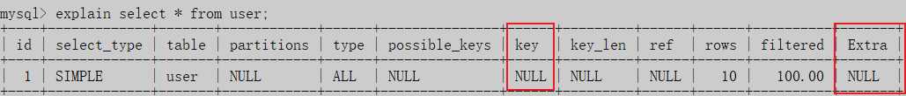

可以看到这里的 索引没有覆盖， 因为 * 是所有字段， 但是 phone password 这两个字段是没有索引的， 所以没有覆盖索引。


```sql
 explain select id,username from user;
```

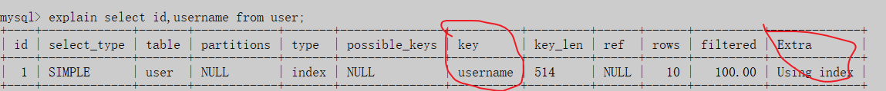

这里使用了索引，因为 查询的列 都建立了索引。


#### 第三部分 事务


##### 1.ACID是什么？可以详细说一下吗？

- `原子性(Atomicity)`: 事务开始后所有操作, 要么全部做完,要么全部不做,不可能停滞在 中间环节. 如果事务执行过程中出错,会回滚到事务开始前的状态.
- `一致性(Consistency)`: 事务开始前和结束后,数据库的完整性约束没有被破坏.   
- `隔离性(Islation)`: 同一时间,只允许一个事务请求同一数据,不同的事务之间彼此没有干扰
- `持久性(Durability)`: 事务完成之后,事务对数据库的所有更新 将被保存到数据库中,不能回滚  


##### 2.并发事务带来的问题有哪些？

并发事务带来的**问题**一般有以下三种: 

- `脏读`：事务A 读取了事务 B 更新的数据， 但是 B 进行了回滚， 那么 事务A 读取的数据就是脏数据.

- `不可重复读`：事务A 多次读取 同一数据 data， 但是在 事务A 多次读取的过程中，事务B  对数据进行了修改并提交， 那么事务 A 就会发现 **多次读取的数据不一致**， 这就叫 不可重复读。

-   `幻读`:  事务 A 读取 某个数据, 但是事务B 对这个数据进行 **添加** n 条记录 或者 **删除** n 条记录, 

    事务A 完成之后,就会发现刚才怎么还有 几条记录 没处理,刚才明明处理过了, 就像是出现了幻觉 一样, 叫做幻读

| 类别       | 描述                                                         |
| :--------- | :----------------------------------------------------------- |
| 脏读       | 事务A 读取了事务B 更新的数据, 但是 B 进行了回滚, 那么 事务A 读取的数据就是脏数据. |
| 不可重复读 | 事务A 多次读取同一数据,事务 B 在事务A 多次读取的过程中, 对数据进行了**修改**并提交, 那么事务A 就会发现多次读取的数据不一致, 这就叫做 不可重复读 |
| 幻读       | 事务 A 读取 某个数据,但是事务B 对这个数据进行 **添加** n 条记录或者 **删除** n 条记录, 事务A 完成之后,就会发现刚才怎么还有 几条记录 没处理,刚才明明处理过了, 就像是出现了幻觉一样, 叫做幻读 |

**小结**: 不可重复读和幻读 很容易混淆,不可重复读侧重于修改,幻侧重于删除.


##### 3.怎么解决并发事务带来的问题？Mysql默认隔离级别是？

上面说了, 有这些并发问题. 那么怎么解决? 默认的隔离级别是 ：**读已提交**

**MySql 的事务隔离级别**: 

- **读未提交**: 事务A 可以读取 事务B 还未进行提交的数据

- **读已提交**: 事务A 可与读取 事务B 已经提交的数据 
  - 解决脏读

- **可重复读**: 事务 A 读取 一个资源, 然后 事务 B  修改了这个数据资源, 并且提交,但是 事务A 读到的 却不是 事务B 更新完的数据, 而是更新前的数据. 只有当 事务A 中进行了 insert delete update 操作的时候,才会更新数据. （可以理解为缓存） 
  - 解决了不可重复读 但是会产生 幻读

- **串行化**: 当事务 A 开启事务的时候, 其他事务 无法开启. 就相当于上锁了.所有的事务都是 串行的.   


| 类型       | 原因                                                         | 解决-事务级别 |
| ---------- | ------------------------------------------------------------ | ------------- |
| 脏读       | 事务B 还没有提交的时候, 事务A 就已经读取了数据               | 读已提交      |
| 不可重复读 | 多次读取的数据不一致, 因为别人在我读的过程中更新并提交了数据 | 可重复读      |
| 幻读       | 别人在我读的时候进行了插入或者删除                           | 串行化        |

##### 4.什么是mvcc （多版本并发事务控制）

[轻松理解MYSQL MVCC 实现机制_杨龙飞的博客的博客-CSDN博客_mvcc机制](https://blog.csdn.net/whoamiyang/article/details/51901888)


#### 第四部分 分库分表

 

##### 1.Mysql大表如何优化

##### 2.如何实现数据库水平拆分

**关于 分库分表**

当数据量过大时，单台机器无法存储， 需要对数据库进行拆分。有两种拆分方式，
垂直拆分和水平拆分
垂直拆分 可以分为 垂直分库 和 垂直分表

**垂直分库** 

- 以表为基准，将不同的表拆分到不同的数据库中
- 每个表的结构都不一样
- 表中的数据也不一样
- 所有库的并集是全量数据库

**垂直分表**

- 以字段为依据，根据字段的属性不同，拆分到不同的表中。
- 每个表的结构不一样
- 每个表的数据也不一样
- 所有表的并集是全量数据库

**水平拆分 也可以分为水平分库 和 水平分表**

****

**水平分库**

- 按照一定的策略，将一个库，拆分到多个库当中，
  例如： 我的每个库的每张表 我可以放 原来的库的 每张表的 每 20%。 也就是将标的一部分记录 拆到一个数据库中。
  - 所有库的表的结构都是一样的
  
  - 所有库的数据都是不一样的
  
  - 所有的库的并集是全量数据库

**水平分表 **    

- 按照一定的策略 将一个表的数据拆分到多个表中

  - **例如** ： 原来的表A 有 100 条数据， 我可以把它拆分到 五个表中, 每张表放 20 条记录

  - 每张表的结构都一样

  - 每张表的数据不一样  

**那么问题就来了， 我在插入数据的时候， 应该插入到那个数据 库/表， 我在查找的时候怎么查找 ?**

- 我们可以直接使用 取模 的方式。
  这里虽然解决了 选择数据库的方式，其实真正的业务 当中，还有很多步骤， 这样就对服务器增加很多压力。对于 业务代码 也不是很好。 所以我们可以使用一个中间件来 帮我们 控制这些事情。
  **解决方式**： 
- 可以使用 `mycat `来解决。 
      `mycat` : 数据库分库分表的 中间件


##### 3.Mysql分库分表的原则


#### 第五部分 主从复制模型


##### 1.Mysql 主从赋值原理？

假如我们有一张 数据量特别大的  表， 如果 一个 数据库既要负责读操作又要负责写操作， **并发**压力是很大的，很容易就会崩溃。

**为了解决这个 读写 并发的问题**

那么我们的解决方案是 `主从架构-读写分离`

我们有 1 个 Master 机器 和 n 个 Slave 机器. 

- Master 负责写， Slave 会从 Master 那里同步数据， 然后 外部只能从 Slave 这里读。

##### 2.主从复制原理流程

主从赋值原理流程也很简单：

上面我们说了， 当我们的数据量很大的时候， 单台服务器无法同时满足 读 和 写 的需求， 所以我们采用了 一主 多从的读写分离架构， 但是问题是数据如何尽可能的保证一致性呢？

当 Master 的数据发生改变（data change）， 也就是发生 增删改 操作时， 

我们将 修改的新数据 写入 `binlog `（就是把所有的 修改的数据变成 二进制日志）,

然后当 Slaves 来进行数据同步的时候， 会开启一个 `IOThread` 去读取 `binlog` , 写入到一个 `relay log `中

然后 slave 再开启开启一个 SQLThread 来进行读取 relay log 中的数据写入到数据库中。  


#### 第六部分 Mysql 优化

**优化的步骤**：

 一般情况下 ， 应该是先用 海量的 数据去进行测试 ， 测试的时候发现 我们的 sql 有问题， 这个时候再去优化， 而不是在 开发项目写 sql 的时候就进行 优化。

 

##### 2.Sql优化方案

###### 一些基本的规则:

> [(8条消息) SQL优化思路及步骤_clcl456456的博客-CSDN博客_sql优化的方法及思路](https://blog.csdn.net/clcl456456/article/details/116088800)
>
> 1. 避免全表扫描 `select * from table;`
> 2.  应尽量避免在 where 子句中对字段进行 null 值判断: `select id from t where num is null` ,  这样将导致引擎放弃使用索引而进行全表扫描; NULL对于大多数数据库都需要特殊处理，MySQL也不例外，它需要更多的代码，更多的检查和特殊的索引逻辑，有些开发人员完全没有意识到，创建表时NULL是默认值，但大多数时候应该使用NOT NULL，或者使用一个特殊的值，如0，-1作为默 认值。
> 3. 应尽量避免在 where 子句中使用`!=`或`<>`操作符, 否则将引擎放弃使用索引而进行全表扫描。 MySQL只有对以下操作符才使用索引：`<，<=，=，>，>=，BETWEEN，IN`
> 4. 应尽量避免在 where 子句中使用 or 来连接条件;`select id from t where num=10 or num=20`; 应该使用 UNION合并查询： `select id from t where num=10 union all select id from t where num=20`
> 5. 应尽量避免在 where 子句中对字段进行表达式操作 `select id from t where num/2=100`;应改为: ` select id from t where num=100*2`
> 6. 应尽量避免在where子句中对字段进行函数操作，
> 7. 索引字段不是复合索引的前缀索引;


###### 可以查看 sql 的执行频率： 

```sql
show status like 'Com_______';
```


这样就可以看到 那种类型的操作执行的比较多。 例如， select 的操作 远远高于 insert , update, delete 那么我们的存储引擎就可以考虑 MyIsam 

###### 定位低效率的Sql 

```sql
show processlist;
```

这个命令是用来查看当前 Mysql 正在进行的线程，包括线程的状态。

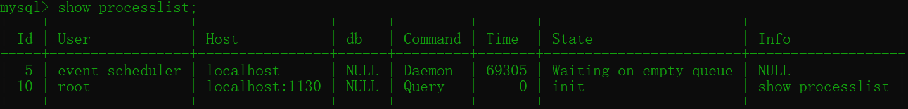

 

| 列名    | 含义                                                         |
| ------- | ------------------------------------------------------------ |
| ID      | 用户登录mysql时，系统分配的"connection_id"，可以使用函数connection_id()查看 |
| user    | 显示当前用户。如果不是root，这个命令就只显示用户权限范围的sql语句 |
| host    | 显示这个语句是从哪个ip的哪个端口上发的，可以用来跟踪出现问题语句的用户 |
| db      | 显示这个进程目前连接的是哪个数据库                           |
| command | 显示当前连接的执行的命令，一般取值为休眠（sleep），查询（query），连接（connect）等 |
| time    | 显示这个状态持续的时间，单位是秒                             |
| state   | 显示使用当前连接的sql语句的状态，很重要的列。state描述的是语句执行中的某一个状 态。一个sql语句，以查询为例，可能需要经过copying to tmp table、sorting result、sending data等状态才可以完成 |
| info    | 显示这个sql语句，是判断问题语句的一个重要依据                |


###### explain分析执行计划

语法： 

```sql
explain sql语句
例如： 
explain select * from dept;
```


通过以上步骤查询到效率低的 SQL 语句后，可以通过 `EXPLAIN`或者 `DESC`命令获取 MySQL如何执行

SELECT 语句的信息，包括在 SELECT 语句执行过程中表如何连接和连接的顺序。

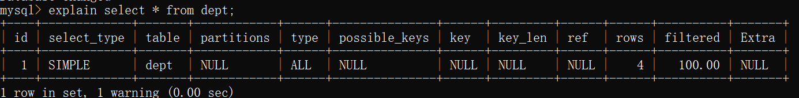


每个列的含义

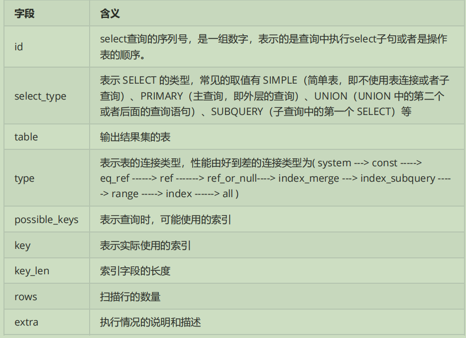


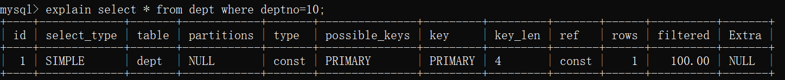


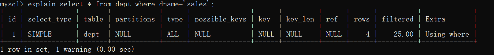

上面的两个例子， 第一个是按照主键查询， 第二个是按照 姓名查询

但是我们通过 explain 命令连接到 第一个按照主键查询 是使用了索引的（ key = primary） 第二个 没有使用索引 是一个全表扫描。

这是因为 主键默认是建立了索引的 ，而 dname 没有建立索引


#### SqL优化方案总结： 

我们可以先通过 **explain** ,**show profile**, **trace** 命令来 进行分析sql ， 执行的各项指标

###### explain 

- explain 可以查看 我们关心的一些指标， 比如 

  - **select 查询的序列号（id）**：可以反映语句 执行的顺序

    - 三种情况：

      1. `id 相同`  表示加载表的顺序是从上到下。

      2. `id 不同`  id值越大，优先级越高，越先被执行 

      3. `id 有相同，也有不同，同时存在`： id相同的可以认为是一组，从上往下顺序执行；在所有的组中，

         id的值越大，优先级越高，越先执行。

  - **索引覆盖的情况(key)**  

    - 有三个相关的指标：
      1. `possible_keys` : 显示可能应用在这张表的索引， 一个或多个。
      2. `key` ： 实际使用的索引， 如果为NULL， 则没有使用索引。 
      3. `key_len` : 表示索引中使用的字节数， 该值为索引字段最大可能长度，并非实际使用长度，在不损失精确性的前提下， 长度越短越好 。

  - **访问类型（type）：**

    - 这个取值有很多我们只说几种：

      1. `all` ： 将遍历全表以找到匹配的行 （扫描全表，效率最低）

      2. `index`: index 与 ALL的区别为 index 类型只是遍历了索引树， 通常比ALL 快， ALL 是遍历数

         据文件。

      3. `range` : 只检索给定返回的行，使用一个索引来选择行。一般是 where 之后出现 between ， < , > , in 等操作。

      4. `ref`: **非唯一性索引扫描**，返回匹配某个单独值的所有行。本质上也是一种索引访问，返回所

         有匹配某个单独值的所有行（多个）

      5. `eq_ref`: `类似ref，区别在于使用的是唯一索引`，使用主键的关联查询，关联查询出的记录只有

         一条。常见于主键或唯一索引扫描

      6. `const` : 表示通过索引一次就找到了，const 用于比较 primary key 或者 unique 索引。

         1. 因为只匹配一行数据，所以很快。
         2. 如将主键置于where列表中，MySQL 就能将该查询转换为 一个常量。const 于将 "主键" 或 "唯一" 索引的所有部分与常量值进行比较

    - **扫描的行（rows）**

      - 扫描行的数量

    - **额外的执行计划（extra）** 

      - `using filesort`: 说明mysql会对数据使用一个外部的索引排序，而不是按照表内的索引顺序进行读

        取， 称为 `**“文件排序”**`, **效率低**。

      - `using temporary`: **使用了 临时表 保存中间结果**，MySQL在对查询结果排序时使用临时表。常见于 `order by` 和 `group by`； **效率低**

      - `using index`: 表示相应的select操作使用了覆盖索引， 避免访问表的数据行， 效率不错。 

######  **show profile 命令 分析sql**

`show profiles` 能够在做SQL优化时 **帮助我们了解时间都耗费到哪里去了**。

这个其实是还挺简单的：

常用的命令：

```sql
select @@have_profiling; 查看当前数据库是否支持 profiling
select @@profiling;  查看当前状态 0 是关闭， 1 是开启， 默认是关闭的。
set profiling=1;    设置 profiling 的值；
show profiles; 查看每个语句的耗时
show profile for query query_id  可以看到该SQL执行过程中 每个线程的状态和消耗的时
间： 
select profile [all/cpu/block io/context switch/page faults] for query query_id;
在获取到最消耗时间的线程状态后，MySQL支持进一步选择 all、cpu、block io 、context switch、
page faults等明细类型类查看MySQL在使用什么资源上耗费了过高的时间。
```

1. select @@have_profiling; 查看当前数据库是否支持 profiling

   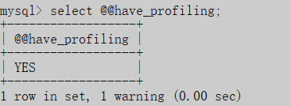

2. select @@profiling;  查看当前状态 0 是关闭， 1 是开启， 默认是关闭的。

   

3. set profiling=1;    设置 profiling 的值；

   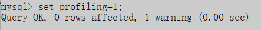

4. show profiles; 查看每个语句的耗时

    

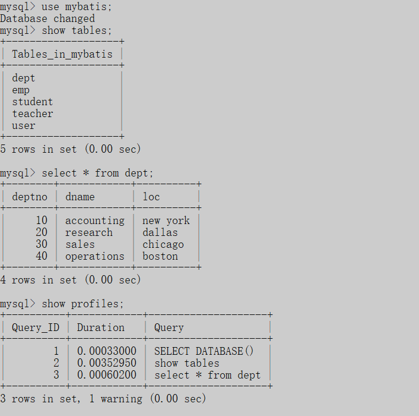

5. 通过show profile for query query_id 语句可以查看到该SQL执行过程中每个线程的状态和消耗的时

间：


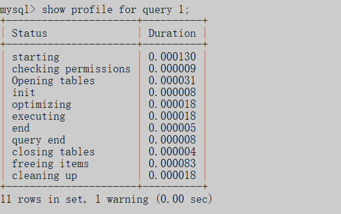

6. 在获取到最消耗时间的线程状态后，MySQL支持进一步选择all、cpu、block io 、context switch、

page faults等明细类型类查看MySQL在使用什么资源上耗费了过高的时间。例如，选择查看CPU的耗费

时间 ：


###### trace

MySQL5.6提供了对SQL的跟踪trace, 通过trace文件能够进一步了解为什么优化器选择A计划, 而不是选

择B计划。

打开trace ， 设置格式为 JSON，并设置trace最大能够使用的内存大小，避免解析过程中因为默认内存

过小而不能够完整展示。

```sql
SET optimizer_trace="enabled=on",end_markers_in_json=on; 

set optimizer_trace_max_mem_size=1000000; 
```


执行sql 语句

```sql
select * from tb_item where id < 4;
```


最后， 检查 `information_schema.optimizer_trace`就可以知道MySQL是如何执行SQL的 ：

```sql
select * from information_schema.optimizer_trace\G;
```


##### 3.关心过业务系统里面的sql耗时吗？统计过慢查询吗？对慢查询都怎么优化过？


##### 4.如何优化sql?

1. 用`PreparedStatement`，一般来说比`Statement`性能高：一个sql 发给服务器去执行，涉及步骤：

   - 语法检查
   - 语义分析 
   - 编译
   - 缓存

2. `有外键约束会影响插入和删除性能`，如果程序能够保证数据的完整性，那在设计数据库时就**去掉外键**。 

3. 表中`允许适当冗余`，譬如，主题帖的回复数量和最后回复时间等 

4. UNION ALL 要比UNION快很多，所以，如果可以确认合并的两个结果集中不包含重复数据且不需要排序时的话，那么就使用UNION ALL。 

   `UNION和UNION ALL关键字都是将两个结果集合并为一个，但这两者从使用和效率上来说都有所不同`:

   1. 对重复结果的处理：UNION在进行表链接后会筛选掉重复的记录，Union All不会去除重复记录。  
   2. 对排序的处理：Union将会按照字段的顺序进行排序；UNION ALL只是简单的将两个结果合并后就返回。 

##### 5.使用过explain查看执行计划吗？

那么就总结一下 explain 的相关知识点吧。

explain --- id

id 字段是 select查询的序列号，是一组数字，表示的是查询中执行select子句或者是操作表的顺序。id

情况有三种:

1. **id 相同表示加载表的顺序是从上到下** 

```sql
explain select * from t_role r, t_user u, user_role ur where r.id = ur.role_id and u.id = ur.user_id ;
```

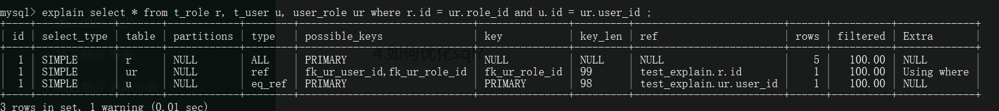


2. **id 不同id值越大，优先级越高，越先被执行。**

```sql
EXPLAIN SELECT * FROM t_role WHERE id = (SELECT role_id FROM user_role WHERE user_id = (SELECT id FROM t_user WHERE username = 'stu1'))
```

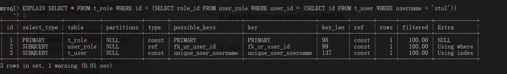

id 值 是1 2 3，  id 值越大 优先级越高， 也就是说， 执行顺序：

3： `SELECT id FROM t_user WHERE username = 'stu1'`

2: `SELECT role_id FROM user_role WHERE user_id =(..)`

1: `SELECT * FROM t_role WHERE id =(..(..))`


3. **id 有相同，也有不同，同时存在。id相同的可以认为是一组，从上往下顺序执行；在所有的组中，**

**id的值越大，优先级越高，越先执行。**

```SQL
EXPLAIN SELECT * FROM t_role r , (SELECT * FROM user_role ur WHERE ur.`user_id` = '2') a WHERE r.id = a.role_id ;
```

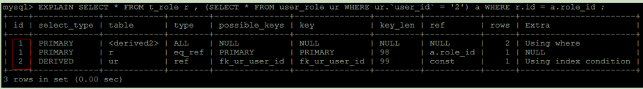

##### 6.mysql语句执行的顺序

from 和 WHERE 子句从后往前执行。因此我们 应该在 最后面的子句 写 过滤效率最高的子句，可以提高效率 

##### 7.count(1)和count(*)的比较

count(1)和count(*)的区别
		count(1)，其实就是计算一共有多少符合条件的行。1并不是表示第一个字段，而是表示一个固定值。我们可以想成表中有这么一个字段，这个字段就是固定值1，count(1)，就是计算一共有多少个1.。同理，count(2)、count(3)，得到的值完全一样，count('x')，count('y')都是可以的。一样的理解方式。在你这个语句理都可以使用，返回的值完全是一样的。就是计数。
      count(*)，执行时会把星号翻译成字段的具体名字，效果也是一样的，不过多了一个翻译的动作，比固定值的方式效率稍微低一些。

     如果你的数据表没有主键，那么count(1)比count(*)快
      如果有主键的话，那主键（联合主键）作为count的条件也比count(*)要快
      如果你的表只有一个字段的话那count(*)就是最快的，不过两者的差别不大

##### 8.delete\truncate\drop的区别

delete 属于数据库操纵语言DML，表示删除表中的数据。

DELETE语句执行删除的过程是每次从表中删除一行，并且同时将该行的删除操作作为事务记录在日志中保存以便进行进行[回滚](https://so.csdn.net/so/search?q=回滚&spm=1001.2101.3001.7020)操作。

delete 既可以对table也可以对view，可以全部删除，也可以按条件删除

drop 属于数据库定义语言DDL，表示删除表， 也可以用来删除数据库。

truncate 属于数据库定义语言DDL，表示删除表中所有数据。TRUNCATE 语句为我们提供了一种快速、有效地删除表所有行的方法。并且 TRUNCATE 是一个 DDL 语句，不会产生任何回滚信息。执行 TRUNCATE 会立即提交，而且不能回滚。
TRUNCATE 语句并不影响与被删除的表相关联的任何结构、约束、触发器或者授权


