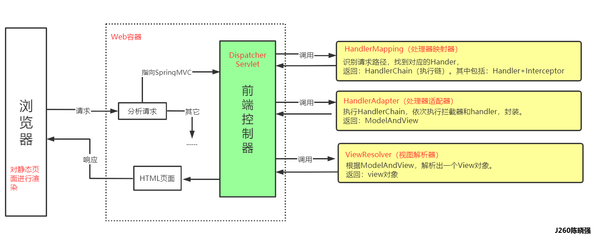
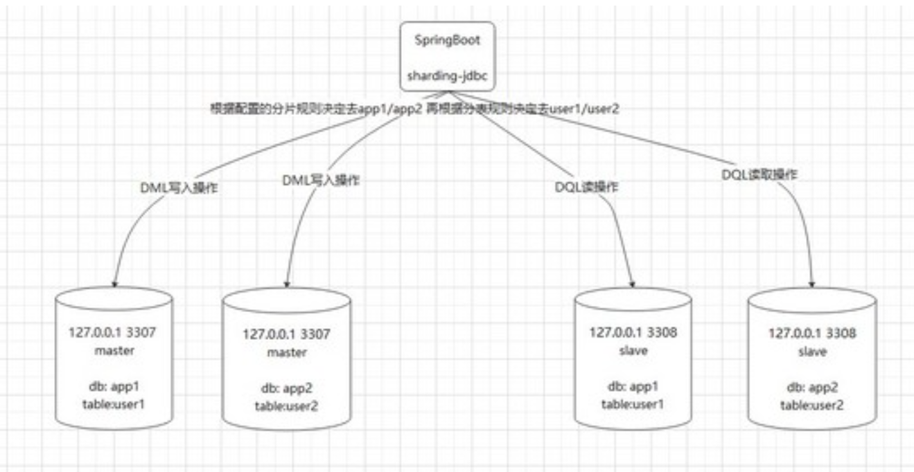
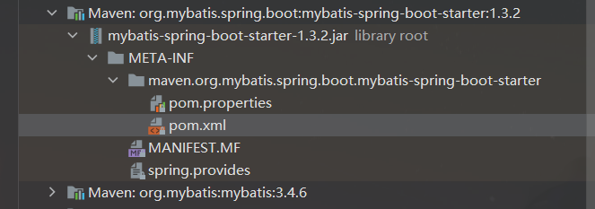
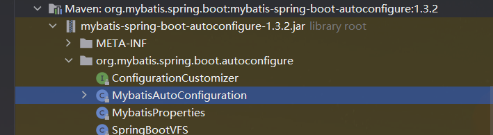

# SpringBoot 常见面试题


[这里也有一些面试题可以看一下]: https://cloud.tencent.com/developer/article/1544240


### Spring mvc 




### 1,什么是springboot? springboot 有什么优点?

**简介:**  Spring Boot 是 Spring 开源组织下的子项目，是 Spring 组件一站式解决方案，主要是简化了使用 Spring 的难度，简省了繁重的配置，提供了各种启动器，开发者能快速上手。

**优点:**

- 简化配置
  - 首先是他简化了 搭建 spring 环境的各种配置,使用 **约定大于配置** 的思想来帮助开发人员快速的搭建一个企业级的 spring 程序,因为开发人员只需要引入starters , spring boot 就可以自动依赖所有的相关依赖.简化了 maven 的配置.
- 独立运行
  - Spring Boot而且内嵌了各种servlet容器，Tomcat、Jetty等，现在不再需要打成war包部署到容器中，Spring Boot只要打成一个可执行的jar包就能独立运行，所有的依赖包都在一个jar包内。
- 自动配置
  - Spring Boot能根据当前类路径下的类、jar包来自动配置bean，如添加一个spring-boot-starterweb启动器就能拥有web的功能，无需其他配置。
- 无代码生成和XML配置
  - Spring Boot配置过程中无代码生成，也无需XML配置文件就能完成所有配置工作，这一切都是借助于条件注解完成的，这也是Spring4.x的核心功能之一。
- 应用监控
  - Spring Boot提供一系列端点可以监控服务及应用，做健康检测。

### 2, springBoot 的核心注解?

##### @SpringBootApplication

- 这是Spring主类上最最最核心的注解，用于 自动化配置文件，表示这是一个SpringBoot项目，用于开启 SpringBoot 的各项能力。

  相当于

  - **@SpringBootConfigration**  : `@Configuration`注解的变体，只是用来修饰Spring Boot的配置而已。
    - `@Configuration`: 用来代替applicationContext.xml 配置文件，所有这个配置文件里面能做到的事情都可以通过这个注解所在的类来进行注册。

  - **@EnableAutoConfiguration:**  
    - 允许 SpringBoot 自动配置注解，开启这个注解之后，SpringBoot就能根据当前类路径下的包或者类来配置Spring Bean。
    - 例如: 当前路径下有MyBatis这个Jar包，MyBatisAutoConfiguration 注解就能根据相关参数来配置Mybatis的各个Spring Bean。

  - **@ComponentScan** 
    - Spring 3.1添加的一个注解，用来代替配置文件中的component-scan配置，开启组件扫描，自动扫描包路径下的`@Component`注解进行注册 bean实例放到context(容器)中。

  *******

  

##### @ResponseBody

- `@ResponseBody ` 标记的控制方法，会将方法返回值通过springboot默认的转换器进行转换，然后附加在响应体中，最后IO回写给调用方 ：
  `@ResponseBody` 若标记在控制**类**上，则相当于对该类中所有的控制方法全部标记该注解。
  `@ResponseBody` 标记的控制**方法**不使用视图解析器，即不进行**页面的跳转**。

##### @**RequestMapping**

- 配置方法URL。

##### @RestController

- `@RestController` 整合了 `@Controller` 和 `@ResponseBody` 两个注解
- 这个注解 的作用就是: 
  - 会将方法返回值通过springboot默认的转换器进行转换，然后附加在响应体中，最后IO回写给调用方,并且不会进行页面的跳转
  - 加入 spring 的管理

##### @**RequestParam**

- 控制方法允许直接使用 `@RequestParam` 标记的形参来接收请求参数

##### @PathVariable

- 控制方法允许直接使用 `@PathVariable` 标记的形参来接收请求头中的路径参数。

##### @RequestHeader

- 控制方法允许直接使用 `@RequestHeader` 标记的形参来接收请求头中的指定参数。

##### @CookieValue

-  控制方法允许直接使用 `@CookieValue` 标记的形参来接收请求中的Cookie参数

### springBoot自动化配置原理?

> **结论:**
>
> `@SpringBootApplication`等同于下面三个注解：
>
> - `@SpringBootConfiguration`
> - `@EnableAutoConfiguration`
> - `@ComponentScan`
>
> 其中`@EnableAutoConfiguration`是关键(启用自动配置)，
>
> 内部实际上就去加载`META-INF/spring.factories`文件的信息，然后筛选出以`EnableAutoConfiguration`为key的数据，加载到IOC容器中，实现自动配置功能！

> **详解:** 
>
> 我们在搭建 springboot 环境的时候, 除了spring boot  的依赖之外, 就是在main 方法上面挂了一个`@SpringBootApplication` 的注解,然后我们的springboot 程序就可以跑起来了.这个注解里面包含三个重要的注解: 
>
> - `@SpringBootConfiguration`：我们点进去以后可以发现底层是**Configuration**注解，说白了就是支持**JavaConfig(配置类)** 的方式来进行配置(**使用Configuration配置类等同于XML文件**)。
> - `@EnableAutoConfiguration`：开启**自动配置**功能(后文详解)
> - `@ComponentScan`：这个注解，学过Spring的同学应该对它不会陌生，就是**扫描**注解，默认是扫描**当前类下**的package。将`@Controller/@Service/@Component/@Repository`等注解加载到IOC容器中。
>
> ###### 重点`EnableAutoConfiguration`
>
> 我们知道SpringBoot可以帮我们减少很多的配置，也肯定听过“约定大于配置”这么一句话
>
> 那SpringBoot是怎么做的呢？其实靠的就是`@EnableAutoConfiguration`注解。
>
> 简单来说，这个注解可以帮助我们**自动载入**应用程序所需要的所有**默认配置**。
>
> 这个注解点进去可以发现这两个注解: 
>
> - `@AutoConfigurationPackage`：自动配置包
> - `@Import`：给IOC容器导入组件
>
> 点进 `@AutoConfigurationPackage` 里面发现还是 `@Import`
>
> 进入到 `@Import` 里面查看发现最核心的代码: 
>
> ```java
> @Override
> public void registerBeanDefinitions(AnnotationMetadata metadata,
>         BeanDefinitionRegistry registry) {
>     register(registry, new PackageImport(metadata).getPackageName());
> }
> ```
>
> 在**默认**的情况下就是将：主配置类(`@SpringBootApplication`)的所在包及其子包里边的组件扫描到Spring容器中。
>
> 也许你会问:这个不就是 ComponentScan的功能吗？
>
> 比如说，
>
> - 你用了Spring Data JPA，可能会在实体类上写`@Entity`注解。这个`@Entity`注解由`@AutoConfigurationPackage`扫描并加载，
>
> - 而我们平时开发用的`@Controller/@Service/@Component/@Repository`这些注解是由`ComponentScan`来扫描并加载的。
>
> 他们的区别: 同样是扫描包 但是**他们 扫描的对象是不一样**的。
>
> 

### 服务器运行Springboot 项目一般有哪些方式?

>springboot项目运行有两种方式，一种是`jar`包(官方推荐)，一种是`war`包。
>
>jar包 : 相对简单,直接使用 springboot 内置的tomcat 服务器就可以运行
>
>war包: 需要部署到单独的tomcat 服务器上. 

### SpringBoot 读取配置的三种方式?

>- @Value : 是比较常见的注入方式，功能强大但一般可读性较差。
>
>- Environment	: 通过注入获取Environment对象，然后再获取定义在配置文件的属性值：
> 
>  - ```java
>    @Resource    
>                               private Environment environment;
>          
>    public void getAttrByEnvironment() {
>          String property = environment.getProperty(SPRING_BOOT_HELLO);
>          System.out.println("2-1. 通过注入Environment获取值: " + property);
>        }
>    ```
>   
>- 使用`@ConfigurationProperties`注解映射到`bean`中，定义一个User对象里面有`name`和`age`属性，在配置文件里使用`spring.user`作为`prefix`，为`User`增加对应注解即可
>
>详情请点击 : https://cloud.tencent.com/developer/article/1343830

### 请谈谈对 SpringBoot 和 SpringCloud 的理解

[(2条消息) SpringBoot和SpringCloud的区别？归纳理解_凌晨四点#的博客-CSDN博客_springboot和springcloud](https://blog.csdn.net/weixin_44852524/article/details/108528093)

### 保护SpringBoot 应用有哪些方法?

答案:   https://cloud.tencent.com/developer/article/1461871

>**1、** 在生产中使用HTTPS
>
>**2、** 使用Snyk检查你的依赖关系
>
>- 官网地址：https://app.snyk.io/org
>  在现在的开发中，不管是用什么语言，什么技术栈，我们都会用到很多的开源框架和包。从安全角度讲，这也变相的等于说我们信任陌生的开发者，信任其安全技术水平和相信他没有恶意。在关键业务系统中，仅凭信任肯定不靠谱的。**Snky就是用来检查你的依赖包安全漏洞的工具，确保你放心引用各种开源依赖包到你的工程**
>
>**3、** 升级到最新版本
>
>**4、** 启用CSRF保护 (https://tech.meituan.com/2018/10/11/fe-security-csrf.html) (推荐看一下)
>
>- 防护策略
>
>  ```java
>  ------------------------------**什么是CSRF**-------------------------------------  
>  CSRF（Cross-site request forgery）跨站请求伪造：攻击者诱导受害者进入第三方网站，在第三方网站中，向被攻击网站发送跨站请求。利用受害者在被攻击网站已经获取的注册凭证，绕过后台的用户验证，达到冒充用户对被攻击的网站执行某项操作的目的。
>  --------------------------------CSRF 的特点 ------------------------
>  - 攻击一般发起在第三方网站，而不是被攻击的网站。被攻击的网站无法防止攻击发生。
>  - 攻击利用受害者在被攻击网站的登录凭证，冒充受害者提交操作；而不是直接窃取数据。
>  - 整个过程攻击者并不能获取到受害者的登录凭证，仅仅是“冒用”。
>  - 跨站请求可以用各种方式：图片URL、超链接、CORS、Form提交等等。部分请求方式可以直接嵌入在第三方论坛、文章中，难以进行追踪
>  ---------------------------------**** 策略 **** ---------------------------
>  上文中讲了CSRF的两个特点：
>  
>  - CSRF（通常）发生在第三方域名。
>  - CSRF攻击者不能获取到Cookie等信息，只是使用。
>  
>  针对这两点，我们可以专门制定防护策略，如下：
>  
>  - 阻止不明外域的访问
>    - 同源检测
>    - Samesite Cookie
>  - 提交时要求附加本域才能获取的信息
>    - CSRF Token
>    - 双重Cookie验证
>  ```
>
>  
>
>**5、** 使用内容安全策略防止XSS攻击


### SpringBoot 使用sharding-jdbc 实现主从分离是否了解过?

>**sharding-jdbc**
>
>增强版 的JDBC驱动，客户端使用的时候，就像正常使用JDBC驱动一样， 引入Sharding-JDBC依赖包，连接好数据库，配置好分库分表规则，读写分离配置，然后客户端的sql 操作 Sharding-JDBC会自动根据配置完成 分库分表和读写分离操作。
>
>**主从分离**
>
>当一个数据库无法承载我们的需求的时候, 我们可以使用分库分表的方式让 数据库的压力分摊到多个数据库中, 然后每个数据库(主库)又可以搭配多个从节点(从库)
>
>**读写分离**：读写分离 在我们这里主要指的是 我们项目DQL会根据Sharding-JDBC配置的master-slave-rule (主从规则)走的3308的数据源，而项目的DML会根据master-slave-rule走3307的数据源



具体操作:  https://blog.csdn.net/gp16674213804/article/details/121039501

### Springboot 项目如何 配置 Nginx 负载均衡?

分别在不同的项目中配置 server.port  

```java
spring.application.name=nginx-01
server.port=13001
# session的存储方式设置为redis
spring.session.store-type=redis

# redis配置
spring.redis.host=localhost
spring.redis.port=6380    

```

```java
spring.application.name=nginx-02
server.port=13002
# session的存储方式设置为redis
spring.session.store-type=redis

# redis配置
spring.redis.host=localhost
spring.redis.port=6380    
```

然后在ngnix 中配置上面的服务集群的端口号

```java
http {
    include       mime.types;
    default_type  application/octet-stream;
    
    
	upstream apps{
		server 127.0.0.1:13001 weight=1;
		server 127.0.0.1:13002 weight=1;
	}
}

```


此时，用户的请求会被随机均分到不同的服务器，但是此时如果用户在A服务器登录成功，然后访问的时候被分配到了B服务器，会发现在访问的时候session不存在，造成不好的用户体验。

因此有一种常用得session共享方式是把session放到一台单独的redis服务器中，在访问之前首先请求redis服务器去拿session信息. 要在 springboot 的pom 文件中添加依赖整合redis

```xml
  <!--spring-boot-starter-data-redis-->
        <dependency>
            <groupId>org.springframework.boot</groupId>
            <artifactId>spring-boot-starter-data-redis</artifactId>
        </dependency>

        <!--spring-boot-starter-data-redis-->
        <dependency>
            <groupId>org.springframework.session</groupId>
            <artifactId>spring-session-data-redis</artifactId>
        </dependency>
```


### Spring Boot 默认的缓存技术和使用 Redis 缓存的优缺点?

>- Spring cache是代码级的缓存，他一般是使用一个ConcurrentMap。也就是说实际上还是是使用JVM的内存来缓存对象的，
>  - 优点: 使用方便
>  - 缺点:  会造成大量的(`jvm`)内存消耗, 在集群环境下缓存无法同步
>- Redis 作为一个缓存服务器，是内存级的缓存。它是使用单纯的内存来进行缓存
>
>*********
>
>- ###### **sprirng cache+redis的好处:** 
>
>  -  那么Spring cache +redis的好处显而易见了。既可以很方便的缓存对象，同时用来缓存的内存的是使用redis的内存，不会消耗JVM的内存，提升了性能。当然这里Redis不是必须的，换成其他的缓存服务器一样可以，只要实现Spring的Cache类，并配置到XML里面就行了
>
>  ###### 集群环境下的springcache+redis
>
>  集群环境下，每台服务器的spring cache是不同步的，这样会出问题的，spring cache只适合单机环境
>
>  redis是设置单独的缓存服务器，所有集群服务器统一访问redis，不会出现缓存不同步的情况
>
>  spring cache是很早就有的东西，现在+redis是为了顺应时代，更好的兼容集群环境，加强保留spring cache功能，不如直接使用redis
>
>  

### SpringBoot 如何实现异步执行?

SpringBoot为我们提供了很多使用便利，我们只需要一个@Enablexxx注解 + 功能注解，便能轻松简单的实现功能，比如异步调用和定时任务。

```java
@EnableAsync
@SpringBootApplication
public class SpringBootApp {
    public static void main(String[] args) {
        SpringApplication.run(SpringBootApp.class, args);
    }
}
```

- 使用`@EnableAsync` 开启异步: 
  - @EnableAsync 注解主要是为了扫描范围包下的所有 @Async注解

- 然后在我们的异步任务类或者方法上标记` @Async注解` 即可

**好处**: 通过异步处理，可以先释放容器分配给请求的线程与相关资源，减轻系统负担，从而增加了服务器对客户端请求的吞吐量。但并发请求量较大时，通常会通过负载均衡的方案来解决，而不是异步。

```java
@Slf4j
@Component
@Async
public class AsyncTask {

    /**
     * 无返回值的异步任务：模拟耗时3秒
     *
     * @return 异步方法，即使无返回值，也要返回Future<Void>类型
     */
    @SneakyThrows
    public Future<Void> taskA() {
        TimeUnit.SECONDS.sleep(3);
        log.info("taskA()执行完毕..");
        return new AsyncResult<>(null);
    }

    /**
     * 有返回值的异步任务：模拟耗时4秒
     *
     * @return 异步结果
     */
    @SneakyThrows
    public Future<String> taskB() {
        TimeUnit.SECONDS.sleep(4);
        log.info("taskB()执行完毕..");
        return new AsyncResult<>("taskB()数据");
    }
}。
```


### springboot 的启动过程?

>`SpringBoot`应用程序的启动流程主要包括`初始化SpringApplication`和`运行SpringApplication`两个过程。
>
>- 其中初始化`SpringApplication`包括配置基本的环境变量、资源、构造器和监听器，为运行`SpringApplciation`实例对象作准备；
>- 而运行`SpringApplication`实例为应用程序正式启动加载过程，包括
>  - `SpringApplicationRunListeners ` 引用启动监控模块、
>  - `ConfigrableEnvironment`配置环境模块和监听
>  - `ConfigrableApplicationContext`配置应用上下文。
>
>当完成刷新应用的上下文和调用`SpringApplicationRunListener#contextPrepared`方法后表示`SpringBoot`应用程序已经启动完成。


### 如何理解 SpringBoot 的 starter?

​	Starters 可以理解为启动器，它包含了一系列可以集成到应用里面的依赖包，
你可以一站式集成 Spring及其他技术，而不需要到处找示例代码和依赖包。
如你想使用Spring JPA访问数据库，只要加入springboot-starter-data-jpa启动器依赖就能使用了。Starters包含了许多项目中需要用到的依赖，它们能快速持续的运行，都是一系列得到支持的管理传递性依赖

### SpringBoot启动机制（starter机制）核心原理详解

先说结论: 

注解 

- `@EnableAutoConfiguration`: 让 自动配置生效
  -  给容器导入jar 包中的`META-INF/spring.factories` 里定义的自动配置类,

- ` @Configuration` + `@ Bean`:    基于Java代码的bean配置
  - 用来代替 xml 配置文件: 来配置各种属性
- ` @ConditionalOnClass` 
  - 条件注解: 用来筛选出 有效的自动配置类

我们可以将自动配置的关键几步以及相应的注解总结如下：

- @Configuration&与@Bean------>>>基于java代码的bean配置
- @Conditional-------->>>>>>设置自动配置条件依赖
- @EnableConfigurationProperties与@ConfigurationProperties->读取配置文件转换为bean。
- @EnableAutoConfiguration、@AutoConfigurationPackage 与@Import-> 实现bean发现与加载。


###### 引言: 

如果我们要开发一个 spring web 程序,我们可能会做下列工作:

1. pom文件中引入相关jar包，包括spring、springmvc、redis、mybaits、log4j、mysql-connector-java 等等相关jar …
2. 配置web.xml，Listener配置、Filter配置、Servlet配置、log4j配置、error配置 …
3. 配置[数据库](https://cloud.tencent.com/solution/database?from=10680)连接、配置spring事务
4. 配置视图解析器
5. 开启注解、自动扫描功能
6. 配置完成后部署tomcat、启动调试 ……
7. 等等

光是搭建一个初始项目，可能一个小时或者半天就过去了，但是用了SpringBoot之后一切都会变得非常便捷，下面我们首先来分析一下SpringBoot的**起步依赖**以及**自动配置**。

##### 起步依赖

###### 1.在我们的pom文件里面引入以下jar：

```xml
<?xml version="1.0" encoding="UTF-8"?>
<project xmlns="http://maven.apache.org/POM/4.0.0"
         xmlns:xsi="http://www.w3.org/2001/XMLSchema-instance"
         xsi:schemaLocation="http://maven.apache.org/POM/4.0.0 http://maven.apache.org/xsd/maven-4.0.0.xsd">
    <modelVersion>4.0.0</modelVersion>

    <parent>
        <groupId>org.springframework.boot</groupId>
        <artifactId>spring-boot-starter-parent</artifactId>
        <version>2.3.1.RELEASE</version>
        <relativePath /> <!-- lookup parent from repository -->
    </parent>
    <groupId>org.example</groupId>
    <artifactId>TestStarter</artifactId>
    <version>1.0-SNAPSHOT</version>
    <name>demo</name>
    <description>Demo project for Spring Boot</description>

    <properties>
        <java.version>1.8</java.version>
    </properties>

    <dependencies>
        <!--测试包 -->
        <dependency>
            <groupId>org.springframework.boot</groupId>
            <artifactId>spring-boot-starter-test</artifactId>
            <scope>test</scope>
        </dependency>

        <!--mybatis 开发包 -->
        <dependency>
            <groupId>org.mybatis.spring.boot</groupId>
            <artifactId>mybatis-spring-boot-starter</artifactId>
            <version>1.3.2</version>
        </dependency>
        <!--springboot web模块支持 -->
        <dependency>
            <groupId>org.springframework.boot</groupId>
            <artifactId>spring-boot-starter-web</artifactId>
        </dependency>
        <dependency>
            <groupId>mysql</groupId>
            <artifactId>mysql-connector-java</artifactId>
            <scope>runtime</scope>
        </dependency>
    </dependencies>

    <build>
        <plugins>
            <plugin>
                <groupId>org.springframework.boot</groupId>
                <artifactId>spring-boot-maven-plugin</artifactId>
            </plugin>
        </plugins>
    </build>
</project>
```


然后我们点进 任意 starter 的 META-INF中, 发现里面没有源码,只有一个 pom 文件



所以他的作用就是用来帮我们引入 jar 包.

stater机制帮我们完成了项目起步所需要的的相关jar包。

那问题又来了，传统的spring应用中不是要在 application.xml 中配置很多bean的吗，比如 dataSource的配置，transactionManager的配置 … springboot是如何帮我们完成这些bean的配置的？

这是我们的`application.properties` 属性文件

```properties
## 项目端口-project port
server.port=5277
## 项目名-project name
spring.application.name=javabook-03-lesson
## 驱动串-drive string
## 连接串-connection string
## 账号-username
## 密码-password
## 连接池-connection pool
spring.datasource.driver-class-name=com.mysql.cj.jdbc.Driver
spring.datasource.url=jdbc:mysql://localhost:3306/lesson?serverTimezone=UTC
spring.datasource.username=lesson
spring.datasource.password=lesson
spring.datasource.type=com.alibaba.druid.pool.DruidDataSource
```

#### 三、自动配置

##### 1.基于java代码的bean配置

以mybatis为例,我们发现mybatis-spring-boot-starter这个包帮我们引入了mybatis-spring-boot-autoconfigure这个包，如下图：



我们发现里面有 MybatisAutoConfiguration 这个类, 这是 mysatis自动配置类. 

他的脑袋上挂了这些注解: 

有 `@Configuration` 和  `@EnableConfigurationProperties(MybatisProperties.class)` 

```java
// 根据数据源创建一个 SqlSessionFactory
  @Bean
  @ConditionalOnMissingBean
  public SqlSessionFactory sqlSessionFactory(DataSource dataSource) throws Exception {
      //省略细节...
    return factory.getObject();
  }
```

我们可以看到 在这个类上挂了 一些注解: 

```java
@org.springframework.context.annotation.Configuration : 这是一个鱼缸(spring容器)
@ConditionalOnClass({ SqlSessionFactory.class, SqlSessionFactoryBean.class }) : 
// 条件注解, 只有当类路径上存在 SqlSessionFactory.class, SqlSessionFactoryBean.class, 的时候,才会实例化这个bean
    
@ConditionalOnBean(DataSource.class)
@EnableConfigurationProperties(MybatisProperties.class)
@AutoConfigureAfter(DataSourceAutoConfiguration.class)        
```

然后在里面的方法上 挂了 `@Bean ` : 声明这是一个 bean , spring 容器 会帮我们管理

```java
  @Bean
  @ConditionalOnMissingBean
  public SqlSessionFactory sqlSessionFactory(DataSource dataSource) throws Exception {
    return factory.getObject();
  }
```

因此,`@Configuration + @Bean` 这两个注解就可以 让我们使用 基于Java代码的配置类 来代替 xml配置文件. 

**@Configuration注解的类可以看作是能生产让Spring IoC**[**容器**](https://cloud.tencent.com/product/tke?from=10680)**管理的Bean实例的工厂。** **@Bean注解告诉Spring，一个带有@Bean的注解方法将返回一个对象，该对象应该被注册到spring容器中。**

从`MybatisAutoConfiguratio`这个类中使用的注解可以看出，要完成自动配置是有依赖条件的

##### 2, 自动配置条件依赖

###### 条件注解表

| 注解                            | 详情                                                  |
| :------------------------------ | :---------------------------------------------------- |
| @ConditionalOnBean              | 仅在当前上下文中存在某个bean时，才会实例化这个Bean。  |
| @ConditionalOnClass             | 某个class位于类路径上，才会实例化这个Bean。           |
| @ConditionalOnExpression        | 表达式为true的时候，才会实例化这个Bean。              |
| @ConditionalOnMissingBean       | 仅在当前上下文中不存在某个bean时，才会实例化这个Bean  |
| @ConditionalOnMissingClass      | 某个class在类路径上不存在的时候，才会实例化这个Bean。 |
| @ConditionalOnNotWebApplication | 不是web应用时才会实例化这个Bean                       |
| @AutoConfigureAfter             | 在某个bean完成自动配置后实例化这个bean                |
| @AutoConfigureBefore            | 在某个bean完成自动配置前实例化这个bean。              |

所以要完成Mybatis的自动配置，

- 需要在类路径中存在SqlSessionFactory.class、SqlSessionFactoryBean.class这两个类，
- 需要存在DataSource这个bean且这个bean完成自动注册。

##### 3.参数的获取

到此我们已经知道了bean的配置过程，但是还没有看到springboot是如何读取yml或者properites配置文件的的属性来创建数据源的?

在DataSourceAutoConfiguration类里面，我们注意到使用了EnableConfigurationProperties这个注解。

而在 DataSourceProperties 中封装了数据源的各种属性,并且 @ConfigurationProperties 指定了前缀\

**因此:** 

- `@ConfigurationProperties`注解的作用是把 yml 或者 properties 配置文件转化为bean。
- `@EnableConfigurationProperties`注解的作用是使@ConfigurationProperties注解生效。
  - 如果只配置`@ConfigurationProperties`注解，在spring容器中是获取不到yml或者properties配置文件转化的bean的。

- 通过这种方式，把yml或者properties配置参数转化为bean

这些bean又是如何被发现与加载的

##### 4.Bean的发现

springboot 默认扫描启动类所在的包下的主类与子类的所有组件，**但并没有包括依赖包的中的类**，那么依赖包中的bean是如何被发现和加载的？

我们通常在启动类中加@SpringBootApplication这个注解，点进去看

- **@Configuration**（@SpringBootConfiguration里面还是应用了@Configuration）
- **@EnableAutoConfiguration**
- **@ComponentScan**

> - `@Configuration`的作用上面我们已经知道了，被注解的类将成为一个bean配置类。
>
> - `@ComponentScan`的作用就是自动扫描并加载符合条件的组件，比如`@Component`和`@Repository`等，最终将这些bean定义加载到spring容器中。
>
> - `@EnableAutoConfiguration` 这个注解的功能很重要，借助`@Import`的支持，收集和注册依赖包中相关的bean定义。
>  - `@EnableAutoConfiguration`注解引入了`@AutoConfigurationPackage`和`@Import`这两个注解。
>   
>    -  `@AutoConfigurationPackage`的作用就是自动配置的包，
>     - `@Import`导入需要自动配置的组件。
> 
>

```java
protected List<String> getCandidateConfigurations(AnnotationMetadata metadata, AnnotationAttributes attributes) {
		List<String> configurations = SpringFactoriesLoader.loadFactoryNames(getSpringFactoriesLoaderFactoryClass(),
				getBeanClassLoader());
		Assert.notEmpty(configurations, "No auto configuration classes found in META-INF/spring.factories. If you "
				+ "are using a custom packaging, make sure that file is correct.");
		return configurations;
	}

```

进入 AutoConfigurationImportSelector类，我们可以发现SpringFactoriesLoader.loadFactoryNames方法调用loadSpringFactories方法**从所有的jar包中读取META-INF/spring.factories文件信息。**

##### 5.Bean 加载

如果要让一个普通类交给Spring容器管理，通常有以下方法：

- 使用 @Configuration与@Bean 注解
- 使用@Controller @Service @Repository @Component 注解标注该类，然后启用@ComponentScan自动扫描
- 使用@Import 方法

**springboot中使用了@Import 方法**

@EnableAutoConfiguration注解中使用了@Import({AutoConfigurationImportSelector.class})注解，AutoConfigurationImportSelector实现了DeferredImportSelector接口，

DeferredImportSelector接口继承了ImportSelector接口，ImportSelector接口只有一个selectImports方法。

selectImports方法返回一组bean，@EnableAutoConfiguration注解借助@Import注解将这组bean注入到spring容器中，springboot正式通过这种机制来完成bean的注入的。

## 四、总结

>我们可以将自动配置的关键几步以及相应的注解总结如下：
>
>- @Configuration&与@Bean------>>>基于java代码的bean配置
>- @Conditional-------->>>>>>设置自动配置条件依赖
>- @EnableConfigurationProperties与@ConfigurationProperties->读取配置文件转换为bean。
>- @EnableAutoConfiguration、@AutoConfigurationPackage 与@Import->实现bean发现与加载。

