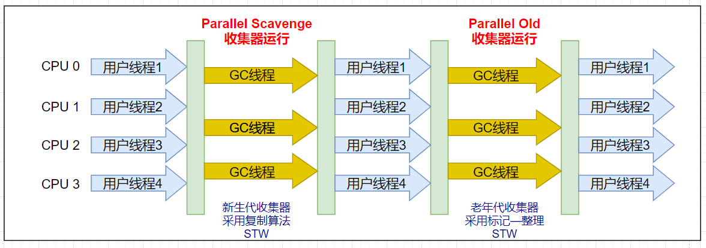
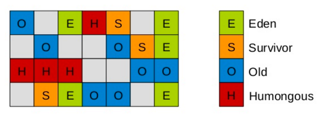

# JVM 笔记

## 类加载


#### 类加载器

1. `BootStrapClassLoader`(启动类加载器) : 负责加载java 的核心类库: lib\rt.jar等
2. `ExtensionClassLoader`(扩展类加载器) : 加载扩展类库 : JAVA_HOME\lib\ext等
3. `ApplicationCalssLoader`(应用程序加载器) : 加载用户路径下ClassPath下的类包
4. `用户自定义加载器`: 加载用户自定义的包下的类(例如: Tomcat)

#### 类加载的生命周期


**加载:** 通过io读入字节码文件(`.class`)

“加载”过程主要是靠类加载器实现的，包括用户自 定义类加载器。类加载过程的一个阶段，ClassLoader通过一个类的完全限定名查找此类字节码文件，并利用字节码文件创建一个`Class对象`(**这也是类加载的终极目的**)。

**连接(可分为三个步骤):**

- **验证**: 目的在于确保class文件的字节流中包含信息符合当前虚拟机要求，不会危害虚拟机自身的安全，主要包括四种验证：`文件格式的验证`，`元数据的验证`，`字节码验证`，`符号引用验证。`
- **准备**:为static成员分配内存 1.7之前在方法区中,1.7之后在堆中,并且初始化 0 值
- **解析**:把常量池中的符号引用 -->  直接引用.

**初始化**:这是类加载的最后阶段: `调用类初始化方法`的过程，完成对 `static 修饰的类变量的`手动赋值还有主动调用静态代码块。如果该类具有父类就进行对父类进行初始化，执行其静态初始化器（静态代码块）和静态初始化成员变量。（前面已经对static 初始化了默认值，这里我们对它进行赋值，成员变量也将被初始化）

然后就是: **使用**和**卸载**了

****

#### 双亲委派机制

##### 源码

```java
public Class<?> loadClass(String name) throws ClassNotFoundException {
        return loadClass(name, false);
    }
    //              -----??-----
    protected Class<?> loadClass(String name, boolean resolve)
        throws ClassNotFoundException
    {
            // 首先，检查是否已经被类加载器加载过
            Class<?> c = findLoadedClass(name);
            if (c == null) {
                try {
                    // 存在父加载器，递归的交由父加载器
                    if (parent != null) {
                        c = parent.loadClass(name, false);
                    } else {
                        // 直到最上面的Bootstrap类加载器
                        c = findBootstrapClassOrNull(name);
                    }
                } catch (ClassNotFoundException e) {
                    // ClassNotFoundException thrown if class not found
                    // from the non-null parent class loader
                }
 
                if (c == null) {
                    // If still not found, then invoke findClass in order
                    // to find the class.
                    c = findClass(name);
                }
            }
            return c;
    }
```

##### 流程图


##### 概念:

首先,三种JAVA提供的三种类加载器是一个层级关系,如上图,

当一个类被加载的时候,我们会按照这个层级关系来依次检查每一层的类是否需要加载,(已经加载就不需要加载加载了),从 AppClassLoader -> ExtClassLoader -> BootstrapClassLoader,当bootstrapClassLoader 被检查完之后才会开始按照之前的结果逐层加载,类似与递归的过程,如果都加载不了们就会抛异常:`ClassNotFoundException`。 

##### 沙箱安全机制:

其实双亲委派机制,体现了`沙箱安全机制`的理念,这样做的好处就是:

- 如果有人想替换系统级别的类,比如 :String.java。篡改它的实现，在这种机制下这些系统的类已经被Bootstrap classLoader加载过了,就不会加载用户自己写的 String.java,这样就防止了危险代码的植入.
- 避免了重复加载

###### 如何打破双亲委派机制?

```txt
不按照正经流程走类加载顺序就打破了。
    破坏的话，自定义一个类加载器，重写loadClass方法，不让他双亲委派。
    tomcat得类加载器就是不重写的类加载器打破的双亲委派。因为一个tomcat里可能有很多工程，不同的工程可能引用一个jar包的不同版本，默认双亲委派无法加载多个相同类。所以tomcat提供了隔离机制，给每个web容器提供一个WebAppClassLoader，每个项目都有自己的类加载器，重写了loadClass方法，优先加载当前目录下的类
```


***

## JVM分区模型


*******

1. **堆区**: 初始化的对象,成员变量(非静态变量) , 所有的实例对象和数组都要在堆上分配.
2. **方法区**:  主要是存储类信息,常量池,编译后的代码(字节码文件)等数据.
3. **虚拟机栈**: 栈的结构是栈帧组成的.调用一个方法就压入一帧,
   - `帧` 上面存储 **局部变量表**,**操作数栈**,**方法出口等信息**. 局部变量表存放的是 8 大 基础类型加上一个引用类型,所以还是指向地址的指针.
4. **本地方法栈:** 主要为 Native 方法服务 
5. **程序计数器**: 记录当前线程执行的行号

***

#### 本地方法栈:

通过本地方法接口（Java Native Interface JNI），调用跟本地方法库(存放通过C或C++操作CPU\内存等方法)，本地方法库中的方法，可以是C，C++,python等其他语言的方法，方法运行产生的数据会保存在本地方法栈中

#### PC寄存器（程序计数器）

在JVM规范中，每个线程都有它自己的程序计数器，是线程私有的，生命周期与线程的生命周期保持一致。任何时间一个线程都只有一个方法在执行，也就是所谓的当前方法。**程序计数器会存储当前线程正在执行的Java方法的JVM指令地址**；或者，如果是在执行native方法，则是未指定值（undefned）。

它是程序控制流的指示器，分支、循环、跳转、异常处理、线程恢复等基础功能都需要依赖这个计数器来完成。字节码解释器工作时就是通过改变这个计数器的值来选取下一条需要执行的字节码指令。

#### 方法区

**** 

`方法区`属于共享内存区域，存储已被虚拟机加载的类信息、常量、静态变量、即时编译器 编译后的代码等数据。 

`运行时常量池`：属于方法区一部分，用于存放编译期生成的各种**字面量**和**符号引用**。编译器和运行期(String 的 intern() )都可以将常量放入池中。内存有限，无法申请时抛出OutOfMemoryError。 

`直接内存`：非虚拟机运行时数据区的部分 OutOfMemory


**从方法区(PermGen)到元空间(Metaspace)**


#### 虚拟机栈


每一个正在执行的方法都会在虚拟机栈中被分配一块空间(**栈帧**),每一个线程都会在虚拟机栈中有一个独立的空间.

因此:虚拟机栈,程序计数器,本地方法栈都是线程私有的.堆和方法区是线程共享的 

栈帧中包含了: **局部变量表**，**操作数栈**，**动态链接**，**返回出口**、**附加信息**

**动态链接**：每个栈帧内部都包含一个指向运行时常量池中该栈帧所属的方法的引用。

- Java源文件被编译到字节码文件时，所有**变量和方法都会引用为符号引用**，保存在class文件的常量池中。
- **动态链接的作用** : 就是为了将这些符号引用转换为方法的直接引用
- 如果调用一个方法，有静态绑定和动态绑定
  - 静态绑定，是在**编译时**，明确知道该调用的方法的字节码是谁，在哪（private final static）
  - 动态绑定，在编译时，不知道调用的具体方法体是哪个，在**运行时才知道**
- 动态链接 找到方法区中的运行时 常量池中的 method ref 找到对应方法的方法表，通过方法表里的引用找到具体方法字节码存在的地址

#### 堆区

堆：对于绝大多数应用来说，这块区域是 JVM 所管理的内存中最大的一块。 线程共享，主要是存放**对象实例和数组**。 内部会划分出多个线程私有的分配缓冲区(Thread Local Allocation Buffer, TLAB)。可以位于物理上不连续的空间，但是逻辑上要连续。

## 垃圾回收常用算法

#### 垃圾判断算法:

**引用计数法**: 无法解决循环引用的问题.

- 循环引用: 是指堆中的两个对象互相引用,但是从栈中却没有只想他们的引用. 

**可达性分析算法** : 

- 通过一系列称为 “GC Roots” 的对象作为起始点，从这些节点开始向下搜索，搜索走过的路径称为“引用链”，当一个对象到 GC Roots 没有任何的引用链相连时(从 GC Roots 到这个对象不可达)时，证明此对象不可用。

- 在Java语言中，可作为**GC Roots**的对象包含以下几种：
  - 虚拟机栈(栈帧中的本地变量表)中引用的对象。遍历虚拟机栈，将变量指向的堆中的对象作为CG ROOT
  - 方法区中静态属性引用的对象
  - 方法区中常量引用的对象
  - 本地方法栈中(Native方法)引用的对象

#### 垃圾收集算法

1. **标记-清除法:**

   其实就是先将垃圾进行标记,然后在进行清理.,但是这样最大的问题就是 **内存碎片**:

   等我们回收完，内存就会切成了很多段。我们知道开辟内存空间时，需要的是连续的内存区域，这时候我们需要一个2M的内存区域，其中有2个1M是没法用的。这样就导致，其实我们本身还有这么多的内存的，但却用不了

2. **复制算法**: 

   为了解决标记-清除法的内存碎片的问题.它将可用内存按容量划分为大小相等的两块，每次只使用其中的一块。当这一块的内存用完了，就将还存活着的对象复制到另外一块上面，然后再把已使用过的内存空间一次清理掉。

   - 保证了内存的连续可用，内存分配时也就不用考虑内存碎片等复杂情况。
   - 但坏处也是显而易见的，就是**直接损失了一半的可用内存**。

3. **标记- 整理法** : 

   - 算法标记过程仍然与标记-清除算法一样，但后续步骤不是直接对可回收对象进行清理，而是让所有存活的对象都向一端移动，再清理掉 端边界以外的内存区域。

   - 标记压缩算法解决了内存碎片的问题，也规避了复制算法只能利用一半内存区域的弊端。标记压缩算法对内存变动更频繁，需要整理所有存活对象的引用地址，**在效率上比复制算法要差很多**。

##### 分代收集算法 

- 一般是把Java堆分为`**新生代**`和`**老年代**`，这样就可以根据各个年代的特点采用最适当的收集算法。

  - **在新生代中**，每次垃圾收集时都发现有大批对象死去，只有少量存活，那就选用**复制算法**，只需要付出少量存活对象的复制成本就可以完成收集。
  - **在老年代中**，因为对象存活率高、没有额外空间对它进行分配担保，就必须使用**标记-清理算法**或者**标记-压缩**算法来进行回收。

- **分代算法的执行过程**:

  - **新生代中**:(`Minor GC`)

    新对象都创建在Eden区,当Eden区满了之后,就会触发 young GC/Minor GC(不同的叫法), 此时会将Eden区中存活的对象复制到 from 或者 to ,然后清空eden  

    有几种情况，对象会晋升到老年代：

    - 超大对象会直接进入到老年代（受虚拟机参数-XX:PretenureSizeThreshold参数影响，默认值0，即不开启，单位为Byte，例如：3145728=3M，那么超过3M的对象，会直接晋升老年代）

    - 如果from/to区已满，多出来的对象也会直接晋升老年代,此时eden区和from区都是垃圾对象，可以直接清除。

    - 复制15次(15岁)后，依然存活的对象，也会进入老年代

    - > PS：为什么复制15次(15岁)后，被判定为高龄对象，晋升到老年代呢？因为每个对象的年龄是存在对象头中的，对象头用4bit存储了这个年龄数，而4bit最大可以表示十进制的15，所以是15岁

- **老年代中**(Full GC)

  - Minor GC 前的准备工作: 在进行Minor GC之前，JVM还有一步操作，他会**检查新生代所有对象使用的总内存是否小于老年代最大剩余连续内存**，
    - 如果上述条件成立，那么这次Minor GC一定是安全的，因为即使所有新生代对象都进入老年代，老年代也不会内存溢出。
    - 如果上述条件不成立，JVM会查看参数 `-XX:HandlePromotionFailure`是否开启（JDK1.6以后默认开启），
      - 如果没开启，说明Minor GC后可能会存在老年代内存溢出的风险，会进行一次Full GC，
      - 如果开启，JVM还会**检查历次晋升老年代对象的平均大小是否小于老年代最大连续内存空间**，
        - 如果成立，会尝试直接进行Minor GC，
        - 如果不成立，老年代执行Major GC。

**Full GC** : 当 JVM堆空间不足的是否触发; 清理整个堆的垃圾包括新生代和老年代

- 可以分为几个过程:标记,清理,和内存碎片的整理. 

#### **垃圾收集器**


在很早以前，计算机内在只有几十M的时候，串行收集器基本上能满足使用，但随着硬件性能不断提高，内存大小和CPU运行速度的提升，在JVM发展的不同时期，诞生了针对当时计算机性能的垃圾回收器在G1以前，物理和逻辑上都进行了分代，即将堆分为年轻代和老年代，直到G1的出现，这种分代概念就愈发模糊了，因为G1收集器针对的是整堆的收集。

##### ** 基本概念 **

###### STW

Stop The World，当垃圾回收线程工作时，需要暂停当前的用户（业务）线程，这个过程称它为STW;

###### 串行收集

单线程收集器，简单高效，因为是单线程的原因，也就不会产生用户态和内核态切换所带来的开销；会产生 STW 

###### 并行收集

随着内存地不断增大，单CPU实现了多核的技术，通过多线程的方式收集垃圾可以极大地提升效率；会产生 STW 

###### 并发收集

指用户线程与垃圾收集线程同时工作（不一定是并行的可能会是交替执行）。用户程序在继续运行，而垃圾收集程序运行在另一个CPU上（多核CPU）(并发标记 和 并发清除 阶段不会产生STW)。**缺点**就是在垃圾回收的同时还会产生新的垃圾，有可能没有回收完，新的垃圾就把内存占满了，需要重新STW

##### Serial 收集器

- 串行收集器，它是最早诞生的垃圾回收器，以***单线程***的方式进行垃圾收集，在JVM刚出来的情况下，计算机内存与现在相比特别地小，**即便是串行回收，它的速度依然很快。**

- 特点：单线程、简单高效（与其他收集器的单线程相比），对于限定单个CPU的环境来说，Serial收集器由于没有线程交互的开销，专心做垃圾收集自然可以获得最高的单线程收集效率。
- 收集器进行垃圾回收时，必须暂停其他所有的工作线程，直到它结束（Stop The World）。
- 应用场景：小内存、单核CPU情况下的垃圾收集


##### ParNew 收集器

- ParNew收集器其实就是Serial收集器的**多线程版本**，除了使用多线程外其余行为均和Serial收集器一模一样（参数控制、收集算法、Stop The World、对象分配规则、回收策略等）

- 特点：多线程、ParNew收集器 默认开启的收集线程数与CPU的数量相同，在CPU非常多的环境中，可以使用`-XX:ParallelGCThreads`参数来限制垃圾收集的线程数。

- 和Serial收集器一样存在Stop The World问题
- 应用场景：ParNew收集器是许多运行在Server模式下的虚拟机中首选的**新生代收集器**，**因为它是除了Serial收集器外，唯一一个能与CMS收集器配合工作的。**


##### Parallel Scavenge 收集器

- 收集与吞吐量关系密切，故也称为**吞吐量优先收集器。**

- **吞吐量**：运行用户代码时间/（运行用户代码时间+垃圾收集时间）

- **特点**：属于**新生代收集器**也是采用复制算法的收集器，又是并行的**多线程收集器**（与ParNew收集器类似）。该收集器的目标是**达到一个可控制的吞吐量。**

- 还有一个值得关注的点是：**GC自适应调节策略**（与ParNew收集器最重要的一个区别）

- `GC自适应调节策略`：Parallel Scavenge收集器可设置 `-XX:+UseAdptiveSizePolicy`参数。

  - 当开关打开时不需要手动指定
    - 新生代的大小（-Xmn）、
    - Eden与Survivor区的比例（-XX:SurvivorRation）、
    - 晋升老年代的对象年龄（-XX:PretenureSizeThreshold）等，
  - 虚拟机会 根据系统的运行状况收集性能监控信息，**动态设置这些参数以提供最优的停顿时间和最高的吞吐量**，这种调节方式称为GC的自适应调节策略。
  - Parallel Scavenge收集器使用两个参数控制吞吐量：
    - XX:MaxGCPauseMillis 控制最大的垃圾收集停顿时间
    - XX:GCRatio 直接设置吞吐量的大小。

  **应用场景**: 用于大内存（大于2G）的垃圾收集

##### Serial Old 收集器

- Serial Old是Serial收集器的老年代版本。

- **特点**：同样是单线程收集器，采用`标记-整理`算法。
- 应用场景：主要也是使用在Client模式下的虚拟机中。也可在Server模式下使用。它在Server模式下主要的两大用途：
  - 在JDK1.5以及以前的版本中与Parallel Scavenge收集器搭配使用。
  - 作为CMS收集器的后备方案，在并发收集Concurent Mode Failure 时使用。Serial / Serial Old收集器工作过程图（Serial收集器图示相同）：

##### Parallel Old 收集器

- 它是Parallel Scavenge收集器的老年代版本。
- **特点**：多线程，采用**标记-整理算法**。
- **应用场景**：注重高**吞吐量**以及**CPU资源敏感**的场合，都可以优先考虑 Parallel Scavenge+Parallel Old **（PS + PO，JDK1.8默认）** 收集器。



##### 对比图

****

| 垃圾收集器        | 回收的对象 |  线程  |                      应用场景                       |                             特点                             |                             参数                             |   算法   |
| ----------------- | :--------: | :----: | :-------------------------------------------------: | :----------------------------------------------------------: | :----------------------------------------------------------: | :------: |
| Serial            |   新生代   | 单线程 |                   小内存,单核cpu                    |                 简单高效,专心回收垃圾 `STW`                  |                              无                              | 复制算法 |
| ParNew            |   新生代   | 多线程 | 许多运行在Server模式下的虚拟机中首选的新生代收集器  | Serial的多线程版本,它是除了Serial收集器外，唯一能与CMS收集器配合工作的。`STW` |          `-xxParallelGCThreads`限制垃圾收集的线程数          | 复制算法 |
| Parallel Scavenge |   新生代   | 多线程 |           用于大内存（大于2G）的垃圾收集            |                吞吐量优先收集器。可控制吞吐量                | `XX:+UseAdptiveSizePolicy`自适应调节策略,动态设置一些参数以提供**最优的停顿时间**和**最高的吞吐量** | 复制算法 |
| Serial Old        |   老年代   | 单线程 | 在Client模式下的虚拟机中,server中可以作为cms 的备选 |                     serial 的老年代版本                      |                              无                              | 标记压缩 |
| Parallel Old      |   老年代   | 多线程 |          注重高吞吐量以及CPU资源敏感的场合          |          PS 的老年代版本PS + PO JDK1.8默认收集器。           |                              无                              | 标记压缩 |


****

##### CMS收集器

- 一种**以获取最短回收停顿时间**为目标的收集器，用于**老年代的垃圾回收**;
- **特点**：基于`标记—清除`算法实现，与用户线程并发收集、并发清除，低停顿、低延时
- **应用场景**：适用于注重服务的响应速度，希望系统停顿时间最短，给用户带来更好的体验等场景下。如web程序、b/s服务。


###### CMS的四个阶段

**初始标记(STW)** 

- 标记`老年代中的所有GC Roots对象`
- 标记`年轻代中活着的对象引用到老年代的对象`（指的是年轻带中还存活的引用类型对象，引用指向老年代中的对象）

**并发标记**

- 进行GC Roots Tracing 的过程，找出存活对象 且与用户线程可并发执行。
- 从“初始标记”阶段标记的对象 开始找出所有存活的对象.  
- 因为是并发执行，在用户线程运行的时候，会发生 `新生代对象晋升到老年代`、或者是`更新老年代对象的引用关系`等等，对于这些新生成或改变的引用关系，可能会存在**漏标**，
- 所以就必须要进行下一阶段的“重新标记”，为了提高下了阶段重新标记的效率，该阶段会把上述对象所在的Card标识为Dirty，下一阶段只需扫描这些Dirty Card的对象，避免扫描整个老年代；
- 并发标记阶段**只负责将引用发生改变的Card标记为Dirty状态**，不负责处理。由于这个阶段是和用户线程并发执行的，可能会导致concurrent mode failure.如果出现了这个错误 就用`serial old`来进行处理 

**重新标记(STW)**

- 为了修正并发标记期间因用户程序继续运行而导致标记 产生变动的那一部分对象的标记记录。仍然存在Stop The World问题。
- 由于之前的预处理阶段是与用户线程并发执行的，这时候可能年轻代的对象对老年代的引用已经发生了很多改变，这个时候，remark阶段要花很多时间处理这些改变，会导致很长stop the word，所以通常CMS尽量在年轻代是足够干净的时候 运行Final Remark阶段。
- 另外，还可以开启并行收集：-XX:+CMSParallelRemarkEnabled，提高reMark效率
- 总结: **其实就是按照刚才上一阶段的标记(Dirty Card)进行重新标记,修正漏标的情况**

**并发清理:**

对标记的对象进行清除回收。通过以上3个阶段的标记，老年代所有存活的对象已经被标记并且现在要通过Garbage Collector采用清扫的方式回收那些不能用的对象了。这个阶段主要是清除那些没有标记的对象并且回收空间

**CMS的缺点:** 

1. 由于CMS**并发清理阶段**用户线程还在运行着，伴随程序运行自然就还会有新的垃圾不断产生，**这一部分垃圾出现在标记过程之后**，CMS无法在当次收集中处理掉它们，只好留待下一次GC时再清理掉。这一部分垃圾就称为“**浮动垃圾”**。
2. 内存碎片: 由于使用了标记清除算法，所以会产生内存碎片，通过参数`-XX:UseCMSCompactAtFullCollection`可以让JVM做完标记-清除之后再进行整理
3. 执行过程包含**不确定性**，**会存在上一次垃圾回收没有执行完，然后垃圾回收又被触发的问题**，特别是在并发标记 和并发清理阶段，一边回收系统一边运行，可能导致没有执行完成就再次出现FULL GC，产生"concurrent mode failure"，此时会进入SWT，用serial old垃圾收集器来进行回收

**********************

#### G1垃圾收集器(重点)

##### 几个基础概念

> G1是面向服务器的垃圾收集器,作为jdk1.9的默认垃圾回收器



###### region的概念

G1 把 java堆分成一个一个的region,每个region 可以扮演五种角色中的任何一种: eden, survicor, old, humongous, 还有未分配的区域.G1对于不同的区域采用不同的策略进行处理,这样无论是哪种对象,都能得到很好的收集效果.

**G1中五种不同类型的Region：**

1. Eden regions(年轻代-Eden区)
2. Survivor regions(年轻代-Survivor区)
3.  Old regions（老年代）
4. Humongous regions（巨型对象区域，通常也被认为是老年代的一部分，G1认为只要大小超过了一个Region容量一半的对象即可判定为大对象。） 
5. Free resgions（未分配区域，也会叫做可用分区）- 上图中空白的区域

> 还可以通过参数来设定region的大小: G1HeapRegionSize -- 但是他的取值必须满足:  1M - 32M  && 必须是2的 n次幂
>
> 而对于那些超过呢region 大小的超大对象,将会被放在N个来连续的Humongous region 中.

###### 特点:

**并行与并发**: 

- 并行:  就是能充分利用多Cpu多核环境的硬件优势,使用多个cpu来减少STW的时间
- 并发: 可以与用户线程一起工作.

**分代收集:**  G1能够独立管理整个堆,并且采用不同的策略去处理新创建的对象和已经存活了一段时间的对象,以及熬过15次的对象, 以便获得更好的收集效果

**空间整合:**  G1没有内存碎片

****

###### ***可预测的停顿(重点)**

-  G1可以建立可预测的停顿时间模型.能让使用者**明确指定**  : < 在 一个长度为M毫秒内,消耗在垃圾收集上的时间不能超过n毫秒 >

*那么这是怎么做到的呢?*

- 它可以通过一个Rset来避免扫描整个堆,并且用 TAMS 指针来动态的记录每个 region 的使用情况,可以根据region的收集价值进行排序.这样的话我们就可以在垃圾收集的时候选择那些回收价值高的region来回收,直到把规定的时间用完. 这样保证了在规定的时间内得到了尽可能高的收集效率.

  > 这个规定的时间可以通过  -XX:MaxGCPauseTime 参数来指定,默认是 200 ms

*******

###### **G1使用场景**:

- 面向服务端,大内存(6G以上),多核心处理器的机器. 
- [超过50%的java堆被活跃对象占用] [对象的分配频率或者年代晋升频率较高] [GC停顿时间长(0.5s-1s)] 的情况下,可以考虑用 G1来替换CMS

> 在Hotspot垃圾收集器中,除了G1之外,其他的来及收集器都是采用的jvm线程,而G1当jvm认为GC线程处理速度不理想的时候,可以调用引用线程来帮助进行垃圾回收

###### **G1和其他垃圾收集器的区别**: 

|       类别       |                   G1                    |              其他垃圾收集器              |
| :--------------: | :-------------------------------------: | :--------------------------------------: |
|     工作范围     |                 整个堆                  |           整个新生代或者老年代           |
|     分区方式     | 将整个堆分成大小相等的region,不需要连续 | 为每个年代分配固定大小的来连续内存的空间 |
| 分区之间是否隔离 |                 不隔离                  |                独立隔离的                |
|       线程       |           jvm线程 + 应用线程            |                 jvm线程                  |

******

##### **G1收集器的问题:**

一个分配在 region 中的对象,可能与任何region中的对象发生引用关系.

在采用可达性分析算法进行垃圾识别的时候就必须扫描整个java堆才能保证正确性.

###### **如何解决扫描整个堆的问题?**

**Remember Set** 可以解决.

> Remeber Set : 每个region中都有一个 R-set 用来记录谁引用了本 region 中的对象
>
> 还有另一种数据结构:
>
> Collection Set: C-set中记录的是要收集的region的集合,C-set 中的region可以是任一代的.
>
>  dirty card queue : 脏卡队列，再执行引用赋值语句时再写屏障中会将判断当前赋值是否跨代，如果跨代则将其对应的card标记为脏并加入dirty card queue中，后续会由其他线程异步处理更新到rset中。

###### 重点

当引用赋值的时候:会触发 ***写屏障函数***  来判断是否发生了跨代引用 . 如果跨代,我们就把把对应的card 标记为 dirty card, 并加入 dirty cart queue .后续会有其他线程异步更新的RSet中. 

在GC的时候，对于 *old-> young* 和 *old -> old* 的跨代对象引用，只要扫描对应的CSet中的RSet即可。

因此，RSet存在的意义就是**避免对象跨代引用时对整个堆内存对象的扫描**，起到一种类似索引（更像空间索引）的作用。

**什么是原始快照?**

> Snapshot At The Beginning 简称 SATB
>
> SATB是一种维持并发GC的手段, 因为CMS,和 G1 他们经过初始标记然后进行并发标记,在并发标记的过程中,可能会修改初始标记的结果,需要进行修正,CMS采用增量更新的方式进行修正,而G1则采用SATB(原始快照) 的策略

##### G1垃圾回收的过程

首先G1垃圾回收可以分成**三个阶段**:

- 新生代垃圾回收(回收 Eden区 + Survivor区)
- *新生代垃圾回收* 和 **老年代并发标记**
- 混合回收(年轻代和老年代)

官方文档中描述: 这三个过程时循环执行的.

****

###### 1, 新生代垃圾回收

> 1. 这个阶段的垃圾回收是并行的(多线程的),独占式的(Stop The World)的垃圾回收 . 
>
> 2. 可能会发生对象的晋升 : eden --> survivor , survivor --> old  
>
> 3. 垃圾回收的**时机** : 当**Eden区内存空间耗尽**的时候，G1会启动一次年轻代垃圾回收，**顺带**回收Survivor区。

**可以分成五个阶段**:

*在进行垃圾回收开始的时候(`G1 Young GC` ): 会先停止线程(STW) , 创建 回收集 (`Collection-Set: 需要被回收的内存分段集合包括 eden区和survivor 区`)* 

- **第一个阶段**:  扫描根(GC Roots),Gc Root 连同 R set 中记录的外部引用作为`可达性分析`的 入口.
- **第二个阶段**: 处理 dirty card queue 中的 card,(也就是发生了跨代引用的card) ,更新 R-set .处理完成之后,此时Rset 中就可以准确的表示老年代所在`region中的对象的引用`了.
- **第三个阶段**: 识别出被老年代对象指向的Eden区的新生代对象(是为了把他们排除在垃圾回收之外).
- **第四个阶段**: 使用`**复制算法** `把Eden 区存活的对象复制到Survivor 区,把Survivor 区存活的对象进行年龄判断(是否达到阈值(默认15)) : [ 达到的就复制到老年代] , [ 未达到的就年龄加 1]
- **第五个阶段:** 处理软引用 弱引用,虚引用,虚拟机引用,等等.

最终eden区清空,GC停止.

****

###### 2, 新生代垃圾回收和老年代的并发标记

> 当堆空间的内存占用达到阈值（-XX: InitiatingHeapOccupancyPercent，默认45%）就开始老年代的并发标记过程
>
> 这个过程是和用户线程并发执行的

**可以分成四个阶段**


- **初始标记阶段**:标记GC Roots 直接可达的对象,也就是直接引用关系(由于是直接可达,因此STW的时间很短) 此过程是单线程的.

  G1扫描Survivor 区直接可达的老年代区域对象,并标记被引用的对象.这个过程必须在Young GC之前完成,因为Young GC会操作survivor区的对象 

- **并发标记阶段(Concurrent Marking)**: 在整个堆中进行并发标记  (与线程并发执行) ,需要注意的是:

  - 这个过程可能会被Young GC打断,因为在并发标记阶段中,若发现某些region中所有对象都是垃圾,那么这个region会被立刻回收.
  - 同时在并发标记的过程中,会计算每个region对象的活性(该region中存活对象的比例,G1垃圾回收的时候并不是所有的region都参与回收,而是按照回收价值的高低来排序,在指定的时间内,尽可能的选择价值高的回收)

- **再次标记阶段(remark)** :  由于上个阶段是收集器线程和用户线程并发执行的, 有可能产生漏标,误标的情况,需要对标记结果 进行修正 (需要STW). G1采用SATB(Snapshot-at-the-beginning)初始快照算法 (三色标记法) 来完成.

- 独占清理：计算各个region的存活对象和GC回收比例，并进行排序（回收价值高低排序），识别可以混合回收的区域。**为下阶段做铺垫，**会发生STW**。需要注意的是这个阶段实际上并不会做垃圾的回收。**

- **并发清理阶段:** 识别并清理标记完成的区域    

###### 三色标记法: 

> 黑色表示已经完成扫描的region
>
> 灰色表示被发现了但是没有进行扫描的region
>
> 白色表示还未被发现的region
>
> 需要注意的是,永远不会出现 黑色直接指向白色的情况.
>
> 这样从GC Roots 扫面完成之后,白色的就是不可达的对象,标记为垃圾
>
> 但是有一个Bug : 
>
> 原本一个灰色A 的指向一个白色 B,由于某些原因,线程停止,Application让灰色的 A 不在指向白色的 B,然后让一个黑色的C指向这个白色的 A.那么当线程继续的时候就会出现错误,因为此时黑色直接指向了白色.
>
> 我们采用写屏障函数来进行解决这个问题: 当发现引用赋值操作的时候,触发写屏障函数,记录旧的引用指向的对象会以及他的子孙会被标记下来这样就不会漏标了,当然如果他本就是垃圾,那么只能等到下一次再处理了(浮动垃圾)

****

###### 3, 混合回收

> 包括年轻代和老年代的垃圾回收.
>
> 标记完成之后,马上开始垃圾的回收.对于一个混合的回收过程,G1会将老年代中存活的对象移动到空闲区,这些空闲区立刻就变成了old region.
>
> 但越来越多的对象晋升到老年代的时候,为了避免内存被耗尽,就会触发混合垃圾垃圾回收.这不是一个old gc 也不是 young gc 除了回收整个年轻代之外还会回收一部分old region.

- 在并发标记结束之后,老年代中能够完全确认为垃圾的region的内存分段就被回收了,部分为垃圾的region的分段也被计算出来了.默认情况下,老年代内存分段会被分为8 次回收.(可以通过`XX:G1MixedGCCountTarget`参数设置)
- 混合回收的会收集包括1/8的老年代分段,eden区内存分段,survivor 内存分段.使用复制算法进行回收
  - 混合回收不一定有8次,可以设置一个参数阈值(-XX:G1HeapWastePercent),默认10% .表示允许10%的内存可以浪费.当发现回收的垃圾的比例小于这个阈值,就不进行垃圾回收了,因为复制对象的时间对于得到的较少的内存释放来说,不划算.
- 由于老年代的内存分段默认分为8次回收，G1会优先回收垃圾多的内存分段，垃圾占内存分段比例越高的会优先被回收。并且有一个阈值决定内存分段是否被回收：-XX:G1MixedGCLiveThresholdPercent，默认为65%，代表垃圾占内存分段比例要达到65%来回被回收，如果垃圾占比太低，意味着存活的对象多，复制算法就会花费更多的时间区复制存活的对象。

*****

最后,在必要的情况下 ,会触发 FULL GC:

- 对象分配速度远大于回收速度
- 堆内存太小
- 在复制存活对象的时候没有空闲的内存分段可用

都会触发Full GC,但是Full GC 是单线程的 并且会尽力比较长的 STW 所以成本很高.


 
