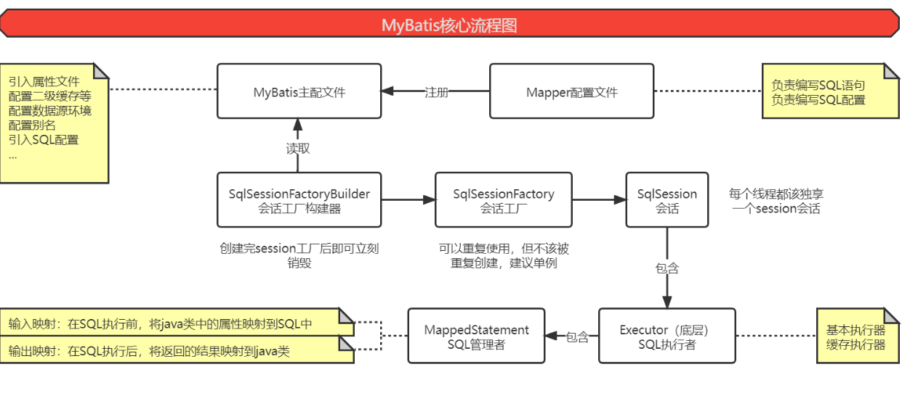
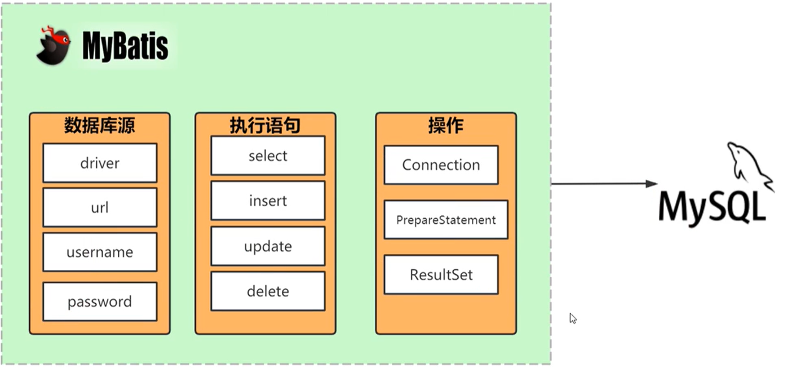
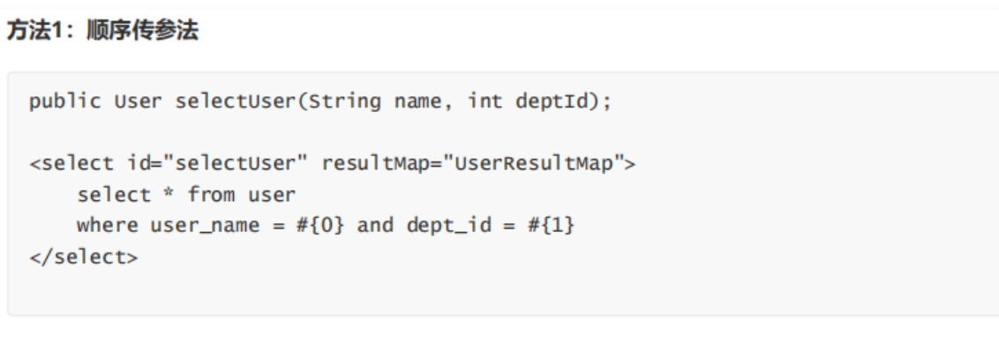
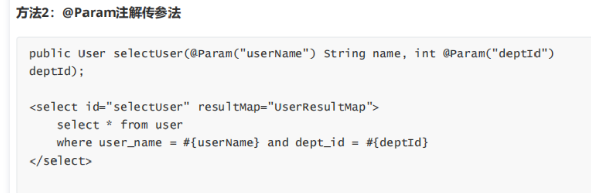
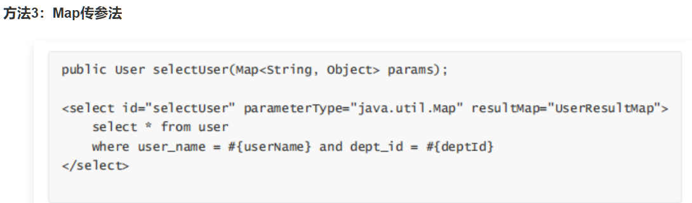
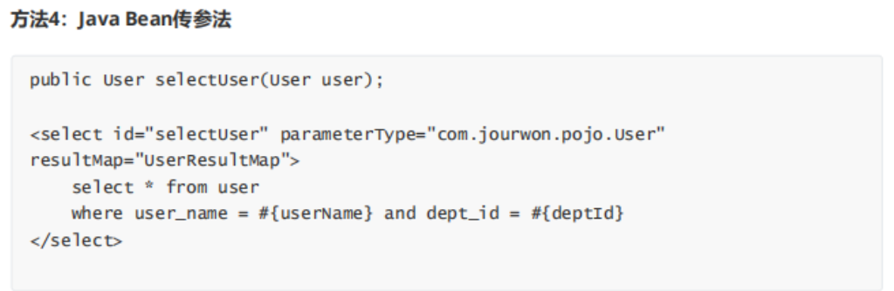

## mybatis面试题总结(version-0.0)





## 动态SQL 

```sql
```


## 为什么要是用Mybatis框架？

 当我们使用传统的JDBC去操作数据库的时候，有很大的问题

- jdbc底层是没有使用连接池的， **我们操作数据库的时候需要频繁的创建和关毕连接，很消耗资源**（因为这涉及到网络IO , 和磁盘IO）。
- **JDBC的代码写在 java 文件中， 一旦我们要修改sql的话， java需要整体的重新编译，不利于系统维护**
- 使用 PreparedStatement 预编译的话对变量进行设置 1，2，3数字 这样的序号不利于维护
- 返回 result 结果集也需要硬编码

## mybatis的优缺点

**优点**

- 基于Sql语句编程，或者数据库现有的设计造成任何的影响, sql写在xml中，跟用用程序的代码解耦，便于统一管理，提供xml标签，支持动态SQL

- 跟JDBC相比，减少了至少一半 的代码量，消除了大量冗余的代码， 不需要手动的开关连接

- 很好的与各种数据库兼容（因为mybatis 封装了JDBC,所以只要是支持JDBC 数据库， mybatis 都支持）

- 能够很好的与spring集成（只需要把在pom文件中引入相关的依赖即可）

- 提供了映射标签，支持对象与数据库的ORM字段关系映射

  - 例如：

  ```java
  <resultMap id="listMap" type="Student">
      <id column="id" property="id" jdbcType="INTEGER"></id>
      <result column="studentName" property="name"></result>
      <result column="gender" property="gender"></result>
      <result column="age" property="age"></result>
      <result column="info" property="info"></result>
  </resultMap>
  ```

  

**缺点**

- SQL编写工作量大，当字段多，关联表多的时候， 对于开发人员编写SQL 的功力有一定的要求
- SQL语句依赖数据库，导致数据库移植性差，不能随意更换数据库。


从mybatis 到 mysql




## mybatis核心流程图


- `SqlSessionFactoryBuilder`：用于创建session工厂，且创建完session工厂后即可销毁：
  - 创建session工厂时需读取mybatis的主配文件。
  - 主配文件用于配置mybatis的环境信息和Mapper配置文件路径等。
  - Mapper配置文件用于配置CRUD语句块和SQL语句相关配置信息。
- `SqlSessionFactory`：session工厂用于获取一个session会话，可以重复使用，但不该被重复创建，建议以单例模式来管理。
- `SqlSession`：session会话用于获取数据库连接的接口，每个线程都该独享一个session会话，建议设置为局部变量。
- `Executor`：session会话中的SQL执行者，有基本和缓存两种执行器实现。
- `MappedStatement`：SQL执行者中，专门负责SQL组装和结果转换的的SQL管理者：
  - 每个SQL块都通过id属性对应一个SQL管理者者。
  - 输入映射：在执行SQL前，将输入的java实体类中的属性映射到SQL代码中。
  - 输出映射：在执行SQL后，将返回的SQL结果映射到java实体类中保存。


## 3、#{}和${}的区别是什么？

```java
- #{}是预编译处理，${} 是字符串替换。
- Mybatis在处理 #{} 时，会将sql中的 #{} 替换为 ? 号，调用PreparedStatement的set方法来赋值；
- Mybatis在处理 ${} 时，就是把${}替换成变量的值。
所以使用#{}可以有效的防止SQL注入，提高系统安全性。
```


##  4、Mybatis是如何进行分页的？分页插件的原理是什么？

- Mybatis使用`RowBounds`对象进行分页，它是针对ResultSet结果集执行的内存分页，而非物理分页。可以在sql内直接书写带有物理分页的参数来完成物理分页功能，也可以使用分页插件来完成物理分页。

- 分页插件的基本原理是使用Mybatis提供的插件接口，实现自定义插件，在插件的拦截方法内拦截待执行的sql，然后重写sql，根据dialect方言，添加对应的物理分页语句和物理分页参数。

- 插件接口：

  - parameterHandler: 对sql参数进行处理 
  -  ResultHandler： 对结果集进行处理
  - StatementHandler ：对sql语句进行处理  
  - Executor：执行器，执行增删改查

  这个插件其实就是一个拦截器，mybatis通过动态代理为需要拦截的接口生成代理对象 --》实现接口方法拦截功能，每当执行这四种接口对象的方法时：

  判断执行的方法是否是需要代理的方法，如果是，则执行插件类的增强方法(重写)，进行方法的拦截处理。

  > 这是典型的AOP的思想。


## 如何编写一个插件？

- 实现 Mybatis 的 `**Interceptor 接口**`并重写 `**intercept()**`方法，
- 然后再给插件**编写注解**，指定要拦截哪一个接口的哪些方法即可
- 最后在配置文件中配置你编写的插件。

## 5 Mybatis的Xml映射文件中，不同的Xml映射文件，id是否可以重复？

- 不同的Xml映射文件，如果配置了`namespace`，那么 id 可以重复；如果没有配置`namespace`，那么id不能重复；
- **毕竟namespace不是必须的，只是最佳实践而已。** 
- 原因就是 `namespace+id` 是作为`Map<String, MappedStatement> 的key`使用的，如果没有namespace，就剩下id，那么，id重复会导致数据互相覆盖。有了namespace，自然id就可以重复，namespace不同，namespace+id自然也就不同。

## 6. Mybatis是否支持延迟加载？如果支持，它的实现原理是什么？

- Mybatis仅支持 `association(一对一查询)` 关联对象和`collection（一对多查询）`关联集合对象的延迟加载，在Mybatis配置文件中，可以配置是否启用延迟加载`lazyLoadingEnabled=true|false。 `

- 当我们调用方法的时候并不会立刻发送SQL进行查询，只有当用到数据的时候，才会真正的进行查询

  - **这样做的好处就是:** 
    节省我们的内存空间,因为我们立刻查询出来之后,有可能并不会立刻用到数据,但是这些数据却还占着宝贵的内存空间,所以当我们用到的时候,再进行查询,就可以节省内存空间
                  

  - **它的原理是**:

    - 使用CGLIB创建目标对象的代理对象，当调用目标方法时，进入拦截器方法
      -  比如调用 `a.getB().getName()`，拦截器 invoke()方法发现 `a.getB()`是null值，
      - 那么就会单独发送事先保存好的查询关联 B 对象的 sql，把B查询上来，
      - 然后调用`a.setB(b)`，于是a的对象 b 属性就有值了，
      - 接着完成`a.getB().getName()`方法的调用。这就是延迟加载的基本原理。 

    - 当然了，不光是Mybatis，几乎所有的包括Hibernate，支持延迟加载的原理都是一样的 

## 7. Mybatis配置别名

由于类的全限定名称很长，需要大量使用的时候，总写那么长的名称不方便。在 MyBatis 中允许定义一个简写来代表这个类，这就是别名，别名分为系统定义别名和自定义别名。

在 MyBatis 中别名由类` TypeAliasRegistry`（org.apache.ibatis.type.TypeAliasRegistry）去定义。注意，在 MyBatis 中**别名不区分大小写**。

## 8. 在mapper中如何传递多个参数



- `#{} `里面的数字代表传入的参数的顺序
- 这种方法不建议使用,sql层表达不直观,一旦循序搞错,很容易出错(不推荐使用)



- `#{}` 里面的名称对应的是注解 @Param 括号里面的名称
- 如果参数不是很多的情况下还是很直观的  (推荐使用)



- `#{}` 里面的名称对应的是 Map 里面的 key 名称
- 这种方法适合传递多个参数,且适合 参数易变,能灵活传递的情况



- 如果我们的参数是一个实体类,那么我们就可以使用这种方式来传递.
- `#{}` 里面的名称对应的User类里面的成员变量
- 这种方法直观,需要建立一个实体类,不利于扩展,需要加属性,但是代码可读性强,业务逻辑处理方便(推荐使用)

#### 9. MyBatis 的缓存机制?

**缓存:** 就是内存中的一个对象，用于对数据库查询结果的保存，用于减少与数据库的交互次数从而降低数据库的压力，进而提高响应速度。

**Mybatis 缓存机制原理:**

是将第一次从数据库 SQL 查询的结果数据保存到缓存（内存中），当下一次 SQL 查询和第一次相同，如果缓存中有数据则直接获取，而不用再从数据库获取，从而减少数据库访问频率，大大提升数据库

**详解** :

mybatis 的缓存分成两级: 一级缓存,二级缓存 他们的优先级是  `二级缓存`  > ` 一级缓存`

- 一级缓存是默认开启的, 这是Session 级别的缓存, 在操作数据库时需要构造 `SqlSession` 对象，在对象中有一个（内存区域）数据结构（HashMap）用于存储缓存数据。不同的`SqlSession`对象之间的数据是互不影响的.

  - 一级缓存的**作用范围**是同一个 `SqlSession` 对象，如果在同一个 `SqlSession` 对象中**再次执行相同的 SQL 语句**，会直接从缓存中获取数据，不必再从数据库中查询，从而提升查询效率。当 `SqlSession` 对象释放后，该 SqlSession 对象中的一级缓存也就不存在了。

  - 一级缓存**满足条件**如下：

    - 同一个 SqlSession 对象
    - 相同的 SQL 语句和参数

    > 注：使用 SqlSession.clearCache( ) 方法可以强制清除一级缓存

- 二级缓存需要在主配中配置开启:

  ```xml
      <settings>
          <!--开启二级缓存-->
          <setting name="cacheEnabled" value="true"/>
      </settings>
  ```

  **二级缓存是 Mapper 级别的缓存。**

  - 多个 SqlSession 对象 SQL 语句查询数据库结果会存放二级缓存区域，而多个SqlSession对象可以共用二级缓存。

  - 其作用范围是 Mapper 的同一个 namespace ，不同的 SqlSession 对象再次执行相同 namepace 下的 SQL 语句，第一次执行会将数据库中查询结果数据存储到二级缓存中，第二次会从二级缓存中获取数据，而不再从数据库中获取，从而提高查询效率。

  - > 注意: 使用二级缓存属性类需要实现 Serializable 序列化; 

  **MyBatis 缓存使用注意事项**
  
  1. 缓存是以`namespace`为单位的，不同`namespace`下的操作互不影响。
  2. `insert,update,delete`操作会清空所在`namespace`下的全部缓存。
  3. 通常使用MyBatis Generator 生成的代码中，都是各个表独立的，每个表都有自己的`namespace`。
  4. **多表操作一定不要使用二级缓存，因为多表操作进行更新操作，一定会产生脏数据。**
  
  如果你遵守二级缓存的注意事项，那么你就可以使用二级缓存。但是，如果不能使用多表操作，二级缓存不就可以用一级缓存来替换掉吗？而且二级缓存是表级缓存，开销大，没有一级缓存直接使用 HashMap 来存储的效率更高，所以**二级缓存并不推荐使用**

## 10、简述Mybatis的Xml映射文件和Mybatis内部数据结构之间的映射关系？

- Mybatis 将所有 Xml 配置信息都封装到 All-In-One 重量级对象 **Confifiguration**内部。

- 在 Xml 映射文件中， 
  - `<parameterMap>` 标签会被解析为 `ParameterMap` 对象
    - 其每个子元素会被解析为`ParameterMapping`对象
  - `<resultMap>` 标签会被解析为`ResultMap`对象
    - 其每个子元素会被解析为`ResultMapping`对象
  - 每一个` <select>` 、` <insert>` 、` <update> `、` <delete> `标签均会被解析为`MappedStatement`对象，
    - 标签内的sql会被解析为`BoundSql`对象。

*********************************

## 11、MyBatis编程步骤是什么样的？

1、 创建SqlSessionFactory 

2、 通过SqlSessionFactory创建SqlSession 

3、 通过sqlsession执行数据库操作 

4、 调用session.commit()提交事务 

5、 调用session.close()关闭会话

## 如何获取生成的主键

使用主键回注: `useGeneratedKeys = true`

然后使用 `keyProperty="id"` 指定主键

```xml
 <insert id="insert" parameterType="Student" useGeneratedKeys="true" keyProperty="id">
        insert into mybatis.student (name, age, gender, info)
        values (#{name}, #{age}, #{gender}, #{info})
    </insert>
```


## MyBatis如何进行批量操作？

使用`<foreach>` 标签

```xml
<!--<foreach>：动态循环标签-->
<!--
    collection属性：被遍历的变量，可直接使用入参的@Param别名
    若没设置别名，则数组入参固定使用array，列表入参固定使用list
    item属性：循环的中间变量
    open属性：循环前拼接
    close属性：循环后拼接
    separator属性：循环分隔符
-->
<select id="selectByForeach" resultType="user">
    <include refid="list"/>
    <where>
        <foreach collection="ids" item="e" open="t.id in (" close=")" separator=",">
            ${e}
        </foreach>
        <foreach collection="ages" item="e" open="or t.age in (" close=")" separator=",">
            ${e}
        </foreach>
    </where>
</select>
```

## Mybatis 为什么需要预编译?

###### 什么是SQL预编译？

**SQL预编译**: 指的是数据库驱动在发送 sql 语句 和 参数之前 对 SQL 语句进行编译,这样DBMS 执行SQL时,就不需要重新编译了.

###### 为什么需要SQL预编译？

- 数据库接受到sql语句之后，需要词法和语义解析，优化sql语句，制定执行计划。这需要花费一些时间。
- 如果一条sql语句需要反复执行，每次都进行语法检查和优化，会浪费很多时间。预编译语句就是将sql语句中的`值用占位符替代`，即将`sql语句模板化`。一次编译、多次运行，省去了解析优化等过程。

###### 底层实现

- mybatis是通过`PreparedStatement`和`占位符` 来实现预编译的。

- mybatis底层使用`PreparedStatement`, 默认情况下，将对所有的 `sql` 进行预编译，将`#{}`替换为`?`, 
- 然后将带有占位符`?`的sql模板 发送至mysql 服务器，**由服务器对此无参数的sql进行编译后**，将编译结果缓存，然后直接执行带有真实参数的sql。

###### 这样做的好处

1. 预编译阶段可以**优化 sql 的执行**。预编译之后的 sql 多数情况下可以直接执行，数据库服务器不需要再次编译，可以提升性能。
2. **预编译语句对象可以重复利用**。把一个 sql 预编译后产生的 `PreparedStatement` 对象缓存下来，下次对于同一个sql，可以直接使用这个缓存的 PreparedState 对象。
3. **防止SQL注入**。使用预编译，而其后注入的参数将`不会再进行SQL编译`。也就是说其后注入进来的参数， 系统将不会认为它会是一条SQL语句，而默认其是一个参数。

## Mybatis中的连接池

连接池就是用于存储连接对象的一个容器。而容器就是一个集合，且必须是线程安全的，即两个线程不能拿到同一个连接对象。

同时还要具备队列的特性：先进先出原则。

**使用连接池的好处：**避免频繁创建和关闭数据库连接造成的开销，节省系统资源。


## 自己实现的连接池

**成员变量**: 

连接池大小: private final int size;

连接数组: private Connection[] pool;

连接状态数组: private AtomicIntegerArray states;

**成员方法**:

构造方法: public ConnectionPool(int size);

获取连接: public Connection get();

归还连接: public void reback(Connection connection)


```java
/**
 * 模拟连接池
 * @author zhuyin
 */
public class ConnectionPool {
    /***
     * 连接池大小
     */
    private final int size;

    /***
     * 连接数组
     */
    private Connection[] poll;

    /***
     * 标记对应的连接是否空闲 0 空闲，1 占用
     */
    private AtomicIntegerArray states;

    /***
     * 构造方法
     * @param size  指定连接池大小
     */
    public ConnectionPool(int size) {
        this.size = size;
        this.poll = new Connection[size];
        this.states = new AtomicIntegerArray(size);

        for (int i = 0; i < size; i++) {
            poll[i] = new MyConnection();
            states.set(i,0);
        }
    }

    /***
     * 获取连接
     * @return 返回一个连接
     */
    public Connection get(){
        while(true){
            //遍历poll数组， 查找是否有空闲的连接
            for(int i = 0; i < size; i++){
                //如果有就直接返回连接，结束循环
                if(states.get(i) == 0){
                    states.compareAndSet(i,0,1);
                    return poll[i];
                }
            }
 //没有空闲的连接，当前线程不得不等待，当被唤醒之后，重新进入while循环，继续尝试获取连接
            synchronized (this){
                try {
                    wait();
                } catch (InterruptedException e) {
                    e.printStackTrace();
                }
            }
        }
    }

    /**
     * 归还连接
     * @param connection 要归还的连接
     */
    public void reback(Connection connection){
        //遍历数组找到当前连接原来的位置， 将标记置为 0 (空闲)
        for (int i = 0; i < size; i++) {
            if(poll[i] == connection){
                states.set(i,0);
                break;
            }
        }
        //进入对象锁，唤醒所有正在 wait的线程
        synchronized (this){
            this.notifyAll();
        }
    }
}

```


## Mybatis的事物管理

**`MyBatis`可以通过`XML`配置是否独立处理事务，**

- 可以选择不单独处理事务，将事务托管给其他上层框架如spring等； 

- 如果MyBatis选择处理事务则事务会对数据库操作产生影响
  - 对`UPDATE`操作的影响主要表现在: `UPDATE`操作后 
    - 如果没有进行事务提交则会在 会话关闭时进行数据库回滚；
    - 如果已经提交， 则直接关闭连接
  - 对`SELECT`操作的影响主要表现在**二级缓存**上
    - 执行`SELECT`操作后如果未进行事务提交则缓存会被放在临时缓存中，
    - 后续的SELECT操作无法使用该缓存，直到进行commit()事务提交，临时缓存中的数据才会被转移到正式缓存中；

## mybatis的主配文件分析

都配置了些什么：

- 引入属性文件：` <properties resource="jdbc/mb-db.properties"/>`: 

  ```properties
  <!--这就是属性文件： 这里面配置了 数据源的四项：driver,url,username,password -->
  jdbc.driver=com.mysql.cj.jdbc.Driver
  jdbc.url=jdbc:mysql://localhost:3306/mybatis\
    ?serverTimezone=UTC&useUnicode=true&characterEncoding=utf8
  jdbc.username=root
  jdbc.password=dsw521
  ```
  
  - 这里引入属性文件，便于下面的 `连接池连接数据库`的时候使用。

- 全局配置
  -  开启二级缓存
    - 详情请见: `mybatis 的缓存机制`
  - 开启延迟加载 :
    - 详情在上面(`第六题`)
  -  整包配置别名
    - 详情在上面(`第七题`)

- mybatis 配置： 
  - 使用JDBC事务：该事务支持commit和rollback ， 
  - 使用连接池
- 整包扫描Mapper接口


```xml
<?xml version="1.0" encoding="UTF-8" ?>
<!DOCTYPE configuration PUBLIC "-//mybatis.org//DTD Config 3.0//EN"
        "http://mybatis.org/dtd/mybatis-3-config.dtd">

<configuration>
    <!--引入属性文件-->
    <properties resource="jdbc/mb-db.properties"/>
    <!--全局配置-->
    <settings>
        <!--开启二级缓存-->
        <setting name="cacheEnabled" value="true"/>
        <!--开启延迟加载-->
        <setting name="lazyLoadingEnabled" value="true"/>
        <setting name="aggressiveLazyLoading" value="false"/>
    </settings>

    <!--整包配置别名-->
    <typeAliases>
    <!--<typeAlias type="com.joezhou.spring.entity.Student" alias="student"/>-->
        <package name="com.joezhou.entity"/>
    </typeAliases>

    <!--mybatis环境-->
    <environments default="development">

        <environment id="development">

            <!--使用JDBC事务：该事务支持commit和rollback-->
            <transactionManager type="JDBC"/>

            <!--使用连接池-->
            <dataSource type="POOLED">
                <property name="driver" value="${jdbc.driver}"/>
                <property name="url" value="${jdbc.url}"/>
                <property name="username" value="${jdbc.username}"/>
                <property name="password" value="${jdbc.password}"/>
            </dataSource>
        </environment>
    </environments>

    <!--整包扫描Mapper接口-->
    <mappers>
        <package name="com.joezhou.mapper"/>
    </mappers>

</configuration>
```


 
