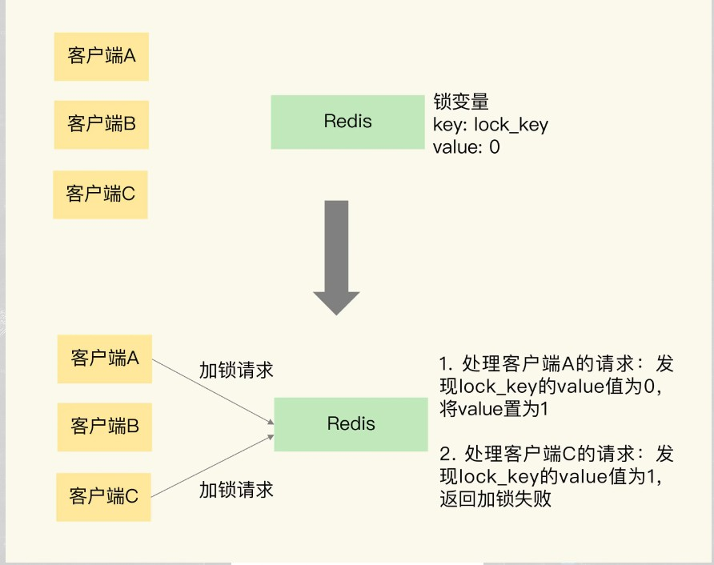

## Redis 笔记

#### 1、Redis持久化机制

**持久化**: Redis通过持久化机制把内存中的数据同步到硬盘文件来保证数据持久化.当Redis重启后通过把硬盘文件重新加载到内存，就能达到恢复数据的目的。

实现: 单独创建fork()一个子进程，将当前父进程的数据库数据复制到子进程的内存中，然后由子进程写入到临时文件中，持久化的过程结束了，再用这个临时文件替换上次的快照文件，然后子进程退出，内存释放

- RDB持久化: RDB是Redis默认的持久化方式。
  - 按照一定的时间周期策略把内存的数据以快照的形式保存到硬盘的二进制文件。即Snapshot快照存储，对应产生的数据文件为dump.rdb，通过配置文件中的save参数来定义快照的周期。（ 快照可以是其所表示的数据的一个副本，也可以是数据的一个复制品。

- AOF持久化：Redis会将每一个收到的写命令都通过Write函数追加到文件最后，类似于MySQL的binlog。
  - 当Redis重启是会通过重新执行文件中保存的写命令来在内存中重建整个数据库的内容。当两种方式同时开启时，数据恢复Redis会优先选择AOF恢复。


#### 2, 缓存雪崩、缓存穿透、缓存预热、缓存更新、缓存降级等问题?

**缓存雪崩:**

 如果把很多缓存设置了相同的过期时间(时间段), 会造成短时间内大面积的缓存过期.所有原本应该去查询缓存的请求全都达到了数据库,对数据库和cpu造成了很大的压力.严重的有可能在会宕机.从而造成一系列的连锁反应,导致系统崩溃

- 解决办法: 
  - 第一种: 加锁或者 使用队列的方式保证不会有大量的线程对数据库进行一次性进行读写,从而避免缓存失效时大量的请求达到数据库上
  - 第二种: 将缓存的失效时间错开.

**缓存穿透**

缓存穿透是指用户查询数据，在数据库没有，自然在缓存中也不会有。这样就导致用户查询的时候，在缓存中找不到，每次都要去数据库再查询一遍，然后返回空（相当于进行了两次无用的查询）。这样请求就绕过缓存直接查数据库

- 解决办法: 
- 使用布隆过滤器:将所有可能存在的数据哈希到一个足够大的 `bitmap`中，**一个一定不存在的数据会被这个bitmap拦截掉**，从而避免了对底层存储系统的查询压力。
- 另外也有一个更为**简单粗暴**的方法，如果一个查询返回的数据为空（不管是数据不存在，还是系统故障），我们仍然把这个空结果进行缓存，但它的过期时间会很短，最长不超过五分钟。通过这个直接设置的默认值存放到缓存，这样第二次到缓冲中获取就有值了，而不会继续访问数据库，这种办法最简单粗暴。
- 布隆过滤器原理: 
  - 既然要把所有的存在的数据 哈希到 bitmap,那么必然存在哈希冲突,布隆过滤器是怎么解决哈希冲突的了?
  - 引入  k ( k > 1 ) 个 哈希函数 . 
    - 所以如果通过其中的一个Hash值我们得出某元素不在集合中，那么该元素肯定不在集合中。
    - 只有在所有的Hash函数告诉我们该元素在集合中时，才能确定该元素存在于集合中。
- 这便是Bloom-Filter的基本思想。Bloom-Filter一般用于在大数据量的集合中判定某元素是否存在

**缓存预热**

- 缓存预热就是系统上线后，将相关的缓存数据直接加载到缓存系统。这样就可以避免在用户请求的时候，先查询数据库，然后再将数据缓存的问题！用户直接查询事先被预热的缓存数据！

- 解决思路：1、直接写个缓存刷新页面，上线时手工操作下；2、数据量不大，可以在项目启动的时候自动进行加载；3、定时刷新缓存；

**缓存更新**

- 除了缓存服务器自带的缓存失效策略之外（Redis默认的有6中策略可供选择），我们还可以根据具体的业务需求进行自定义的缓存淘汰，
- 常见的策略有两种：
  - （1）定时去清理过期的缓存；缺点是维护大量缓存的key是比较麻烦的
  - （2）当有用户请求过来时，再判断这个请求所用到的缓存是否过期，过期的话就去底层系统得到新数据并更新缓存。缺点就是每次用户请求过来都要判断缓存失效，逻辑相对比较复杂！
  - 具体用哪种方案，大家可以根据自己的应用场景来权衡。

**缓存降级**

当访问量剧增、服务出现问题（如响应时间慢或不响应）或 非核心服务影响到核心流程的性能时，仍然需要保证服务还是可用的，即使是有损服务。系统可以根据一些关键数据进行自动降级，也可以配置开关实现人工降级。降级的最终目的是保证核心服务可用，即使是有损的。而且有些服务是无法降级的（如加入购物车、结算）。

*服务降级的目的*，是为了防止Redis服务故障，导致数据库跟着一起发生雪崩问题。因此，对于不重要的缓存数据，可以采取服务降级策略，例如一个比较常见的做法就是，Redis出现问题，不去数据库查询，而是直接返回默认值给用户。

#### 3, 热点数据和冷数据是什么

热点数据，缓存才有价值,

- 对于冷数据而言，大部分数据可能还没有再次访问到就已经被挤出内存，不仅占用内存，而且价值不大。

- 频繁修改的数据，看情况考虑使用缓存

- 对于热点数据,缓存以后可能读取数很多次

  但是有的时候,即便数据的修改频率很高,我们也必须把数据放到 redis 缓存中, 因为这个数据接口对数据库的压力很大,又是热点数据 ,必须 使用缓存来缓解数据据库的压力

#### 4, Memcache与Redis的区别都有哪些？

1)、存储方式 Memecache把数据全部存在内存之中，断电后会挂掉，数据不能超过内存大小。 Redis有部份存在硬盘上，redis可以持久化其数据

2)、数据支持类型 memcached所有的值均是简单的字符串，redis作为其替代者，支持更为丰富的数据类型 ，提供list，set，zset，hash等数据结构的存储

3)、使用底层模型不同 它们之间底层实现方式 以及与客户端之间通信的应用协议不一样。 Redis直接自己构建了VM 机制 ，因为一般的系统调用系统函数的话，会浪费一定的时间去移动和请求。

4). value 值大小不同：Redis 最大可以达到 1gb；memcache 只有 1mb。

5）redis的速度比memcached快很多6）Redis支持数据的备份，即master-slave模式的数据备份。

#### 5、单线程的redis为什么这么快 

(一)纯内存操作

(二)单线程操作，避免了频繁的上下文切换

(三)采用了非阻塞I/O多路复用机制 

多路复用机制:

所谓 I/O 多路复用机制，就是说通过一种机制，可以监视多个描述符，一旦某个描述符就绪（一般是读就绪或写就绪），能够通知程序进行相应的读写操作。这种机制的使用需要 select 、 poll 、 epoll 来配合。

在多路复用IO模型中，会有一个内核线程不断地去轮询多个 socket 的状态，只有当真正读写事件发送时，才真正调用实际的IO读写操作。因为在多路复用IO模型中，只需要使用一个线程就可以管理多个socket，系统不需要建立新的进程或者线程，也不必维护这些线程和进程，并且只有真正有读写事件进行时，才会使用IO资源，所以它大大减少来资源占用


非阻塞IO优点：

- 速度快，因为数据存在内存中，类似于HashMap，HashMap的优势就是查找和操作的时间复杂度都是O(1)
- 支持丰富数据类型，支持string，list，set，sorted set，hash支持事务，操作都是原子性，所谓的原子性就是对数据的更改要么全部执行，要么全部不执行
- 丰富的特性：可用于缓存，消息，按key设置过期时间，过期后将会自动删除

如何解决redis的并发竞争key问题 ?

- 同时有多个子系统去set一个key。这个时候要注意什么呢？ 
- 不推荐使用redis的事务机制。因为我们的生产环境，基本都是redis集群环境，做了数据分片操作。你一个事务中有涉及到多个key操作的时候，这多个key不一定都存储在同一个redis-server上。因此，redis的事务机制，十分鸡肋。
  - (1)如果对这个key操作，不要求顺序： 准备一个分布式锁，大家去抢锁，抢到锁就做set操作即可
  - (2)如果对这个key操作，要求顺序： 分布式锁+时间戳。 假设这会系统B先抢到锁，将key1设置为{valueB 3:05}。接下来系统A抢到锁，发现自己的valueA的时间戳早于缓存中的时间戳，那就不做set操作了。以此类推。
  - (3) 利用队列，将set方法变成串行访问也可以, redis遇到高并发，如果保证读写key的一致性对redis的操作都是具有原子性的,是线程安全的操作,你不用考虑并发问题,redis内部已经帮你处理好并发的问题了。

#### 6. redis的数据类型，以及每种数据类型的使用场景

1. `String` : 最常规的set/get操作，value可以是String也可以是数字。一般做一些复杂的计数功能的缓存。
2. `hash` : 这里value存放的是结构化的对象，比较方便的就是操作其中的某个字段。博主在做单点登录的时候，就是用这种数据结构存储用户信息，以cookieId作为key，设置30分钟为缓存过期时间，能很好的模拟出类似session的效果。
3. `List` : 使用List的数据结构，可以做简单的**消息队列**的功能。另外还有一个就是，可以利用`lrange`命令，做基于redis的分页功能，性能极佳，用户体验好。适合生产者和消费者的场景。LIST可以很好的完成排队，先进先出的原则。
4. 因为 set堆放的是一堆不重复值的集合。所以可以做全局去重的功能。为什么不用JVM自带的Set进行去重？因为我们的系统一般都是集群部署，使用JVM自带的Set，比较麻烦，难道为了一个去重做一个全局去重，再起一个公共服务，太麻烦了。另外，就是利用交集、并集、差集等操作，可以计算共同喜好，全部的喜好，自己独有的喜好等功能。
5. `sorted set(Z-set)` : sorted set多了一个权重参数score,集合中的元素能够按score进行排列。可以做排行榜应用，取TOP N操作。

#### 7, redis的过期策略以及内存淘汰机制

###### Redis 过期策略: 

Redis在设置缓存数据时指定了过期时间，到了过期时间数据就失效了，

那Redis是怎么处理这些失效的数据的呢？

这就用到了Redis的过期策略——"定期删除+惰性删除" 。+

- **定期删除**是指Redis默认每隔 100ms 就 **随机抽取 一部分设置了过期时间的key**，检测这些key是否过期，如果过期了就将其删除。

> ※ 为什么是随机抽取部分检测，而不是全部？
>
> 因为如果Redis里面有大量key都设置了过期时间，全部都去检测一遍的话CPU负载就会很高，会浪费大量的时间在检测上面，甚至直接导致redis挂掉。所有只会抽取一部分而不会全部检查。
>
> 正因为定期删除只是随机抽取部分key来检测，这样的话就会出现大量已经过期的key并没有被删除，这就是为什么有时候大量的key明明已经过了失效时间，但是redis的内存还是被大量占用的原因 ，为了解决这个问题，Redis又引入了“惰性删除策略”。

-  **惰性删除**: 惰性删除不是去主动删除，而是在你要获取某个key 的时候，redis会先去检测一下这个key是否已经过期，如果没有过期则返回给你，如果已经过期了，那么redis会删除这个key，不会返回给你

###### Redis内存淘汰机制

内存淘汰机制就能保证在redis内存占用过高的时候，去进行内存淘汰，也就是删除一部分key，保证redis的内存占用率不会过高，那么它会淘汰哪些key呢？

最常用的时 allkeys-LRU 移除最近最少使用的 key

Redis目前共提供了8种内存淘汰策略，含Redis 4.0版本之后又新增的两种LFU模式：volatile-lfu和allkeys-lfu。


| no-eviction     | 当内存不足以容纳新写入数据时，新写入操作会报错，无法写入新数据，一般不采用 |
| --------------- | ------------------------------------------------------------ |
| allkeys-lru     | 当内存不足以容纳新写入数据时，移除最近最少使用的key，这个是最常用的 |
| allkeys-random  | 当内存不足以容纳新写入的数据时，随机移除key                  |
| allkeys-lfu     | 当内存不足以容纳新写入数据时，移除最不经常（最少）使用的key  |
| volatile-lru    | 当内存不足以容纳新写入数据时，在设置了过期时间的key中，移除最近最少使用的key。 |
| volatile-random | 内存不足以容纳新写入数据时，在设置了过期时间的key中，随机移除某个key 。 |
| volatile-lfu    | 当内存不足以容纳新写入数据时，在设置了过期时间的key中，移除最不经常（最少）使用的key |
| volatile-ttl    | 当内存不足以容纳新写入数据时，在设置了过期时间的key中，优先移除过期时间最早（剩余存活时间最短）的key。 |

※ 什么时候会执行内存淘汰策略，内存占用率过高的标准是什么？

    redis.conf配置文件中的 maxmemory 属性限定了 Redis 最大内存使用量，当占用内存大于maxmemory的配置值时会执行内存淘汰策略。

※ 内存淘汰策略的配置

    内存淘汰机制由redis.conf配置文件中的maxmemory-policy属性设置，没有配置时默认为no-eviction模式。

※ 淘汰策略的执行过程

    > 客户端执行一条命令，导致Redis需要增加数据（比如set key value）；
    
    > Redis会检查内存使用情况，如果内存使用超过 maxmemory，就会按照配置的置换策略maxmemory-policy删除一些key；
    
    > 再执行新的数据的set操作


三、其他场景对过期key的处理
1、快照生成RDB文件时

    过期的key不会被保存在RDB文件中

2、服务重启载入RDB文件时

    Master载入RDB时，文件中的未过期的键会被正常载入，过期键则会被忽略。Slave 载入RDB 时，文件中的所有键都会被载入，当主从同步时，再和Master保持一致。

3、AOF 文件写入时

    因为AOF保存的是执行过的Redis命令，所以如果redis还没有执行del，AOF文件中也不会保存del操作，当过期key被删除时，DEL 命令也会被同步到 AOF 文件中去。

4、重写AOF文件时

    执行 BGREWRITEAOF 时 ，过期的key不会被记录到 AOF 文件中。

5、主从同步时

    Master 删除 过期 Key 之后，会向所有 Slave 服务器发送一个 DEL命令，Slave 收到通知之后，会删除这些 Key。
    
    Slave 在读取过期键时，不会做判断删除操作，而是继续返回该键对应的值，只有当Master 发送 DEL 通知，Slave才会删除过期键，这是统一、中心化的键删除策略，保证主从服务器的数据一致性。

#### Redis 常见性能问题和解决方案？

(1) Master 最好不要做任何持久化工作，如 RDB 内存快照和 AOF 日志文件

(2) 如果数据比较重要，某个 Slave 开启 AOF 备份数据，策略设置为每秒同步一次

(3) 为了主从复制的速度和连接的稳定性， Master 和 Slave 最好在同一个局域网内

(4) 尽量避免在压力很大的主库上增加从库

(5) 主从复制不要用图状结构，用单向链表结构更为稳定，即： Master <- Slave1 <- Slave2 <-Slave3

#### 11、Redis事务

Redis事务功能是通过MULTI、EXEC、DISCARD和WATCH 四个原语实现的;

Redis会将一个事务中的所有命令序列化，然后按顺序执行。

1.redis 不支持回滚“Redis 在事务失败时不进行回滚，而是继续执行余下的命令”， 所以 Redis 的内部可以保持简单且快速。

2.如果在一个事务中的命令出现错误，那么所有的命令都不会执行；

3.如果在一个事务中出现运行错误，那么正确的命令会被执行。

- MULTI `multi` 命令用于开启一个事务，它总是返回OK。 MULTI执行之后，客户端可以继续向服务器发送任意多条命令，这些命令不会立即被执行，而是被放到一个队列中，当EXEC命令被调用时，所有队列中的命令才会被执行。
- EXEC `exec` ：执行所有事务块内的命令。返回事务块内所有命令的返回值，按命令执行的先后顺序排列。 当操作被打断时，返回空值 nil 
- 通过调用DISCARD `discard`，客户端可以清空事务队列，并放弃执行事务， 并且客户端会从事务状态中退出。

#### Redis实现分布式锁

[(2条消息) 如何用Redis实现分布式锁_GeorgiaStar的博客-CSDN博客_redis如何实现分布式锁](https://blog.csdn.net/fuzhongmin05/article/details/119251590)


```Java
// 加锁
SETNX lock_key 1
// 业务逻辑
DO THINGS
// 释放锁
DEL lock_key

```


想要实现分布式锁，必须借助一个外部系统，所有进程都去这个系统上申请加锁。而这个外部系统，必须要实现互斥能力，即两个请求同时进来，只会给一个进程加锁成功，另一个失败。这个外部系统可以是数据库，也可以是Redis或Zookeeper，但为了追求性能，我们通常会选择使用Redis或Zookeeper来做。

命令: 

想要实现分布式锁，必须要求Redis有互斥的能力。可以使用SETNX命令，其含义是SET IF NOT EXIST，即如果key不存在，才会设置它的值，否则什么也不做。两个客户端进程可以执行这个命令，达到互斥，就可以实现一个分布式锁。

以下展示了Redis使用key/value对保存锁变量，以及两个客户端同时请求加锁的操作过程。
————————————————


加锁操作完成后，加锁成功的客户端，就可以去操作共享资源，例如，修改MySQL的某一行数据。操作完成后，还要及时释放锁，给后来者让出操作共享资源的机会。如何释放锁呢？直接使用DEL命令删除这个key即可。这个逻辑非常简单，整体的流程写成伪代码就是下面这样。

