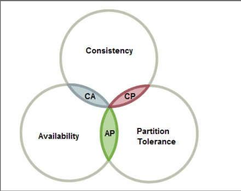

# 分布式相关理论

### 1.什么是BASE理论

eBay 的架构师 Dan Pritchett 源于对大规模分布式系统的实践总结，在 ACM 上发表文章提出 BASE 理论，BASE 理论是对 CAP 理论的延伸，核心思想是即使无法做到**强一致性**（Strong Consistency，CAP 的一致性就是强一致性），但应用可以采用适合的方式达到 **最终一致性**（Eventual Consitency）。

- `基本可用`(Basically Available)： 基本可用是指分布式系统在出现故障的时候，允许损失部分可用性，即保证核心可用。电商大促时，为了应对访问量激增，部分用户可能会被引导到降级页面，服务层也可能只提供降级服务。这就是损失部分可用性的体现。

- `软状态`(Soft State)： 软状态是指允许系统存在中间状态，而该中间状态不会影响系统整体可用性。分布式存储中一般一份数据至少会有三个副本，允许不同节点间副本同步的延时就是软状态的体现。MySQL Replication 的异步复制也是一种体现。

- `最终一致性`(Eventual Consistency)： 最终一致性是指系统中的所有数据副本经过一定时间后，最终能够达到一致的状态。弱一致性和强一致性相反，最终一致性是弱一致性的一种特殊情况。

  ###### ACID 和 BASE 的区别与联系：

  ACID 是传统数据库常用的设计理念，追求强一致性模型。BASE 支持的是大型分布式系统，提出通过牺牲强一致性获得高可用性。

  ACID 和 BASE 代表了两种截然相反的设计哲学，在分布式系统设计的场景中，系统组件对一致性要求是不同的，因此 ACID 和 BASE 又会结合使用
  

### 2.什么是CAP理论

强一致性理论。

CAP 含义的解释： 

**Consistency **： 一致性 `

对于客户端的每次读操作，要么读到的是最新的数据，要么读取失败。换句话说，一致性是站在分布式系统的角度，对访问本系统的客户端的一种**承诺**：要么我给您返回一个错误，要么我给你返回绝对一致的最新数据，不难看出，其强调的是数据正确。

**Availability** 可用性

任何客户端的请求都能得到响应数据，不会出现响应错误。换句话说，可用性是站在分布式系统的角度，对访问本系统的客户的另一种承诺：我一定会给您返回数据，不会给你返回错误，但不保证数据最新，强调的是不出错。

**Partition tolerance ** 分区容忍性

由于分布式系统通过网络进行通信，网络是不可靠的。当任意数量的消息丢失或延迟到达时，系统仍会继续提供服务，不会挂掉。换句话说，分区容忍性是站在分布式系统的角度，对访问本系统的客户端的再一种承诺：我会一直运行，不管我的内部出现何种数据同步问题，强调的是不挂掉。

**作为分布式系统的三个指标**

这三个性质对应了分布式系统的三个指标：
而CAP理论说的就是：一个分布式系统，不可能同时做到这三点

之前提到,CAP理论说一个分布式系统不可能同时满足C、A、P这三个特性。那么我们就来分析C、A、P的权衡吧。

> **note：**其实这里有个关于CAP理论理解的误区。不要以为在所有时候都只能选择两个特性。在不存在网络失败的情况下（分布式系统正常运行时），C和A能够同时保证。只有当网络发生分区或失败时，才会在C和A之间做出选择。

对于一个分布式系统而言，P（不挂掉） 是前提，必须保证，因为只要有网络交互就一定会有延迟和数据丢失，这种状况我们必须接受，必须保证系统不能挂掉。

所以只剩下C、A可以选择。要么保证数据一致性（保证数据绝对正确），要么保证可用性（保证系统不出错）。

- 当选择了C（一致性）时，如果由于网络分区而无法保证特定信息是最新的，则系统将返回错误或超时。

- 当选择了A（可用性）时，系统将始终处理客户端的查询并尝试返回最新的可用的信息版本，即使由于网络分区而无法保证其是最新的。

三者之间的冲突·

由于网络延迟是客观存在的， 所以我们 不可能 在保证 p （  分区容错性）的同时， 同时保证 C 和 A

因为 此时， 分布式系统中 节点之间 更新数据是 有网络延迟的，在这个期间 如果用户请求某个还没有更新数据的 节点， 

- 如果要保证 C 数据一致性， 那么 就只能 返回 错误或者超时， 那么这就违反了 A（可用性）

- 但是如果我们返回 旧数据， 那么就违反了 数据一致性。 

### 3.什么是分布式事务

对于分布式系统⽽⾔，需要保证分布式系统中的数据⼀致性，保证数据在⼦系统中始终保持⼀致，避免业务出现问题。

分布式系统中对所有事务要么 ⼀起成功，要么⼀起失败，必须是⼀个整体性的事务。

- 分布式事务 : 指事务的参与者、⽀持事务的服务器、资源服务器以及事务管理器 **分别位于不同的分布式系统的不同节点之上**。

- 简单的说，在分布式系统上⼀次⼤的操作由不同的⼩操作组成，这些⼩的操作分布在不同的服务节点上，且属于不同的应⽤，分布式事务需要保证这些⼩操作要么全部成功，要么全部失败。

### 4.哪些场景下会产生分布式事务

### 5.为什么分布式系统中无法同时保证一致性和可用性

首先 分布式系统 一般有三个指标： 

CAP 也就是 一致性， 可用性， 分区容错性

- 一致性： 说的是客户端每次 读取的数据要么 是最新的数据，要么读取失败。强调的是数据的正确性
- 可用性： 说的是 客户端的每次请求都会得到相应， 即使数据不是最新的， 强调的是 不出错。
- 分区容错性： 由于分布式系统 通过网络进行通信，网络是不可靠的， 当任意数量的消息丢失，或者延迟时，系统仍然会提供服务，不会挂掉。强调的 系统会一直 运行，不会挂掉。

首先， 对于一个分布式系统来说： 分区容错性是必须保证的， 也就是不能挂掉。

当不存在网络失败的时候，C A 是可以同时保证的。

但是我们都知道， 网络的不可靠性是客观存在  

那么我们来做一个假设。

节点A 做了数据的修改， 然后 节点B 也需要将数据更新到最新，但是网络是由延迟的（假如 10 s），那么在这 10s内， 客户端读取 节点 B 的数据， 

- ###### 如果我们要保证 A 可用性， 那么我们就必须返回 节点 B 的旧数据，这就违反了 一致性‘

- 但是 如果 我们保证一致性， 就必须返回 错误。因为最新的数据还没有更新。但是这就违反了 可用性。

所以无法同时保证 C A 因此要么保证 AP 要么保证 CP 。其实在 大多数的场景下， 只需要 保证最终一致性即可（AP） 

### 6.分布式事务常见的解决方案有哪些

### 7.Seata的架构是什么。

### 8.XA模式的工作流程是什么

### 9.分布式事务的处理方式

### 10.多线程分布式环境下如何保证唯一id

uuid

11.分布式系统的接口幂等性设计
12.分布式session了解过吗？如何实现
13.分布式id策略你能说出几种？
14.分布式锁有哪些实现方案
15.服务器集群后，会产生哪些问题
16.负载均衡算法、类型
17.分布式架构下，session共享有什么方案
18.简述你对RPC RMI的理解
19.分布式id生成方案
20.分布式事务解决方案