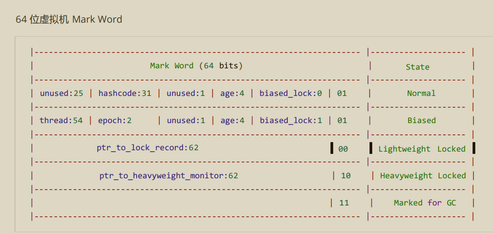

## 多线程并发笔记(zhuyin)


#### 进程和线程
- 程序是由指令和数据组成,但是这些指令和数据要运行,数据要进行读写, 就必须要将指令加载到cpu,数据加载到内存.
  - **进程**: 就是用来加载指令和管理数据和IO的.其实就是程序的一次运行(实例).
  - **线程**: 一个线程就是一组指令的集合(指令流),他负责将指令流中的指令按照一定的顺序交给cpu执行
*************
- ***进程和线程的区别* ?**
  - `根本区别`: 
    `进程` 是操作系统资源分配的基本单位，而 `线程`是处理器任务调度和执行的基本单位.
  - `资源开销`：
    每个进程都有独立的代码和数据空间（程序上下文），程序之间的切换会有较大的开销；
    线程可以看做轻量级的进程，同一类线程共享代码和数据空间，
    每个线程都有自己独立的*运行栈*和*程序计数器*（PC）， 线程之间切换的开销小。
  - `包含关系`：
    线程 是 进程的一部分，
  - `内存分配`：
    同一进程的线程共享本进程的地址空间和资源，
    而进程与进程之间的地址空间和资源是相互独立的影响关系：一个进程崩溃后，在保护模式下不会对其他进程产生影响，
    但是一个线程崩溃有可能导致整个进程都死掉。所以多进程要比多线程健壮。
  - `执行过程`：
    每个独立的进程有程序运行的入口、顺序执行序列和程序出口。
    但是线程不能独立执行，必须依存在应用程序中，由应用程序提供多个线程执行控制，两者均可并发执行
#### 并行与并发
- **并行**: 多核cpu下,多个线程同时执行(真正意义上的同时而不是切换时间片)
- **并发**: 一个cpu通过轮转时间片的方式来"同时"执行多个任务
#### 同步和异步
- **同步**: 需要等待结果返回才能继续运行就是同步
- **异步**: 不需要等待结果返回才能继续运行就是异步          
#### 线程的基本应用
#### 线程运行的原理
###### 栈与栈帧
  - 每个线程启动之后,虚拟机就会为其分配一块`栈内存`. 
  - 每个栈由多个`栈帧`组成,对应着每次方法调用所占的内存
  - 每个线程同一时间只能有一个`活动栈帧` ,也就是当前 *正在执行* 的那个方法
###### 线程的上下文切换(Thread Context Switch)
- 因为以下一些原因导致 cpu 不再执行当前的线程，转而执行另一个线程的代码 
    1. 线程的 cpu 时间片用完 
    2. 垃圾回收 
    3. 有更高优先级的线程需要运行 
    4. 线程自己调用了 `sleep、yield、wait、join、 park、synchronized、 lock` 等方法 
- 当 Context Switch 发生时，需要由操作系统保存当前线程的`状态`，并恢复另一个线程的状态， 
- Java 中对应的概念 就是程序计数器( Program Counter Register)，它的作用是记住下一条 jvm 指令的执行地址，是线程私有的
  - `状态` : 包括 程序计数器、虚拟机栈中每个栈帧的信息，如局部变量、操作数栈、返回地址等 
  - 频繁的发生上下文的切换会影响性能
  - 上下文切换通常是计算密集型的。也就是说，它需要相当可观的处理器时间，
    在每秒几十上百次的切换中,每次切换都需要纳秒量级的时间。
    所以，上下文切换对系统来说意味着消耗大量的 CPU 时间，事实上，可能是操作系统中时间消耗最大的操作。
**************
#### 一些方法的区别
###### start() 和 run()
`start()`: 会让线程从 New 转换到 Runnable, 此时还未获取到cpu时间片
`run()`  : 是线程体,是线程需要执行的任务代码

- 区别:
  - 当我们调用 start() 方法, 就会开启一个线程,并且在新的线程中调用run()方法,执行线程体
  - 但是如果直接调用 run()方法, run()方法中的代码也会执行,但是是在当前线程中执行,不会其开启新线程. 其实这样就相当于调用一个普通方法

###### sleep() 和 yield()
- **sleep(long n)** 
1. 会让线程从 running -> Runnable(Timed Waiting 阻塞);然后休眠n毫秒.
2. 休眠结束之后并一定会立刻得到执行,而是去争抢cpu时间片,只有获取时间片之后才会执行
3. 其他线程可以只用interrupt() 方法打断正在睡眠的线程,这时会抛出`InterruptException` 异常
4. 建议使用TimeUtil 的sleep来代替 Thread 的sleep() 来获取更好的可读性
- **yield()** 翻译: 屈服,谦让
  调用 yield() 方法会向线程调度器发出一个请求:请求让出当前时间片. **但是调度器不一定会同意这个请求**
  - (如果请求成功, 当前线程: Running -> Runnable (就绪态)
  
###### join() 和 join( long n)   
join() 方法就是为了解决: 一个线程需要等待另一个线程执行结束,但是又不知道要等待多长时间的场景
- `join()` : 
  如果在 A 线程中 调用` t.join()` , 代表A线程要等待t线程执行结束,才能继续运行 -->  A 线程进入  `waiting` 
- `有时效性的join(): join(long n)`
  如果在 A 线程中 调用` t.join(long n)` ,代表A线程要等待t线程执行结束,如果超时就不等了 -->  A 线程进入  `Timed waiting`


###### wait() 和 sleep()的区别

|                                | wait()                                                       | sleep()                                                      |
| ------------------------------ | ------------------------------------------------------------ | ------------------------------------------------------------ |
| 所属类不同                     | Object                                                       | Thread                                                       |
| 在进入waiting的时候 是否释放锁 | 释放锁                                                       | 不释放锁                                                     |
| 用途不同                       | Wait 通常被用于线程间交互/通信，                             | sleep 通常被用于暂停执行                                     |
| 用法不同：                     | wait() 方法被调用后，线程不会自动苏醒，需要别的线程调用同一个对象上的 notify() 或者 notifyAll() 方法 | sleep() 方法执行完成后，线程会自动苏醒。或者可以使用 wait(long timeout)超时后线程会自动苏醒 |


##### t.interrupt()
用法: 如果一个线程调用了 t.interrupt() ,代表打断 t 线程; 
1. 如果 t 线程正在 sleep() wait() 和 join() 那么就会抛出异常(`interruptException`)并且会清空打断状态 
2. 打断正常的线程会让线程状态: `running -> runnable`
3. 打断 正在`park`的线程不会清空打断状态
###### 二阶段终止模式
测试代码: `com.zhong.zhuyin.day02.TwoStageTerminationMode`
这里面的重点在于 : 如何优雅的终止一个线程?

- 使用while(true) 一直询问当前线程是否被打断,
   - 如果没被打断就继续执行任务,
   - 如果被打断了,就 break 但是要处理一下 `interruptException` 异常, 
     当被打断之后,必须重置打断状态 
- 用到的一些方法:
  1. `isInterrupted()` : 判断当前线程是否被打断(打断状态)
  2. `cur.interrupt()` : 打断 cur 线程
  [代码如下]
```java
/**
 * @author com.zhong.zhuyin
 */
@Slf4j
public class TwoStageTerminationMode {
    private  Thread download;
    /**
     * 开启下载
     */
    public void startDownload(){
        download = new Thread(()->{
            while(true){
                Thread cur = Thread.currentThread();
                if(cur.isInterrupted()){
                    //模拟一些终止线程之前的必要 处理
                    log.info("关闭网络连接....");
                    log.info("保存下载位置....");
                    break;
                }
                try {
                    Thread.sleep(1);
                    log.info("正在下载....");
                } catch (InterruptedException e) {
                    log.info("是否被打断? : {}",cur.isInterrupted());
//                  因为打断正在sleep()的线程会清空打断状态,所以我们需要重新打断一下
                    cur.interrupt();
                    log.info("是否被打断? : {}",cur.isInterrupted());
                }
            }
        });
        download.start();
    }
    public void stopDownload(){
        download.interrupt();
    }

    public static void main(String[] args) {
        TwoStageTerminationMode twoStageTerminationMode = new TwoStageTerminationMode();
        log.info("开始下载...");
        twoStageTerminationMode.startDownload();
        Sleeper.sleep(0.01);
        log.info("退出下载...");
        twoStageTerminationMode.stopDownload();
    }
}

```

**********
###### park() 和 unPark()
park() 会让线程暂停(进入 waiting) 可以使用unpark() 让线程继续执行
- 打断 park 线程, 不会清空打断状态 
- 如果打断标记已经是 true, 则 park 会失效

#### 主线程和守护线程
默认情况下，Java 进程需要等待所有线程都运行结束，才会结束。有一种特殊的线程叫做守护线程，

只要其它非守护线程运行结束了，即使守护线程的代码没有执行完，也会强制结束。

- 垃圾回收器线程就是一种守护线程
- Tomcat 中的 Acceptor 和 Poller 线程都是守护线程，
  所以 Tomcat 接收到 shutdown 命令后，不会等待它们处理完当前请求

如何设置一个线程为守护线程?

使用` .setDaemon(true)`;

```java
Thread t1 = new Thread(() -> {
	log.debug("开始运行 ...");
	sleep(2);
	log.debug("运行结束 ...");
}, "daemon"); 
t1.setDaemon(true);// 设置该线程为守护线程
t1.start();
```


*****

## 共享模式 之 管程

先看一个问题:

```java
public class SynchronizedTest {
    static int counter = 0;
    static final Object lock = new Object();
    public static void main(String[] args) throws InterruptedException {
        Thread t1 = new Thread(() -> {
            for (int i = 0; i < 5000; i++) {
               
                    counter++;
            }
        }, "t1");
        Thread t2 = new Thread(() -> {
            for (int i = 0; i < 5000; i++) {
                    counter--;
            }
        }, "t2");
        t1.start();
        t2.start();
        t1.join();
        t2.join();
        log.debug("{}",counter);
    }
}

```


我们开启两个线程,一个线程对 count 做 `++操作` 另一个线程做 `--操作`,

那么最后 count 的值一定会是 0 吗?

其实是不一定的.

因为是共享的,所以会涉及到一些问题:

我们的 ++ -- 这些操作其实并非是一步完成的,而是分成多步,那么这多个步骤就有可能因为指令的交错而出现问题.

****

### 临界区 

一个程序运行多个线程本身是没有问题的

- 问题出在多个线程访问共享资源
- 多个线程读共享资源其实也没有问题
- 在多个线程对共享资源读写操作时发生指令交错，就会出现问题
- 一段代码块内如果存在对共享资源的多线程读写操作，称这段代码块为临界区

### Synchronized 关键字

几个基本概念:

###### Java 对象头

每个Java对象都有一个对象头;

| 普通对象 |            32位Mark word + 32位Klass            | 一共64bit |
| -------- | :---------------------------------------------: | --------- |
| 数组对象 | 32位Mark word + 32位Klass + 32位的 array.length | 一共96bit |

Mark Word 的结构: 不同的状态会对应着不同的 Mark Word



###### Monitor 

基本结构

 

有三部分组成:  

Owner : 争抢到了锁的那个线程会进入

EntryList: 没有争抢到锁的线程进入 EntryList 等待。 （`阻塞态`）

WaitSet :  是调用了 wait() 方法的线程会进入waitSet 中及逆行等待， 只有等到  调用对象的 `nitify() 或者 notifyAll()` 才会被唤醒。唤醒之后并不一定会立刻 获得锁， 而是去争抢锁。（`waitting `）

##### 锁重入 和 锁膨胀

我们想来了解一下`轻量级锁`.

`轻量级锁` :  当多个线程`轮流交替的`使用锁,`不发生争抢`的时候,这个时候 jvm 就会使用轻量级锁来进行优化.

###### 锁重入

当我们使用synchronized 加锁之后: 

- 会在线程中创建 Lock Record 对象, 用来存储锁定对象的 Mark Word , 每个线程的每个栈帧都会有这个 Lock Record 结构
- 请看 《原理篇》 中的 synchronized 原理进阶；

###### 锁膨胀

- 进入锁膨胀过程: 


###### 自旋优化

重量级锁在竞争的时候,可以使用自旋来进行优化,如果当前的线程自旋成功,(即这个时候,持锁线程已经退出了 同步块,释放了锁) ,这个时候就可以避免线程阻塞(因为阻塞和唤醒也是需要消耗性能的)

- 自旋会占用cpu 的时间,单核 cpu 自旋就是浪费,多核cpu自旋才能发挥优势.
- 在 Java6之后,自旋锁是自适应的,比如对象刚刚的一次自旋操作成功过,那么认为这次自旋成功的概率会比较大,就会多自旋几次,否则就少自旋几次甚至不自旋.总之,比较智能.
- Java7之后不能控制时候开启自旋功能

###### 偏向锁

轻量级锁在没有竞争的时候(就自己一个线程),每次重入仍然需要就行 CAS操作.

Java6中引入了偏向锁来作进一步的优化: 只有是一次使用CAS将线程ID设置到对象的 Mark Word头,之后发现这个ID 就是自己的时候,就表示没有竞争,不用重新 CAS ,以后只要不发生竞争吗,这个对象就归该线程所有(偏向)

**当一个对象创建时**

- 如果开启了偏向锁(默认开启) 那么对象创建后 Mark Word 的值的最后三位是 `101` ,这时它的 thread ,epoch , age 都是 0

- 偏向锁时默认延迟的,不会再程序启动时立即生效,如果想避免延迟,可以使用VM 参数 `xx:BiasedLockingStartupDelay=0` 来禁用延迟 

- 如果没有开启偏向锁,那么对象创建后, Mark Word 的后三位时=是 001 ,这时它的hashcode age 都是 0 hashcode 只有再用到的时候才会有

- 值得注意的是: 当锁对象调用了 hashcode() 会移除偏向锁,进入重量级锁的状态.

  

##### 保护性暂停

- 保护性暂停(Guarded Suspension)模式是让一个线程等待另一个线程的结果。java中的`join`、`Future`、`FutureTask`均采用了该模式实现。 


```java
 * 实现: 保护性暂停 的模板
 *
 *         synchronized (lock){
 *             while(条件不成立){
 *                 lock.wait();
 *             }
 *             //干活....
 *         }
 *
 *         // 另一个线程
 *         synchronized (lock){
 *             lock.notifyAll();
 *         }
```


```java
    static class GuardedObject {

        private Object response;

// -------------------错误示范: 虚假唤醒-------------
        /**
         * 这种写法是不对的:
         * 如果在线程 wait 的时候 被虚假唤醒,就会重置 wait的时间.
         * @param timeout
         * @return
         */
        public Object get01(long timeout) {
            //同一把锁
            synchronized (this) {
                //只要需要的 条件 不满足,就一直 等待
                while (response == null) {
                    try {
                        this.wait(timeout);
                    } catch (InterruptedException e) {
                        e.printStackTrace();
                    }
                }
            }
            //当满足之后就返回结果
            return response;
        }
//-------------------------------------------------------------------------------------
        

        public Object get(long timeout){
            synchronized (this){
                /*
                为了避免被虚假唤醒之后,时间重置,我们可以在while()循环外边定义一个 passTime 来记录已经过去的时间
                 */
                //即使开始
                long begin = System.currentTimeMillis();
                //记录已经过去的时间
                long passTime = 0;

                while(response == null){
                    //用  timeout(总时间) - (passTime)已经过去的时间 = 应该继续等待的时间(waitTime)
                    long waitTime = timeout - passTime;

                    //如果剩余时间 <= 0 ,说明等待结束,应该跳出循环
                    if(waitTime <= 0){
                        break;
                    }
                    //否则就继续等待..
                    try {
                        this.wait(waitTime);
                    } catch (InterruptedException e) {
                        e.printStackTrace();
                    }
                    //最后更新一下passTime = 当前的时间 - 开始的时间
                    passTime = System.currentTimeMillis() - begin;
                }
            }
            return response;
        }


        public void complete(Object response) {
            synchronized (this) {
                this.response = response;
                this.notifyAll();
            }
        }
    }
```


###### Join原理:

我们可以看一下他的源码:

```java
public final synchronized void join(long millis)
    throws InterruptedException {
    	//定义一个开始时间
        long base = System.currentTimeMillis();
    	//定义一个已经等待过的时间
        long now = 0;
    
		// 当 millis < 0 ,抛出异常,因为我么不能等待 -1 s 
        if (millis < 0) {
            throw new IllegalArgumentException("timeout value is negative");
        }
		//如果到了等于 0
        if (millis == 0) {
            //我们就需要去检测线程是否还活着
            while (isAlive()) {
                //如果活着的话,我们就等待...
                wait(0);
            }
        } else { // 如果 millis > 0
            //还是先检测当前线程是否活着
            while (isAlive()) {
                //计算出还需要等待的时间 delay
                long delay = millis - now;
                //如果 delay <= 0 ,说明等待结束了
                if (delay <= 0) {
                    break;
                }
                //否则就继续等待 delay
                wait(delay);
                //更新已经过去的时间...
                now = System.currentTimeMillis() - base;
            }
        }
    }
```


这个源码的思路 跟 保护性暂停的思路就是一摸一样的.详情将上面的源码注释.


###### 使用保护性暂停的方式实现消息队列

```java
 	/**
     * 消息队列
     */
    class MessageQueue{

        private LinkedList<Message> list = new LinkedList<>();
        //消息队列的容量
        private int capacity;
		//构造方法,可以指定容量
        public MessageQueue(int capacity) {
            this.capacity = capacity;
        }
        
        /**
         * 消费者消费消息(拿消息)
         */
        public  Message take(){
            synchronized (list){
                while(list.isEmpty()){
                    try {
                        log.info("消息队列为空,等待生产者提供消息....");
                        list.wait();
                    } catch (InterruptedException e) {
                        e.printStackTrace();
                    }
                }
                Message message = list.removeFirst();
                log.info("已经消费消息{}",message);
                list.notifyAll();
                return message;
            }
        }

        /**
         * 生产消息: 把 message 放入队列尾部
         * @param message 消息
         */
        public void put(Message message){
            synchronized (list){
                while(list.size() == capacity ){
                    try {
                        log.info("队列已满,等待消费者消费消息");
                        list.wait();
                    } catch (InterruptedException e) {
                        e.printStackTrace();
                    }
                }
                list.addLast(message);
                log.info("已经生产消息{}",message);
                list.notifyAll();
            }
        }

    }
//--------------------------------------消息类-----------------------------------
    /**
     * 消息类
     */
    final class Message{
        private Integer id;
        private Object value;

        public Message(Integer id, Object value) {
            this.id = id;
            this.value = value;
        }

        public Integer getId() {
            return id;
        }

        public Object getValue() {
            return value;
        }
        @Override
        public String toString() {
            return "Message{" +
                    "id=" + id +
                    ", value=" + value +
                    '}';
        }
    }
```


##### Park 和 unPark

###### **与 Object 的 wait & notify 相比**

- wait ，notify 和 notifyAll 必须配合 Object Monitor 一起使用，而 park ，unpark 不必 
- park & unpark 是以线程为单位来【阻塞】和【唤醒】线程，而 notify 只能随机唤醒一个等待线程， notifyAll 是唤醒所有等待线程，就不那么【精确】  
- park & unpark 可以先 unpark，而 wait & notify 不能先 notify

###### park 和 unpark 原理


- 首先他们都是来自`LockSupport类`  
- 每个线程都有自己的Parker对象,由三部分组成  
  - `_counter`  :  干粮 只有两种状态(0,1)  : unpark 会让他变成1 ,park 会让他变成 0; 
  - `_cond` : 条件变量-- 相当于 entryList,调用park 的是否,如果干粮没了,就进入这里等待
  - `_mutex` : 互斥锁
- 当我们先调用 unPark 在调用 park 线程不会暂停, 但是 在调用 park 就会暂停,因为 干粮只能补充一次,也就是调用多次unPark只能生效一次.

#### 锁的活跃性

###### 死锁

- 死锁 是指两个或两个以上的进程在执行过程中，由于 竞争资源 或者 由于彼此通信 而造成的一种阻塞的现象，若无外力作用，它们都将无法推进下去。此时称系统处于死锁状态或系统产生了死锁，这些永远在互相等待的进程称为死锁进程。

**死锁产生的4个必要条件**
    1、***互斥***： 某种资源一次只允许一个线程访问，即该资源一旦分配给某个进程，其他进程就不能再访问，直到该进程访问结束。
    2、***占有且等待***： 一个进程本身占有资源（一种或多种），同时还有资源未得到满足，正在等待其他进程释放该资源。
    3、***不可抢占***： 别人已经占有了某项资源，你不能因为自己也需要该资源，就去把别人的资源抢过来。
    4、***循环等待***： 存在一个进程链，使得每个进程都占有下一个进程所需的至少一种资源

###### 避免死锁的手段

- **破坏“占有且等待”条件**
  - 方法1：所有的进程在开始运行之前，必须一次性地申请其在整个运行过程中所需要的全部资源。
    - 优点：简单易实施且安全。
    - 缺点：因为某项资源不满足，进程无法启动，而其他已经满足了的资源也不会得到利用，严重降低了资源的利用率，造成资源浪费。使进程经常发生饥饿现象。
  - 方法2：该方法是对第一种方法的改进，允许进程只获得运行初期需要的资源，便开始运行，在运行过程中逐步释放掉分配到的已经使用完毕的资源，然后再去请求新的资源。这样的话，资源的利用率会得到提高，也会减少进程的饥饿问题。
- **破坏“不可抢占”条件**
   当一个已经持有了一些资源的进程在提出新的资源请求没有得到满足时，它必须释放已经保持的所有资源，待以后需要使用的时候再重新申请。这就意味着进程已占有的资源会被短暂地释放或者说是被抢占了。
        该种方法实现起来比较复杂，且代价也比较大。释放已经保持的资源很有可能会导致进程之前的工作实效等，反复的申请和释放资源会导致进程的执行被无限的推迟，这不仅会延长进程的周转周期，还会影响系统的吞吐量
- **破坏“循环等待”条件**
  - 可以通过定义资源类型的线性顺序来预防，可将每个资源编号，当一个进程占有编号为i的资源时，那么它下一次申请资源只能申请编号大于 i 的资源

###### 活锁: 

- 活锁指的是任务或者执行者没有被阻塞，由于某些条件没有满足，导致一直重复尝试—失败 —尝试—失败的过程。处于活锁的实体是在不断的改变状态，活锁有可能自行解开。
- 例子: 一个线程挖坑另一个线程填坑,他们有可能永远都无法结束....,但是他们都处于活跃状态

###### 饥饿  

- 线程饥饿问题其实指的公平性问题，意思是多个线程都在执行任务，但是只有一个cpu，如果想要大家都有机会执行自己的任务，那么必须是每个人执行一会之后，让出资源让别人执行，谁都不能一直占着cpu，如果某个线程一直占着cpu，那么造成的结果就是别的线程一直没有机会运行，从而导致饿死。
- 有可能是线程的优先级太低(其他原因),始终得不到调度 .....  

******

### ReentrantLock

相当于Syncronized 它具备如下特点:

- 可中断
- 可以设置超时时间
- 可以设置公平锁
- 支持多个条件变量

与 `Syncronized` 一样,都支持 可重入.

基本语法:

```java
//获取锁
reentrantLock.lock();

try{
    //临界区
}finally{
    //释放锁
    reentrantLock.unLock();
}
```

- 可中断: 如果我们的临界区的代码有可能被打断,那么应该使用` lockInterruptibly()` 获取锁 而不是 `lock()`
  - 如果使用lock()在我们使用`interrupt()`  来打断的时候,打断不生效
- 锁超时 :  
  - `tryLock()` : 不加时间的时候,只尝试一次获取锁
  - `tryLock(long timeout, TimeUnit.*)`: 如果指定时间内获取不到锁,就放弃.
- `ReentrantLock` 可以有多个条件变量, 我们可以让不同的线程进入到不同的`waitSet(这仅仅是个比喻)`中 ,可以实现精准唤醒. --- `day05.ConditionTest`

#### 底层实现： CAS  + AQS  

参考： 

[(7条消息) ReentrantLock详解_SunStaday的博客-CSDN博客_reentrantlock lock =new reentrantlock();](https://blog.csdn.net/SunStaday/article/details/107451530)

底层实现
当我们new一个ReentrantLock对象时，底层会帮我们new一个`NonfairSync`对象，`NonfairSync` `FairSync`都是基于AQS队列实现，AbstractQueuedSynchronizer简称为AQS队列。
它是基于先进先出FIFO实现的等待队列，AQS队列是由Node节点组成的双向链表 实现的，所有的操作都是在这个AQS队列当中，如果一个线程获取锁就直接成功，如果失败了就将其放入等待队列当中

- 获取锁
  1）CAS操作抢占锁，抢占成功则修改锁的状态为1，将线程信息记录到锁当中，返回state=1
  2）抢占不成功，tryAcquire获取锁资源，获取成功直接返回，获取不成功，新建一个结点插入到
  当前AQS队列的尾部，acquireQueued（node）表示唤醒AQS队列中的节点再次去获取锁

- 释放锁
  1）获取锁的状态值，释放锁将状态值-1
  2）判断当前释放锁的线程和锁中保存的线程信息是否一致，不一致会抛出异常
  3）状态只-1直到为0，锁状态值为0表示不再占用，为空闲状态
  ————————————————

>**AQS** :  全称是 `AbstractQueuedSynchronizer` ，是阻塞式锁和相关的同步器工具的框架 
>
>特点：    用 state 属性来表示资源的状态(分独占模式和共享模式)，    
>
>子类需要定义如何维护这个状态，控制如何 `获取 锁`和`释放锁`
>
>- getState --- 获取 state 状态  
>- setState - 设置 state 状态  
>- compareAndSetState - cas 机制设置 state 状态  
>- 独占模式是只有一个线程能够访问资源，而共享模式可以允许多个线程访问资源 
>- 提供了基于 FIFO 的等待队列，类似于 Monitor 的 EntryList 
>- 条件变量来实现等待、唤醒机制，支持多个条件变量，类似于 Monitor 的 WaitSet   
>- 子类主要实现这样一些方法(默认抛出 UnsupportedOperationException ) 
>  - tryAcquire 
>  - tryRelease 
>  - tryAcquireShared 
>  - tryReleaseShared 
>  - isHeldExclusively 


****************************

### 同步模式 -- 交替输出

###### 使用 `synchronized + 标记变量 `实现

```java
final static Object lock = new Object();
    private static boolean flag;

    public static void main(String[] args) {
        Thread t1 = new Thread(() -> {
            synchronized (lock){
                while(!flag){
                    try {
                        lock.wait();
                    } catch (InterruptedException e) {
                        e.printStackTrace();
                    }
                }
                log.info("1");
            }
        });
        t1.start();

        Thread t2 = new Thread(() -> {
            synchronized (lock){
                log.info("2");
                flag = true;
                lock.notifyAll();
            }
        });
        t2.start();
    }
```

###### 使用`park() 和 unPark()`实现

```java

 /*
 线程1 输出 5 次, 线程 2 输出 b 5 次, 线程 3 输出 c  5次,
 现在要求输入 abcabcabcabcabc
*/

@Slf4j
public class WaitAndNotify {


    private int loopNumber;
    private int flag;

    public WaitAndNotify(int loopNumber, int flag) {
        this.loopNumber = loopNumber;
        this.flag = flag;
    }

    /**
     *
     * @param waitFlag 当前应该要的标记
     * @param nextFlag 下一个要打印的标记
     * @param str 要打印的数字
     */
    public void print(int waitFlag, int nextFlag, String str){
        for(int i = 0; i < loopNumber; i++){
            synchronized (this){
                while (this.flag != waitFlag){
                    try {
                        this.wait();
                    } catch (InterruptedException e) {
                        e.printStackTrace();
                    }
                }
                log.info(str);
                flag = nextFlag;
                this.notifyAll();
            }
        }
    }


    public static void main(String[] args) {
        WaitAndNotify w = new WaitAndNotify(5,1);
        new Thread(()->{
            w.print(1,2,"a");
        }).start();

        new Thread(()->{
            w.print(2,3,"b");
        }).start();

        new Thread(()->{
            w.print(3,1,"c");
        }).start();
    }
}


```

###### 使用`ReentrantLock` 来实现

```java
@Slf4j
public class AwaitSingle extends ReentrantLock {
    private int loopNumber;
    public AwaitSingle(int loopNumber) {
        this.loopNumber = loopNumber;
    }

    public void start(Condition first){
        this.lock();
        try{
            log.info("start");
            first.signal();
        }finally {
            this.unlock();
        }
    }
    public void print(String str,Condition cur, Condition next){
        for(int i = 0; i < loopNumber; i++){
            this.lock();
            try {
                cur.await();

                System.out.print(str);
                next.signal();
            } catch (InterruptedException e) {
                e.printStackTrace();
            } finally {
                this.unlock();
            }
        }
    }

    public static void main(String[] args) {

        AwaitSingle lock = new AwaitSingle(5);
        Condition c1 = lock.newCondition();
        Condition c2 = lock.newCondition();
        Condition c3 = lock.newCondition();

        new Thread(()->{
            lock.print("a",c1,c2);
        }).start();

        new Thread(()->{
            lock.print("b",c2,c3);
        }).start();

        new Thread(()->{
            lock.print("c",c3,c1);
        }).start();
		
        lock.start(c1);
    }
}
```


## 共享模式之内存

##### Java 内存模型

`JMM` 即 Java Memory Model ，它定义了**主存**、**工作内存**抽象概念，底层对应着 CPU 寄存器、缓存、硬件内存、 CPU 指令优化等。 JMM 体现在以下几个方面 

- 原子性 - 保证指令不会受到线程上下文切换的影响 
- 可见性 - 保证指令不会受 cpu 缓存的影响 
- 有序性 - 保证指令不会受 cpu 指令并行优化的影响 

### Volatile 关键字 

###### 可以修饰什么?

volatile (易变关键字)

- 它可以用来修饰`成员变量`和`静态成员变量`，
- 他可以避免线程 从`自己的工作缓存`中查找变量的值，**必须到主存中获取 它的值**，线程操作 volatile 变量都是直接操作主存 

 可以保障`共享变量`的 **可见性**  和  **有序性** 

###### 如何保证可见性 和 有序性的 ? (原理)

**写屏障** : 

- 保证在该屏障之前的,对于共享变量的修改,都同步到主存当中.

- 保证之前的代码不会重排到屏障之后

**读屏障**: 

- 保证再该屏障之后,对于共享变量的读取都是从主存中加载的最新数据,

- 保证之后的代码不会重排到屏障之前

  

**可见性问题** 其实就是还工作内存和主存不同步,当我们给 共享变量加上了 volitile 之后就会在共享变量的前后加上读写屏障.从而保证读取的都是最新的值,写完的值也都同步到主存中去.

**有序性的问题** 是因为 cpu 的指令重排.我们加了 volitile 之后虽然也会指令重排,但是在读屏障之后的代码不会重排到读屏障之前,写屏障之前的代码不会重排到写屏障之后. 


#### 单例模式

###### 原始的单例实现(懒汉式)

```java
public class Singleton {

//  -------------------最原始的单例模式 : 单线程下是安全的 (我们可以加一个锁)
    private static Singleton instance = null;

    private Singleton(){}
    //这样做的弊端就是加锁的范围太大了,synchronized 太重量级了.效率太低了
    public static synchronized Singleton getInstance(){
        if(instance == null){
            instance = new Singleton();
        }
        return instance;
    }
    // read  next ---> DoubleCheckLock
}
```


###### 双重检查锁

```java
public class DoubleCheckLockSingleton {
    private static DoubleCheckLockSingleton instance = null;
    private DoubleCheckLockSingleton(){}
    public static DoubleCheckLockSingleton getInstance(){
        //避免线程重复的加锁:提高了效率
        if(instance == null){ 
            
            synchronized (DoubleCheckLockSingleton.class){
                //避免重复的创建对象
                if(instance == null){
                    instance=  new DoubleCheckLockSingleton();
                }
            }
        }
        return instance;
    }
}
```


这样似乎就没有问题了,但是其实在多线程下还是有问题的.

问题出现在 `instance` 的有序性问题上.


 当指令重排之后: 有可能产生这样的问题: 对象的引用已经有了,但是对象还没有创建.那么如果在这两步中间 t1 暂停, t2 直接拿着引用(并没有指向对象)就走了, 那么就会出现问题

**怎么解决呢?**

其实就是 用 volitile 修饰一下 instance 就行了;

```java
public class DoubleCheckLockSingleton {
    private static volitile DoubleCheckLockSingleton instance = null;
    private DoubleCheckLockSingleton(){}
    public static DoubleCheckLockSingleton getInstance(){
        //避免线程重复的加锁:提高了效率
        if(instance == null){ 
            
            synchronized (DoubleCheckLockSingleton.class){
                //避免重复的创建对象
                if(instance == null){
                    instance=  new DoubleCheckLockSingleton();
                }
            }
        }
        return instance;
    }
}
```


###### 值得注意的点:

- 反序列化会破坏单例 -- 可以在类中加入一个 方法 来防止反序列化破坏单例

  - ```java
    	public Object readResolve(){
            return INSTANCE;
        }
    ```

- 饿汉式的写法是可以保证线程安全的

  - ```java
    private static final Singleton instance = new Singleton();
    ```

  - 因为在类加载的我时候就已经创建对象了


## 无锁并发

##### CAS:  

```java
    @Override
        public void withdraw(Integer amount) {
            while(true){
                //获取最新的值
                int prev = balance.get();
                //计算出修改之后的值
                int next = prev - amount;
                //将期望值和修改之后的值与当前值做比较,如果一致,就返回true ,退出循环
                //不一致就证明有其他线程进行修改过,就返回false , 重新进行循环
                if(balance.compareAndSet(prev,next)){
                    break;
                }
            }
        }
```


从上面的例子我们可以看到我们的线程不会因为锁进入到阻塞状态,因为我们就没有锁.

**执行的流程:**  CAS 通过把我们传入的 `修改之前的原值`,`和修改之后得到的期望值`   和当前的值进行比较, 如果一致就修改成功, 不一致重新进入循环进行修改. 这样保证了共享变量的**原子性**

**volitile + CAS :** 

- CAS 只是保证了 共享变量的原子性,但是可见性和有序性无法保证
- 因此我们需要 用 volitile  来保证 可见性和有序性

所以就有了这种 无锁并发的组合: CAS + volitile 

- 这是一个`乐观锁` 
- Syncronized 是`悲观锁 `

理论上讲, 这种方式应该比加锁的效率高:

- **为什么无锁的效率高?**

  - 因为在无锁的情况下,线程始终在高速运行,而syncronized 在没有获得锁的时候,线程会进入阻塞状态.

- **CAS 特点**

  **结合` CAS + volitile` 可以实现无锁并发, 无阻塞并发 适合于线程数少,多核cpu 的情况**

  - CAS是基于乐观锁的思想: 最乐观的估计,不怕别的线程来修改共享变量,就算改了也没关系,再重新尝试就即可.
  - synchronized 是基于悲观锁的思想: 最悲观的估计: 得防着其他线程来修改共享变量,上了锁的线程,只有我执行完才会解锁.其他线程才能用.

   需要注意**线程的数量要 <= cpu  的核数** 否则竞争就会很激烈,重试会频繁的发生,会影响效率

  ###### `CAS` 必须和`volitile` 一起使用

  因为再获取共享变量的时候,为了保证该变量的可见性,需要使用 `volitile`来修饰

  `volitile`可以修饰成员变量和静态成员变量,它可以避免从自己的工作缓存中查找变量的值,必须到主存中获取它的值,线程操作volitile 变量都是直接操作主存,也就是一个线程对于`volitile` 变量的修改对另一个线程可见. 

  因此 CAS 必须和 `volitile` 一起使用才能读取到共享变量的最新值来是实现(比较并且替换) 的效果

  ###### 温馨提示:

  > 在真正的生产环境中到底用哪一个还是需要经过大量的压力测试才能做出判断

#####   AtomicInteger

###### 常用的方法

```java
    public static void main(String[] args) {
        AtomicInteger a = new AtomicInteger(1);
        //获取 a 的值 : 1
        System.out.println(a.get()); 
        //先加 1 再获取 a 的值 : 2 
        System.out.println(a.incrementAndGet()); 
        //先 获取 a 的值,再对 a  加 1 : 2 
        System.out.println(a.getAndIncrement());
        //先获取 a 再减 1 : 3
        System.out.println(a.getAndDecrement());
        //先减1 再获取 a : 1
        System.out.println(a.decrementAndGet());
        //先获取 a 然后加 x : 1 
        System.out.println(a.getAndAdd(5));
        //获取 a 的值
        System.out.println(a.get()); 
               
    }
```

**上面的都是一些简单加减操作.如何实现 乘法 除法, 等一些复杂的操作呢?**

```java
		/*
		使用updateAndGet 实现 乘法 除法, 等一些复杂的操作.详细的请看源码分析
		*/
		a.updateAndGet(value -> value * 5);
```


###### updateAndGet 的源码:

```java
/*
其实还是CAS的思路
*/
	public final int updateAndGet(IntUnaryOperator updateFunction) {
 
        int prev, next;
        do {
            //获取原值
            prev = get();
            //使用函数式接口的实现计算 期望值
            next = updateFunction.applyAsInt(prev);

        } while (!compareAndSet(prev, next)); //如果CAS 失败了就继续循环,直到修改成功
    	//
        return next;
    }
//-----------------------------------------------
源码分析: IntUnaryOperator 是一个函数式接口,我们可以直接使用 lamada 表达式来进行编写
我们要对他进行的操作: 乘法,除法,等等.....    
    
```

上面都是一些基本的数据类型

#### 原子引用

```java
Slf4j
public class AtomicReferenceTest {
    /**
     * 测试 `ABA`问题 ,
     */
    private static AtomicReference<String> ref = new AtomicReference<>("A");

    public static void main(String[] args) {
        String prev = ref.get();
        log.info(prev);
        other();
        Sleeper.sleep(1);
        log.info(" A --> C: {}",ref.compareAndSet(prev, "C"));
        log.info(ref.get());
    }

    private static void other() {
        //t1线程将 ref 的值修改为 "B"
        new Thread(()->{
            ref.getAndSet("B");
        },"t1").start();

        //t2线程将将 ref 的值修改为 "A"
        new Thread(()->{
            Sleeper.sleep(0.5);
            ref.getAndSet("A");
        },"t2").start();
    }
}
```


上面的主线程只能判断出来共享变量的值于最初的 A  是否相同,不能感知到这种从 A -> B 又 改回 A 的这种情况,如果主线程希望只要有线程 动过了 共享变量, 那么自己的CAS 就算失败,这时, 仅仅比较值是不够的, 还需要加一个版本号.

````java
@Slf4j
public class AtomicStampedReferenceTest {
    /**
     * 使用 AtomicStampedReference (带邮戳的原子引用...)
     * 其实就是多了个版本: 我们可以知道他都经过几个版本的修改.
     * 当 进行 CAS 的时候,会额外的比较版本,如果版本不一致,也会失败
     */
    private static AtomicStampedReference<String>  ref = new AtomicStampedReference<>("A",0);

    public static void main(String[] args) {
        log.info("main start....");
        String prev = ref.getReference();
        int stamp = ref.getStamp();
        log.info(" ");
        other();
        Sleeper.sleep(1);
        log.info("change A -> C {}", ref.compareAndSet(prev,"C",stamp,stamp + 1));
        log.info(ref.getReference());
    }

    private static void other() {
        new Thread(()->{
            int stamp = ref.getStamp();
            log.info("t1的版本号", stamp);
            log.info("Change A -> B {}",ref.compareAndSet(ref.getReference(),"B",stamp,stamp+1));
        },"t1").start();

        new Thread(()->{
            Sleeper.sleep(0.2);
            int stamp = ref.getStamp();
            log.info("t2的版本号", stamp);
            log.info("Change B -> A {}",ref.compareAndSet(ref.getReference(),"A",stamp,stamp+1));
        },"t2").start();

    }
}
````


可是这个每次都去获取版本号可以追踪原子引用的被修改了几次, 但是有时候我们只是想知道是否被改过.

我们就可以使用: `AtomicMarkableReference`  :  只要被修改过,就返回 CMS 失败

#### 字段更新器

ReenTrainLock 的原理


