#     消息队列

### 什么是消息队列？

> 维基百科： **消息队列就是一个使用队列来通信的组件**。
>
> 那么那我们平常口中的消息队列： 我们常常指代的是**消息中间件**.它的存在不仅仅只是为了通信这个问题

#### 消息队列的基本概念

##### 消息队列有两种模型： 

- `队列模型` 和 `发布订阅模型`； 

###### 队列模型

**示意图**：

​	生产者（可以有多个）往队列里 发送消息， 也就是一个对列可以存储多个生产者的消息， 也可以被多个消费者消费。 但是值得注意的是： 消费者之间是 竞争的关系， 也就是说， **一个消息只能被一个消费者消费**。 

这就像是 微信聊天： 队列模型是 `一对一聊天`。 我发的消息只能你一个人看见。

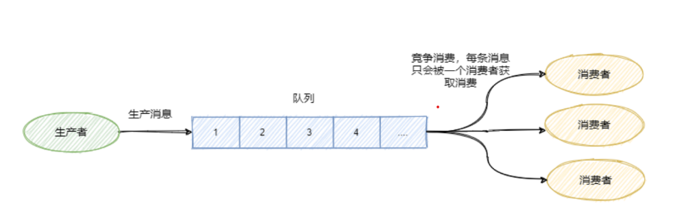


###### 发布/订阅模型：

**示意图**： 

假如我们要实现 我发的消息要让多个人看到， 队列模型就 不太合适了。 那么为了解决这个问题， 我们可以使用 发布订阅模型（如下图）：

生产者生产的消息， 发送到 队列中 特定的 主题（topic) 中， 订阅了这个 topic 的消费者 都可以消费这条消息。

拿微信来说：就是 我往群聊里 发了一条消息， 这个群里的所有人，都可以收到这条消息。   


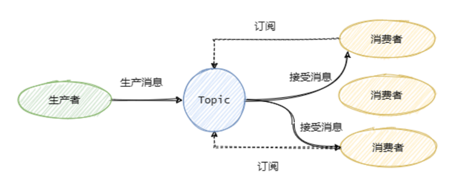 

###### 特殊的情况： 

队列模型 也可以实现 一条消息被多个消费者消费的效果：

可以通过使用多个队列全量 存储相同的消息，就可以实现，一条消息，被多个消费者消费的效果。但是这种方式，**会导致数据冗余的问题**

发布订阅模型 当只有一个消费者订阅该主题的时候， 就跟队列模型没什么区别了。

##### 常用术语

| `Producer` | 发送消息方为生产者     | 消息从Producer发往Broker                                     |
| ---------- | ---------------------- | ------------------------------------------------------------ |
| `Broker`   | 消息队列服务端         | Broker将消息存储至本地                                       |
| `Consumer` | 接受消费消息方为消费者 | 然后Consumer从Broker拉取消息,或者Broker推送消息至Consumer,最后消费 |

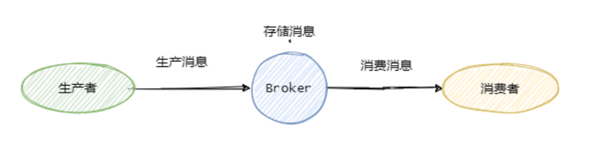

###### tips: 提高并发度

为了提高并发度，往往`发布/订阅模型`还会引入`队列`或者`分区`的概念。

- **对于生产者** ：**消息是发往一个主题下的某个队列或者某个分区中**。rocket 中交队列,kafka叫分区。 都是一样的  

  **例如** : 某个主题下有 5 个队列，那么这个主题的 并发度 就提高为 5 ，同时可以有 5 个消费者并行消费该主题的消息。一般可以采用`轮询` 或者 `key hash` 取余 等策略 来将同一个主题的消息分配到不同的队列中。

  <————————---------------zhuyin 的日常学习笔记----------------------------------->

- **对于消费者**： 与之对应的消费者一般都有组的概念 Consumer Group,即消费者都是属于某个消费组的。一条消息会发往多个订阅了这个主题的消费组。
- 假设现在有两个消费者组 Group1 和 Group2 他们都订阅 Topic-a; 此时有一条消息发往Topic-a, 那么这两个消费者组都能都能接收到这条消息。然后这条消息 实际上是写入  topic-a 的某个队列中，消费者组中的消费者对应消费一个队列的消息。
- 在物理上除了副本拷贝之外，一条消息在 broker（消息队列服务端） 中 只会有一份。 每个消费者组会有自己的 offset(消费点位-用来标识消费到的位置，在消费点位之前的消息 是已经被消费过的，这个 offset 是队列级别的， 每个消费者组都会维护 自己订阅的 topic 下的每个队列的 offset) 

###### 如下图

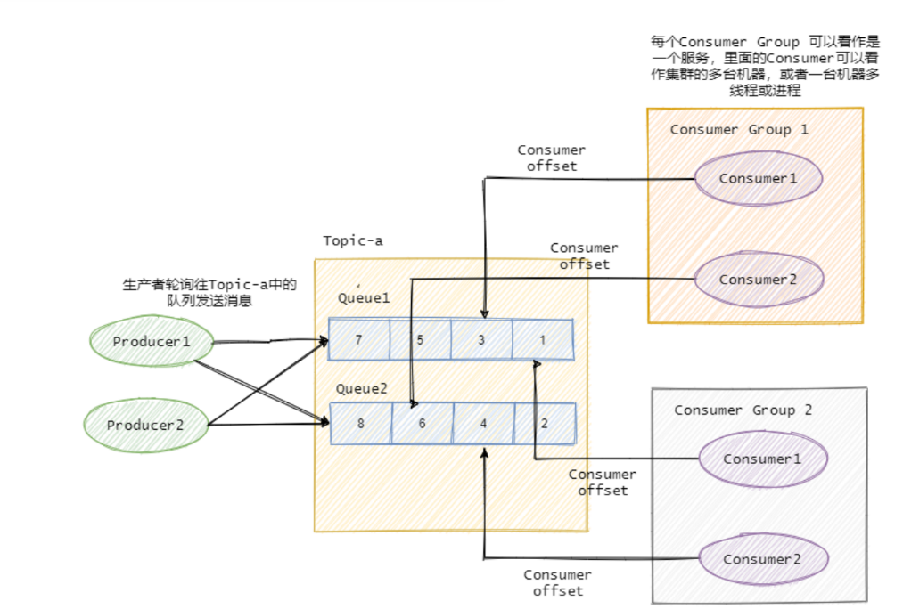


生产者，轮询着往 对应主题中的队列投递消息，订阅了该主题的 消费者组 中的消费者就可以来进行消费这些消息，同时去维护 对应队列的 offset （消费标记）。


### 为什么要使用消息队列？

从本质上来讲，其实就是因为互联网的快速发展，业务不断的扩张， 促使技术架构需要不断的的演变。说白了就是因为 单体架构 满足不了我们的需求， 我们使用了分布式架构，而分布式架构需要用消息队列来 ：

- 进行服务的解耦
- 合理 合时 的控制资源
- 及缓冲流量洪峰等等。
- 等等

也可以理解为：

这三个作用： 异步处理、服务解耦、流量控制.

#### 异步处理：

随着公司的发展你可能会发现你项目的**请求链路越来越长**，例如刚开始的电商项目，可以就是粗暴的扣库存、下单。慢慢地又加上积分服务、短信服务等。这一路同步调用下来客户可能等急了，这时候就是消息队列登场的好时机。 -----解释-->  

- **调用链路长、响应就慢了**，并且相对于扣库存和下单，积分 和 短信 没必要这么的 "及时"。

- 因此只需要在下单结束那个流程，扔个消息到消息队列中就可以直接返回响应了。

- 而且积分服务和短信服务可以并行的消费这条消息。可以看出消息队列可以 **减少请求的等待，还能让服务异步并发处理，提升系统总体性能**。

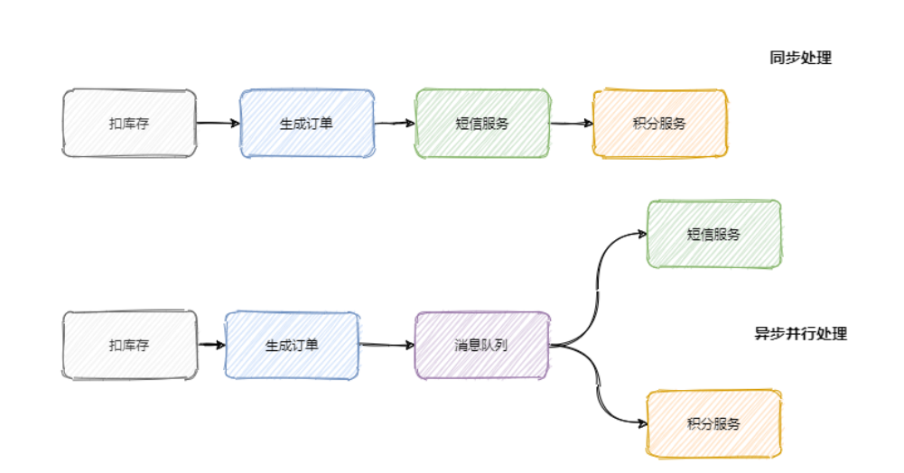


#### 服务解耦

为什么要解耦？写在一起不好吗？ 那么我们来设想一下，就拿上面的那个例子来讲：

我们有 短信服务 和 积分服务 ，那么这个时候，我们需要加入 营销服务 和 数据分析服务 

然后 `订单 `有 四个 下游服务，会有什么问题？ 任何以后 下游服务的 接口发生更改， 订单就需要进行大量的修改。 这就太不好了。

我们使用 **发布订阅模型**：

所以一般会选用消息队列来解决系统之间耦合的问题，订单服务把订单相关消息塞到消息队列中，下游

系统谁要谁就订阅这个主题。这样订单服务就解放啦！

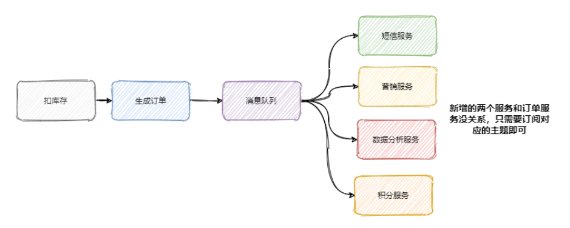


#### 流量控制（缓冲）

- 想必大家都听过「**削峰填谷**」，后端服务相对而言都是比较「**弱**」的，因为业务较重，*处理时间较长*

  - 像一些例如 **秒杀活动** 爆发式流量打过来可能就顶不住了。因此需要引入一个中间件来做缓冲，消息队列再适合不过了。网关的请求 先放入消息队列中，后端服务 尽自己最大能力去消息队列中消费请求。超时的请求可以直接返回错误。

  - 当然还有一些服务特别是 某些后台任务，**不需要及时地响应**，并且业务处理复杂且流程长，那么**过来的请求先放入消息队列中，后端服务按照自己的节奏处理**。这也是很 nice 的。

- 上面两种情况分别对应着生产者生产过快和消费者消费过慢两种情况，消息队列都能在其中发挥很好的缓冲效果。

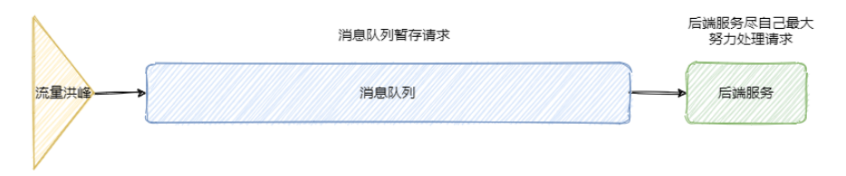

#### **注意**

引入消息队列固然有以上的好处，但是多引入一个中间件系统的**稳定性就下降**一层，**运维的难度抬高**一

层。因此要 **权衡利弊，系统是演进的。**


### 在哪些场景下可能会丢失消息?

我们使用这样一个例子来分析,可能会出现消息丢失的地方.

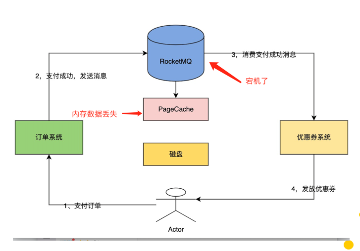

##### 场景描述:

- 用户支付订单之后,发放优惠券, 但是现在 订单确实是 支付成功了 优惠券并没有发到用户的账户上;
- 通过分析是因为消息丢失导致的, 请你分析在那些地方会丢失消息?

**我们来捋一下这个流程**:

1. 用户支付订单成功
2. 订单系统向MQ 发送一条消息
3. MQ 将消息 写入到 PageCache 中
4. 优惠券系统 消费这条消息: (发放优惠券) 

除了 步骤 1 是确定成功了的, 其他位置都有可能会发生 消息丢失.

##### 在(订单系统) 生产者 向 MQ(broker)  投递消息 的过程中有可能会丢失消息

•原因1: 订单系统 和 MQ 需要通过网络来进行通信,如果在这个过程中网络出现抖动 ,就有可能导致消息丢失.

•原因2：MQ确实收到了消息，但是MQ自身的网络通信模块出现了bug，导致消息没被成功处理

•原因3：在发送消息给MQ的过程中，恰好遇到了MQ主节点故障，在进行主从切换，这时也可能遇到异常。

•其他等等 

##### MQ 存储消息的过程也有可能会丢失消息

现在我们假设消息已经成功发送给MQ 了;`MQ 自身会导致消息丢失吗?` 答案是 **会的**;

> 首先让我们先来补充一个知识: 在 RocketMQ 中消息写成功了, 是指消息写到了 PageCache 中(还未到磁盘). 

- 原因1 : 如果消息只是写到了 pageCache中,还没有写到 磁盘中的时候,  服务器宕机了, 消息就会丢失.
- 原因2 : 如果消息已经写入到了磁盘中, 也是有可能消息丢失的, 因为磁盘 有可能会损坏.

##### 消费者 也有可能会丢消息.

现在呢，我们假设消费者已经获取到消息了。但是还没发优惠券，这个时候消费者是自动提交的。提交后，此时消费者宕机了。完美，这个时候，消息又丢了.

### 如何保证消息不丢失？       

我么就可以 从这三个方面来 保证消息不丢失.

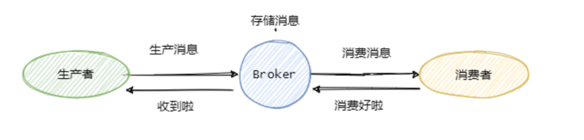


#### 生产消息

生产者 将消息发送到 broker , broker 收到消息后做出 响应,然后 生产者需要处理 broker 的响应.

在上面,我们已经知道了, 在这个阶段,消息丢失主要是因为网络抖动, 但是网络抖动这个事儿,沒办法控制.

所以, 如果因为网络抖动消息没有成功发送到 broker ,只能重新发送了.直到发送成功.

##### 事物消息

- 基于这个思想, 我们来看一下 解决方案: RocketMQ 的 **事务消息** .

**什么是事物消息**: 一个事物级别的消息. 可以做到 让消息一定推送到 MQ 中.

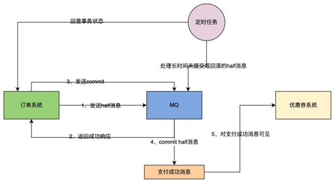

##### 事物消息机制流程:

首先发送 half 消息

- 生产者(订单系统) 先发送一个 half 消息 给 MQ(此时,订单状态是未支付)  , 试探一下网络是否正常(有点像 tcp 握手),  
- 如果 `半消息 发送成功`, 
  - 执行本地事物 (就把订单状态 更新为 已支付), 
  - 然后检查本地事物: 
    - 如果本地事物成功, 那就向 MQ 发送 commit ,如果:
      - 给 MQ 发送 commit 成功 :  会把之前不可见的 half 消息进行提交，提交后，half 消息 对优惠券系统就可见了。此时，优惠券系统就可以消费消息。
      - 给 MQ 发送 commit 失败 : 这个时候，会有一个**定时任务**， **处理长时间未提交或回滚的half消息**，会**回查订单系统的事务状态**
    - 本地事物失败: 
      - 就给 MQ 发送 rollback, 同时本地事物也会回滚.
- 否则就 调用 支付系统的退款.

##### 事物消息机制- 总结

>首先，发送half消息，就是为了判断当前的网络状态如何。
>
>如果网络状态不好，half消息压根发不出去。此时订单就会退款。
>
>commit、rollback和补偿机制的意义，其实就是确保订单系统的本地事务一旦提交，也会确保MQ的消息也会commit。同理，失败，也会确保MQ的消息也会rollback。说白了，就是保持一致性。
>
>这就可以保证订单系统发送消息给MQ的过程中，是不会丢消息的。

##### 补充: 什么是 Half 消息?

######  我们来思考一个问题:    生产者把 half 消息发送到 MQ 之后,  half 消息 为啥对消费者不可见.


我们可以看到: 当生产者投递 half 消息之后, MQ 是发送到一个系统级别的 `内部主题` topic : `RMQ_SYS_TRANS_HARF_TOPIC`. 但是我们的消费者订阅的 却是 真实的 topic.

所以消费者不可见.

###### Half消息什么时候对 消费者可见?

当生产者 执行完 本地事务, 向MQ 发送一个 commit , MQ 收到之后, **会把 half 消息 从 内部主题 发送到 真正的主题**.这个时候,就是对于 消费者可见的啦. 


    


如果 提交的是 rollback , 并不会将 half 消息删除. 而是 在 内部主题里面 , 对该half 消息 做一个标记, 标记为删除(逻辑删除) 	

###### 那么如果 长时间没有收到 commit / rollback 

- 就会交给 一个定时任务去处理(补偿机制). 也就是 MQ 去扫描 MQ的内部主题中长时间未进行提交/回滚 的 half 消息, 然后去回查他们本地事物的 状态. 如果在回查的时候,由于网络原因没有成功, 会进行重试, 最多重试15次，超过15次，自动rollback.  

#### 存储消息:

 在生产者 将消息成功发送到 MQ : 是把消息 写入到了 pageCache 中. 

有两种刷盘策略: 

异步刷盘:   消息写入到 pageCache 中就表示 写入成功.

同步速盘:   消息需要写入到 磁盘中 才算是 写入成功了.

| 种类     | 优点            | 缺点            |
| -------- | --------------- | --------------- |
| 异步刷盘 | 性能高,吞吐量大 | 不安全,会丢消息 |
| 同步刷盘 | 性能低,吞吐量小 | 安全            |

所以 为了保证安全, 我们可以使用 同步刷盘, 但是消息写入到磁盘就真的安全了吗?

也不是, 磁盘也会坏, 解决方案是 使用主从同步 来进行数据的冗余, 来保证数据的安全.

#### 消费者消费消息:

消费者 对于消息的处理; 默认是 自动提交的. 也就是说, 当 消费者 拉取了消息到消费者之后, 消费者会自动提交 offset 给MQ Broker ,告诉 broker 消费者已经处理了这条消息. 但是实际上, 消费者还没有对于这条消息进行处理. 如果这个时候 消费者 挂了, 那么 当 服务器 重启之后, 是不会 去拉取 那部分消息的. 就会造成消息的丢失. 

解决方案: 改成手动提交.就可以了.

 还有一个问题就是: 

消费者消费消息的方式有两种:

###### 异步消费 

就是开启一个子线程进行消费,开启任务之后;这种方式有可能会造成消息的都是, 因为 有可能在子线程 还没有完成的时候, 服务器挂了, 但是 offset 已经提交到了 MQ .

解决方案: 使用 **同步消费模式**, 只有消费完成 之后, 才会提交 offset; 

#### 最终的总结: 

- 生产者: 事物消息 或者 重试机制
- Broker: 同步刷盘 + 主从架构
- 消费者: 手动提交 + 同步消费

这样基本上就可以保证消息不丢失.

> 但是要注意消息可靠性增强了，性能就下降了，等待消息刷盘、多副本同步后, 返回 都会影响性能。
>
> 因此还是看业务，例如 **日志的传输可能丢那么一两条关系不大**，因此没必要等消息刷盘再响应。

***********

----------

### 如何处理重复消息？

首先我们要明确:  为了消息的安全性， 消息的重复不可避免；

##### 消息的重复点

1. **情况1** : 生产者 发送消息 到 broker ,然后等待broker 的响应。有这么一种情况： 此时 broker 已经完成了写入，但是由于网络的原因， 生产者没有收到这个响应。然后生产者就 重新进行了 消息的发送. 那么这个时候消息就重复了.
2. **情况2** : 消费者 在进行消费的时候,消费者已经消费完成了, 业务逻辑走完了, 事物提交了, 这个时候就需要更新 offset 了,但是这个时候 消费者 挂了.另一个消费者顶上, 此时 offset 还没有 更新完毕.这个时候,新的消费者就 有拿到了那条消息.业务重新执行了一遍. 于是消息又重复了.

所以: 可以看到正常业务的消息重复是不可避免的. 因此我们只能 从另一个方面解决这个问题.

###### 使用幂等来解决消息重复

幂等是数学上的概念，我们就理解为 **同样的参数多次调用同一个接口和调用一次产生的结果是一致的。**

例如这条SQL

```sql
update t1 set money = 150 where id = 1 and money = 100;
```

无论执行多少遍 money 都是150，这就叫幂等。

因此需要改造业务处理逻辑，使得在重复消息 的情况下也不会影响最终的结果。

可以通过上面我那条 SQL 一样，做了个前置条件判断，即 money = 100 情况，并且直接修改，更通用的是做个version即版本号控制，对比消息中的版本号和数据库中的版本号。或者通过数据库的约束例如唯一键，例如insert into update on duplicate key...。或者记录关键的key，比如处理订单这种，记录订单ID，假如有重复的消息过来，先判断下这个ID是否已经被处理过了，如果没处理再进行下一步。当然也可以用全局唯一ID等等。基本上就这么几个套路，真正应用到实际中还是得看具体业务细节

### 如何保证消息的有序性？

有序性可以分为: **全局有序**, **部分有序;**

###### 全局有序

如果要保证消息的全局有序，

- 首先只能由一个生产者往Topic发送消息，
- 并且一个 Topic 内部只能有一个队列（分区）。
- 消费者也必须是单线程消费这个队列。

这样的消息就是全局有序的

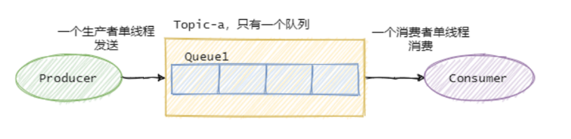

但是我们一般 不用保证全局有序.只需要保证部分有序即可.

###### 部分有序

绝大部分的有序需求是部分有序，

- 部分有序我们就可以将 Topic 内部划分成 我们需要的队列数，
- 把消息通过特定的策略发往固定的队列中，
- 然后每个队列对应一个单线程处理的消费者。

这样即完成了部分有序的需求，又可以通过队列数量的并发来提高消息处理效率。

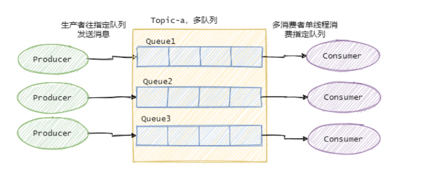

### 如何处理消息堆积？

##### 消息堆积的原因

生产者生产速度 和 消费者消费速度  不匹配. 

- 也有可能 是因为 消费者 消费消息失败反复重试造成的. 
- 也有可能是因为消费者消费能力弱. 

###### 如何处理?

首先我们先定位消费慢的原因, 

- 如果是bug 就处理 bug, 
- 如果是本身消费能力弱,那就优化 消费逻辑.如果优化之后还是慢, 那就需要考虑扩容了.
- 增加 **topic的队列数** 和 **消费者的数量**. (注意: 队列数 和 消费者 都得增加, 要不然 消费者没东西消费. 在一个 topic 中, 一个队列只会分给 一个消费者.)


