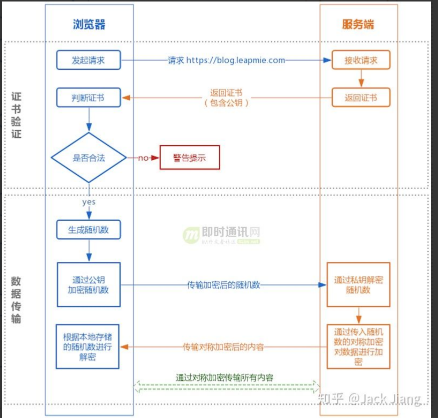

# 网络基础笔记

#### 计算机网络体系结构示意图

- OSI 是标准的定义 分成七层协议

  - 应用层
  - 表示层
  - 会话层
  - 运输层
  - 网络层
  - 数据链路层
  - 物理层

- Tcp/IP协议 是四层协议

  - 应用层 : 各种应用层协议(TELNet,FTP,SMTP 等)
  - 运输层 : TCP  UDP
  - 网际层 : IP
  - 网络接口层: 

- 我们学习的时候采用 五层协议的方式进行学习

  - 应用层 : 
  - 运输层 : 
  - 网络层
  - 数据链路层
  - 物理层

  ****

### 五层协议详情

#### 应用层

- **应用层的任务** 是 通过**应用进程间的交互**来完成特定网络应用

- 应用层协议定义的是 : **应用进程间的通信和交互的规则**。
- 对于不同的网络应用需要不同的应用层协议。在互联网中应用层协议很多:
  - `域名系统DNS`: 域名解析系统
  - 支持万维网应用的 `HTTP协议`
  - 支持电子邮件的 `SMTP协议`等等。

**报文**: 我们把应用层交互的 数据单元 称为报文。

##### 域名系统

域名系统(Domain Name System缩写 DNS，Domain Name被译为域名)是因特网的一项核心服务，它作为可以 **将域名和IP地址相互映射** 的一个分布式数据库，能够使人更方便的访问互联网，而不用去记住能够被机器直接读取的IP数串。

##### HTTP协议

HTTP协议是一种: **超文本传输协议**. 设计 HTTP 最初的目的是为了提供一种发布和接收 HTML 页面的方法。

**什么是超文本?** 

>文本: 早期指的就是 简单的字符, 文本就是能够被计算机解析的有意义的二进制数据包.
>
>超文本: 后来人们不满足于只是在两台电脑间传输文字, 还想要传输 图片,音频,视频,超链接,等等. 他们被称为 超文本(HyperText)

###### 什么是传输?

>我们的信息 (也就是超文本) 会被解析成二进制的数据包,通过 传输载体(光缆,电话线,电缆等) 将 数据包由计算机终端传输 到 另一个终端的过程. 称之为`传输`

###### 什么是协议?

>网络协议就是网络中传递,管理信息的一些规范.

###### 总结

>HTTP协议:一种在计算机世界里专门再**两点之间** 传输文字,图片,音频,视频等超文本的约定和规范

#### 运输层

> 运输层(transport layer)的主要任务就是负责向两台主机进程之间的通信提供通用的数据传输服务。
>
> 运输层主要使用以下两种协议:
>
> 1. 传输控制协议 TCP（Transmission Control Protocol）--> 提供面向连接的，可靠的数据传输服务。
> 2. 用户数据协议 UDP（User Datagram Protocol）       --> 提供无连接的，尽最大努力的数据传输服务（不保证数据传输的可靠性）。

#### 网络层

> - 在计算机网络中进行通信的两个计算机之间可能会经过很多个数据链路，也可能还要经过很多通信子网。
>
> - 网络层的任务 : 就是 **选择合适的网间路由和交换结点， 确保数据及时传送。**
> - 这里强调指出，网络层中的“网络”二字已经不是我们通常谈到的具体网络，而是指 计算机网络体系结构模型中第三层的名称.
>   

#### 数据链路层

> - 数据链路层(data link layer)通常简称为链路层。
> - 两台主机之间的数据传输，总是在一段一段的链路上传送的，这就需要使用专门的链路层的协议。 
> - 在两个相邻节点之间传送数据时，数据链路层将网络层交下来的 IP 数据报组装成帧.
> - 在两个相邻节点间的链路上传送帧。
> - 每一帧包括 **数据** 和 **必要的控制信息**（如同步信息，地址信息，差错控制等）。

#### 物理层

> - 物理层(physical layer)的作用是实现相邻计算机节点之间比特流的透明传送，尽可能屏蔽掉具体传输介质和物理设备的差异， 
>
> 在互联网使用的各种协议中最重要和最著名的就是 TCP/IP 两个协议。现在人们经常提到的TCP/IP并不一定单指TCP和IP这两个具体的协议，而往往表示互联网所使用的整个TCP/IP协议簇。

### HTTP 和 HTTPS 的区别

1. Http 是超文本传输协议.信息是明文传输,存在网络安全的风险. https 在Tcp 和 http 网络层之间加入了 SSL/TLS 安全协议,使得报文能够加密传输
2. Http 连接建立相对简单, Tcp 三次握手之后便可 进行 Http 的报文传输. 而https 在TCP 上次握手之后,还需要 SSL/TLS的握手过程.才可以进行加密传输
3. Http 的端口号是 80 而HTTPS 的端口号是 443
4. Https需要向CA (证书权威机构) 申请数字证书,来保证服务器的身份是可信的

### Tcp 三次握手和四次挥手

**简单示意图**

第一次握手:  发送端 -> 接收端 : 邮件我发你了. `带有 SYN 标志的数据包`

第二次握手:  接收端 -> 发送端 : 我收到了你的消息.`发送带有SYN/ACK 标志的数据包 ` 

第三次握手:  发送端 -> 接收端 : 我确认 你收到了你的消息. 

##### 为什么要三次握手?

三次握手的目的是建立可靠的通信信道，说到通讯，简单来说就是数据的发送与接收，

而三次握手最主要的目的 就是双方确认自己与对方的发送与接收是正常的。

|            | 发送端                                 | 接收端                                 |
| ---------- | -------------------------------------- | -------------------------------------- |
| 第一次握手 | 什么都不能确认                         | 确认对方能发送,自己能接受              |
| 第二次握手 | 自己发送、接收正常，对方发送、接收正常 | 对方发送正常，自己接收正常             |
| 第三次握手 | 自己发送、接收正常，对方发送、接收正常 | 自己发送、接收正常，对方发送、接收正常 |

### 四次挥手

是为了安全的断开连接, 

第一次挥手: 发送方  给 接收方 发送一个 Fin 用来关闭  发送方 --> 接收方的连接

第二次挥手:  接收方 收到这个FIN  接收方 发回 ACK,确认序号为 收到的序号加1 (发送方在接收方确认之后 (进入半关闭状态)

第三次挥手: 接收方 发送一个 FIN 用来断开 与 发送方的连接( 进入半关闭状态)

第四次挥手: 发送方 发送一个ACK 确认,当接收方接收到之后才会完全关闭连接

### TCP 和 UDP 的区别?

| 类型         | TCP协议                             | UDP协议                                    |
| ------------ | ----------------------------------- | ------------------------------------------ |
| 面向连接     | 是                                  | 否                                         |
| 传输的可靠性 | 可靠                                | 不可靠                                     |
| 传输形式     | 字节流                              | 数据报文段                                 |
| 传输效率     | 慢                                  | 快                                         |
| 所需资源     | 多                                  | 少                                         |
| 应用场景     | 要求通讯可靠,例如传输文件,邮件传输, | 要求通信的速度高,如域名转换, QQ, 直播,游戏 |
| 首部字节     | 20-60                               | 8 个字节,由四个字段组成                    |

- UDP 在传送数据之前不需要建立连接, 对方在收到UDP 的报文后,也不需要给出任何的确认.虽然 UDP 不提供可靠的数据交付,但是在某些场景下, UDP却是最 有效的工作方式.(即时通信); QQ语音,QQ视频通话,直播等等.

- TCP 提供了可靠的连接的服务,在传送数据之前必须向建立连接,数据传送之后要释放连接, TCP 不提供 广播或者多播, 只提供点对点的 数据传送(终端-终端).

### TCP 协议为什么可靠?

1. 应用数据被分割成 TCP 认为 最合适发送的数据块
2. TCP 给发送的每一个数据包进行编号,接收方对数据包进行排序,把有序的数据 传送给应用层
3. **校验和**: TCP 将保持他 首部和数据的 检验和. 目的是检测数据在传输过程中的任何变化,如果收到的报文段 检验和有差错, TCP 将会丢弃这个报文段
4. TCP 会丢弃重复的数据
5. **流量控制**: TCP 连接的每一个结点, 都有一个固定大小的 缓冲空间, TCP 的接收端只 允许发送端 发送 接收端 缓冲区可以接纳的数据. 当接收方 来不及处理发送方的数据是,可以提示发送方降低发送的速率, 防止丢包. TCP 使用的流量控制协议是可变大小的滑动窗口协议.(TCP 通过滑动窗口进行流量控制)
6. **拥塞控制**: 当网络拥塞时减少数据的发送.
7. ARQ 协议: 也是为了实现可靠传输的, 原理就是: 每发完一个分组就停止发送,等待对方确认,当受到确认之后再发送下一个分组.如果再一定的时间内没有收到确认帧,就自动重新发送.
8. **超时重传**:  当 TCP 发出一个段之后,他启动一个定时器,等待 结束端确认收到 这个报文段,如果不能即使收到这个确认,将重行发送这个报文段.

### ARQ协议

> 自动重传请求（Automatic Repeat-reQuest，ARQ）
>
> 是OSI模型中数据链路层和传输层的错误纠正协议之一。
>
> - 它通过使用**确认**和**超时**这两个机制，在不可靠服务的基础上实现可靠的信息传输。
> - 如果发送方在发送后一段时间之内没有收到确认帧，它通常会重新发送。ARQ包括停止等待ARQ协议和连续ARQ协议。

##### 停止等待ARQ 协议

停止等待ARQ 协议是为了实现可靠传输的, 

**原理**:  每发完一个分组就停止发送,等待对方确认(回复ACK) 如果过了一段时间(超时时间), 还没有收到 ACK 确认 说明没有发送成功,需要重新发送. 直到收到呢确认后再发送下一个分组.

在停止等待 协议中, 如果接受方 收到重复分组,就丢弃该分组,但是还是要发送确认

**优点**: 简单

**缺点**: 信道利用率低连续发送出去，而不需要等待对方确认。

##### 连续APQ协议

连续ARQ协议可以提高 信道的利用率, 凡是位于 **发送窗口内的分组** 可以来连续发送出去,而不需要等待对方确认.

**接收方**一般采用累计确认，对按序到达的**最后一个分组**发送确认，表明到这个分组为止的所有分组都已经正确收到了。

**优缺点**

- 优点: 信道利用率高,容易实现,即使确认丢失,也不必重传.
- 缺点: 不能向发送方反映出 已经正确收到的所有分组的信息.
  - 比如: 发送五个分组, 中间第三条丢失, 这是接收方 只能对前两个 组发送确认, 发送方只能把后三个全部重传一次(GO -back) 回退.

### 滑动窗口和流量控制

TCP 利用滑动窗口实现 流量控制 . 流量控制是为了 控制发送端的发送速率,保证接收方来得及接收.

接收方发送的 确认报文中的窗口字段 可以控制发送窗口的大小,从而影响发送方的速率.

### 拥塞控制

> 在某段时间，若对网络中某一资源的需求超过了该资源 所能提供的可用部分，网络的性能就要变坏。这种情况就叫拥塞。
>
> 拥塞控制就是为了防止过多的数据注入到网络中，这样就可以使网络中的路由器或链路不致过载。
>
> 拥塞控制所要做的都有一个前提，就是网络能够承受现有的网络负荷。
>
> 拥塞控制是一个全局性的过程，涉及到所有的主机，所有的路由器，以及与降低网络传输性能有关的所有因素。
>
> 相反，流量控制往往是点对点通信量的控制，是个端到端的问题。流量控制所要做到的就是抑制发送端发送数据的速率，以便使接收端来得及接收。

TCP 的拥塞控制采用了四种算法, 慢开始,拥塞避免, 快重传,快恢复

在网络层也可以使路由器采用适当的分组丢弃策略(主动队列管理,AQM) 以减少网络拥塞的发生.

- **慢开始**:  慢开始算法的思路是当主机开始发送数据时，如果立即把大量数据字节注入到网络，那么可能会引起网络阻塞，因为现在还不知道网络的符合情况。经验表明，较好的方法是先探测一下，即由小到大逐渐增大发送窗口，也就是由小到大逐渐增大拥塞窗口数值。cwnd初始值为1，每经过一个传播轮次，cwnd加倍。

- **拥塞避免**: 拥塞避免算法的思路就是 让拥塞窗口的 cwnd缓慢增加,即 每经过一个往返时间就把发送方的 cwnd 加 1;

- **快重传 与 快恢复**(FRR): 

  > 在 TCP/IP 中，快速重传和恢复（fast retransmit and recovery，FRR）是一种拥塞控制算法，它能快速恢复丢失的数据包。
  >
  > - 没有 FRR，如果数据包丢失了，TCP 将会使用定时器来要求传输暂停。在暂停的这段时间内，没有新的或复制的数据包被发送。
  >
  > - 有了 FRR，如果接收机接收到一个不按顺序的数据段，它会立即给发送机发送一个重复确认。如果发送机接收到三个重复确认，它会假定确认件指出的数据段丢失了，并立即重传这些丢失的数据段。有了 FRR，就不会因为重传时要求的暂停被耽误。 当有单独的数据包丢失时，快速重传和恢复（FRR）能最有效地工作。当有多个数据信息包在某一段很短的时间内丢失时，它则不能很有效地工作。

### 当我们在浏览器地址栏输入 一个 url 之后,会发生什么?

1. DNS解析
2. TCP连接
3. 发送HTTP请求 
4. 服务器处理请求并返回HTTP报文 
5. 浏览器解析渲染页面 
6. 连接结束

各种协议和 http 的关系?

### HTTP 1.0 和 HTTP 1.1 的区别

1. **长连接:**  
   - 在1.0中, 默认使用的是短连接.也就是说每次请求都要重新建立连接: 每一次都要进行三次握手四次挥手. 这样就比较浪费资源. 
   - 在 1.1 中, 默认使用长连接, 可以使用这个长连接来 发送多个请求. 
     - 长连接 有流水线 和 非流水线 方式
     - 非流水线 就是 只有等到对方 响应之后,才能继续发送下一个.
     - 流水线  就是 不用等到对方 响应之后,就能继续发送下一个.
2. **错误响应码**: 新增了 24 个 错误响应码
3. **缓存处理**: 在 1.0 中 主要使用 : header 中的 if-Modified-Since 来进行缓存判断的标准,1.1 引进了更多的缓存控制策略. 
4. **带宽优化 以及网络连接的使用** : 1.0 中 存在一些 浪费带宽的现象, 客户端只需要某个对象的一部分,而服务器却将整个对象都 都送过来了. 并且不支持断点续传. 1.1 则在请求头引入了range 头域. 它允许只请求 某个资源的一部分. 

###  URI和URL的区别是什么?

- URI(Uniform Resource Identifier) 是统一资源标志符，可以唯一标识一个资源。

- URL(Uniform Resource Location) 是统一资源定位符，可以提供该资源的路径。它是一种具体的 URI，即 URL 可以用来标识一个资源，而且还指明了如何 locate 这个资源。
- URI的作用像身份证号一样，URL的作用更像家庭住址一样。URL是一种具体的URI，它不仅唯一标识资源，而且还提供了定位该资源的信息

